# Convolutional Neural Networks

## Project: Write an Algorithm for a Dog Identification App 

---

In this notebook, some template code has already been provided for you, and you will need to implement additional functionality to successfully complete this project. You will not need to modify the included code beyond what is requested. Sections that begin with **'(IMPLEMENTATION)'** in the header indicate that the following block of code will require additional functionality which you must provide. Instructions will be provided for each section, and the specifics of the implementation are marked in the code block with a 'TODO' statement. Please be sure to read the instructions carefully! 

> **Note**: Once you have completed all of the code implementations, you need to finalize your work by exporting the Jupyter Notebook as an HTML document. Before exporting the notebook to html, all of the code cells need to have been run so that reviewers can see the final implementation and output. You can then export the notebook by using the menu above and navigating to **File -> Download as -> HTML (.html)**. Include the finished document along with this notebook as your submission.

In addition to implementing code, there will be questions that you must answer which relate to the project and your implementation. Each section where you will answer a question is preceded by a **'Question X'** header. Carefully read each question and provide thorough answers in the following text boxes that begin with **'Answer:'**. Your project submission will be evaluated based on your answers to each of the questions and the implementation you provide.

>**Note:** Code and Markdown cells can be executed using the **Shift + Enter** keyboard shortcut.  Markdown cells can be edited by double-clicking the cell to enter edit mode.

The rubric contains _optional_ "Stand Out Suggestions" for enhancing the project beyond the minimum requirements. If you decide to pursue the "Stand Out Suggestions", you should include the code in this Jupyter notebook.


---
### Why We're Here 

In this notebook, you will make the first steps towards developing an algorithm that could be used as part of a mobile or web app.  At the end of this project, your code will accept any user-supplied image as input.  If a dog is detected in the image, it will provide an estimate of the dog's breed.  If a human is detected, it will provide an estimate of the dog breed that is most resembling.  The image below displays potential sample output of your finished project (... but we expect that each student's algorithm will behave differently!). 


In this real-world setting, you will need to piece together a series of models to perform different tasks; for instance, the algorithm that detects humans in an image will be different from the CNN that infers dog breed.  There are many points of possible failure, and no perfect algorithm exists.  Your imperfect solution will nonetheless create a fun user experience!

### The Road Ahead

We break the notebook into separate steps.  Feel free to use the links below to navigate the notebook.

* [Step 0](#step0): Import Datasets
* [Step 1](#step1): Detect Humans
* [Step 2](#step2): Detect Dogs
* [Step 3](#step3): Create a CNN to Classify Dog Breeds (from Scratch)
* [Step 4](#step4): Create a CNN to Classify Dog Breeds (using Transfer Learning)
* [Step 5](#step5): Write your Algorithm
* [Step 6](#step6): Test Your Algorithm

---
<a id='step0'></a>
## Step 0: Import Datasets

Make sure that you've downloaded the required human and dog datasets:

**Note: if you are using the Udacity workspace, you *DO NOT* need to re-download these - they can be found in the `/data` folder as noted in the cell below.**

* Download the [dog dataset](https://s3-us-west-1.amazonaws.com/udacity-aind/dog-project/dogImages.zip).  Unzip the folder and place it in this project's home directory, at the location `/dog_images`. You can also download this dataset from my personal [google drive](https://drive.google.com/open?id=1-mFxVeBVjdrSOZNbBWnhiEkUep-MoENN) folder.

* Download the [human dataset](https://s3-us-west-1.amazonaws.com/udacity-aind/dog-project/lfw.zip).  Unzip the folder and place it in the home directory, at location `/lfw`. You can also download this dataset from my personal [google drive](https://drive.google.com/open?id=1-mFxVeBVjdrSOZNbBWnhiEkUep-MoENN) folder.  

*Note: If you are using a Windows machine, you are encouraged to use [7zip](http://www.7-zip.org/) to extract the folder.*

In the code cell below, we save the file paths for both the human (LFW) dataset and dog dataset in the numpy arrays `human_files` and `dog_files`.


```python
import numpy as np
from glob import glob

# load filenames for human and dog images
human_files = np.array(glob("/data/lfw/*/*"))
dog_files = np.array(glob("/data/dog_images/*/*/*"))

# print number of images in each dataset
print('There are %d total human images.' % len(human_files))
print('There are %d total dog images.' % len(dog_files))
```

    There are 13233 total human images.
    There are 8351 total dog images.


<a id='step1'></a>
## Step 1: Detect Humans

In this section, we use OpenCV's implementation of [Haar feature-based cascade classifiers](http://docs.opencv.org/trunk/d7/d8b/tutorial_py_face_detection.html) to detect human faces in images.  

OpenCV provides many pre-trained face detectors, stored as XML files on [github](https://github.com/opencv/opencv/tree/master/data/haarcascades).  We have downloaded one of these detectors and stored it in the `haarcascades` directory.  In the next code cell, we demonstrate how to use this detector to find human faces in a sample image.


```python
import cv2                
import matplotlib.pyplot as plt                        
%matplotlib inline                               

# extract pre-trained face detector
face_cascade = cv2.CascadeClassifier('haarcascades/haarcascade_frontalface_alt.xml')
# load color (BGR) image
img = cv2.imread(human_files[0])
# convert BGR image to grayscale
gray = cv2.cvtColor(img, cv2.COLOR_BGR2GRAY)

# find faces in image
faces = face_cascade.detectMultiScale(gray)

# print number of faces detected in the image
print('Number of faces detected:', len(faces))

# get bounding box for each detected face
for (x,y,w,h) in faces:
    # add bounding box to color image
    cv2.rectangle(img,(x,y),(x+w,y+h),(255,0,0),2)
    
# convert BGR image to RGB for plotting
cv_rgb = cv2.cvtColor(img, cv2.COLOR_BGR2RGB)

# display the image, along with bounding box
plt.imshow(cv_rgb)
plt.show()
```

    Number of faces detected: 1


Before using any of the face detectors, it is standard procedure to convert the images to grayscale.  The `detectMultiScale` function executes the classifier stored in `face_cascade` and takes the grayscale image as a parameter.  

In the above code, `faces` is a numpy array of detected faces, where each row corresponds to a detected face.  Each detected face is a 1D array with four entries that specifies the bounding box of the detected face.  The first two entries in the array (extracted in the above code as `x` and `y`) specify the horizontal and vertical positions of the top left corner of the bounding box.  The last two entries in the array (extracted here as `w` and `h`) specify the width and height of the box.

### Write a Human Face Detector

We can use this procedure to write a function that returns `True` if a human face is detected in an image and `False` otherwise.  This function, aptly named `face_detector`, takes a string-valued file path to an image as input and appears in the code block below.


```python
# returns "True" if face is detected in image stored at img_path
def face_detector(img_path):
    img = cv2.imread(img_path)
    gray = cv2.cvtColor(img, cv2.COLOR_BGR2GRAY)
    faces = face_cascade.detectMultiScale(gray)
    return len(faces) > 0
```

### (IMPLEMENTATION) Assess the Human Face Detector

__Question 1:__ Use the code cell below to test the performance of the `face_detector` function.  
- What percentage of the first 100 images in `human_files` have a detected human face?  
- What percentage of the first 100 images in `dog_files` have a detected human face? 

Ideally, we would like 100% of human images with a detected face and 0% of dog images with a detected face.  You will see that our algorithm falls short of this goal, but still gives acceptable performance.  We extract the file paths for the first 100 images from each of the datasets and store them in the numpy arrays `human_files_short` and `dog_files_short`.

__Answer:__ 
The percentage of human faces in human images: 98.0 %. The percentage of human faces in dog images: 17.0 %.


```python
from tqdm import tqdm

human_files_short = human_files[:100]
dog_files_short = dog_files[:100]
#-#-# Do NOT modify the code above this line. #-#-#

## TODO: Test the performance of the face_detector algorithm 
## on the images in human_files_short and dog_files_short.
c_human_in_human_images = 0
c_human_in_dog_images = 0
for i in range(len(human_files_short)):
    file_path = human_files_short[i]
    if face_detector(file_path):
        c_human_in_human_images += 1
print('done counting human images')

for i in range(len(dog_files_short)):
    file_path = dog_files_short[i]
    if face_detector(file_path):
        c_human_in_dog_images += 1
print('done counting dog images')

print('percentage of human faces in human images:', float(c_human_in_human_images/len(human_files_short))*100.0,'%')
print('percentage of human faces in dog images:', float(c_human_in_dog_images/len(dog_files_short))*100.0,'%')
```

    done counting human images
    done counting dog images
    percentage of human faces in human images: 98.0 %
    percentage of human faces in dog images: 17.0 %


We suggest the face detector from OpenCV as a potential way to detect human images in your algorithm, but you are free to explore other approaches, especially approaches that make use of deep learning :).  Please use the code cell below to design and test your own face detection algorithm.  If you decide to pursue this _optional_ task, report performance on `human_files_short` and `dog_files_short`.


```python
### (Optional) 
### TODO: Test performance of anotherface detection algorithm.
### Feel free to use as many code cells as needed.
```

---
<a id='step2'></a>
## Step 2: Detect Dogs

In this section, we use a [pre-trained model](http://pytorch.org/docs/master/torchvision/models.html) to detect dogs in images.  

### Obtain Pre-trained VGG-16 Model

The code cell below downloads the VGG-16 model, along with weights that have been trained on [ImageNet](http://www.image-net.org/), a very large, very popular dataset used for image classification and other vision tasks.  ImageNet contains over 10 million URLs, each linking to an image containing an object from one of [1000 categories](https://gist.github.com/yrevar/942d3a0ac09ec9e5eb3a).  


```python
import torch
import torchvision.models as models

# define VGG16 model
VGG16 = models.vgg16(pretrained=True)

# check if CUDA is available
use_cuda = torch.cuda.is_available()

# move model to GPU if CUDA is available
if use_cuda:
    VGG16 = VGG16.cuda()
```

    Downloading: "https://download.pytorch.org/models/vgg16-397923af.pth" to /root/.torch/models/vgg16-397923af.pth
    100%|██████████| 553433881/553433881 [00:11<00:00, 48771140.46it/s]


Given an image, this pre-trained VGG-16 model returns a prediction (derived from the 1000 possible categories in ImageNet) for the object that is contained in the image.

### (IMPLEMENTATION) Making Predictions with a Pre-trained Model

In the next code cell, you will write a function that accepts a path to an image (such as `'dogImages/train/001.Affenpinscher/Affenpinscher_00001.jpg'`) as input and returns the index corresponding to the ImageNet class that is predicted by the pre-trained VGG-16 model.  The output should always be an integer between 0 and 999, inclusive.

Before writing the function, make sure that you take the time to learn  how to appropriately pre-process tensors for pre-trained models in the [PyTorch documentation](http://pytorch.org/docs/stable/torchvision/models.html).


```python
from PIL import Image
import torchvision.transforms as transforms

def VGG16_predict(img_path):
    '''
    Use pre-trained VGG-16 model to obtain index corresponding to 
    predicted ImageNet class for image at specified path
    
    Args:
        img_path: path to an image
        
    Returns:
        Index corresponding to VGG-16 model's prediction
    '''
    
    ## TODO: Complete the function.
    ## Load and pre-process an image from the given img_path
    ## Return the *index* of the predicted class for that image
    img_size = 224 # img size is 224 x 224
    img = Image.open(img_path)
    # define transformation
    transform_vgg_img = transforms.Compose(
        [
            transforms.Resize((img_size, img_size)),
            transforms.ToTensor(),
            transforms.Normalize(mean=[0.485, 0.456, 0.406],
                                 std=[0.229, 0.224, 0.225])
        ]
    )
    img = transform_vgg_img(img).unsqueeze(0)
    if use_cuda:
        img = img.to('cuda')
    output_classification = VGG16.forward(img)
    if use_cuda:
        output_classification = output_classification.to('cpu')
    output_index = output_classification.data.numpy().argmax()
    return output_index # predicted class index
```

### (IMPLEMENTATION) Write a Dog Detector

While looking at the [dictionary](https://gist.github.com/yrevar/942d3a0ac09ec9e5eb3a), you will notice that the categories corresponding to dogs appear in an uninterrupted sequence and correspond to dictionary keys 151-268, inclusive, to include all categories from `'Chihuahua'` to `'Mexican hairless'`.  Thus, in order to check to see if an image is predicted to contain a dog by the pre-trained VGG-16 model, we need only check if the pre-trained model predicts an index between 151 and 268 (inclusive).

Use these ideas to complete the `dog_detector` function below, which returns `True` if a dog is detected in an image (and `False` if not).


```python
### returns "True" if a dog is detected in the image stored at img_path
def dog_detector(img_path):
    ## TODO: Complete the function.
    cur_index = VGG16_predict(img_path)
    if cur_index >= 151 and cur_index <= 268:
        return True
    return False # true/false
```

### (IMPLEMENTATION) Assess the Dog Detector

__Question 2:__ Use the code cell below to test the performance of your `dog_detector` function.  
- What percentage of the images in `human_files_short` have a detected dog?  
- What percentage of the images in `dog_files_short` have a detected dog?

__Answer:__ 
The percentage of dog faces in human images: 1.0 %. The percentage of dog faces in dog images: 100.0 %


```python
### TODO: Test the performance of the dog_detector function
### on the images in human_files_short and dog_files_short.

c_dog_in_human_images = 0
c_dog_in_dog_images = 0
for i in range(len(human_files_short)):
    file_path = human_files_short[i]
    if dog_detector(file_path):
        c_dog_in_human_images += 1

for i in range(len(dog_files_short)):
    file_path = dog_files_short[i]
    if dog_detector(file_path):
        c_dog_in_dog_images += 1

print('percentage of dog faces in human images:', float(c_dog_in_human_images/len(human_files_short))*100.0,'%')
print('percentage of dog faces in dog images:', float(c_dog_in_dog_images/len(dog_files_short))*100.0,'%')
```

    percentage of dog faces in human images: 1.0 %
    percentage of dog faces in dog images: 100.0 %


We suggest VGG-16 as a potential network to detect dog images in your algorithm, but you are free to explore other pre-trained networks (such as [Inception-v3](http://pytorch.org/docs/master/torchvision/models.html#inception-v3), [ResNet-50](http://pytorch.org/docs/master/torchvision/models.html#id3), etc).  Please use the code cell below to test other pre-trained PyTorch models.  If you decide to pursue this _optional_ task, report performance on `human_files_short` and `dog_files_short`.


```python
### (Optional) 
### TODO: Report the performance of another pre-trained network.
### Feel free to use as many code cells as needed.
```

---
<a id='step3'></a>
## Step 3: Create a CNN to Classify Dog Breeds (from Scratch)

Now that we have functions for detecting humans and dogs in images, we need a way to predict breed from images.  In this step, you will create a CNN that classifies dog breeds.  You must create your CNN _from scratch_ (so, you can't use transfer learning _yet_!), and you must attain a test accuracy of at least 10%.  In Step 4 of this notebook, you will have the opportunity to use transfer learning to create a CNN that attains greatly improved accuracy.

We mention that the task of assigning breed to dogs from images is considered exceptionally challenging.  To see why, consider that *even a human* would have trouble distinguishing between a Brittany and a Welsh Springer Spaniel.  

Brittany | Welsh Springer Spaniel
- | - 
 | 

It is not difficult to find other dog breed pairs with minimal inter-class variation (for instance, Curly-Coated Retrievers and American Water Spaniels).  

Curly-Coated Retriever | American Water Spaniel
- | -
 | 


Likewise, recall that labradors come in yellow, chocolate, and black.  Your vision-based algorithm will have to conquer this high intra-class variation to determine how to classify all of these different shades as the same breed.  

Yellow Labrador | Chocolate Labrador | Black Labrador
- | -
 |  | 

We also mention that random chance presents an exceptionally low bar: setting aside the fact that the classes are slightly imabalanced, a random guess will provide a correct answer roughly 1 in 133 times, which corresponds to an accuracy of less than 1%.  

Remember that the practice is far ahead of the theory in deep learning.  Experiment with many different architectures, and trust your intuition.  And, of course, have fun!

### (IMPLEMENTATION) Specify Data Loaders for the Dog Dataset

Use the code cell below to write three separate [data loaders](http://pytorch.org/docs/stable/data.html#torch.utils.data.DataLoader) for the training, validation, and test datasets of dog images (located at `dog_images/train`, `dog_images/valid`, and `dog_images/test`, respectively).  You may find [this documentation on custom datasets](http://pytorch.org/docs/stable/torchvision/datasets.html) to be a useful resource.  If you are interested in augmenting your training and/or validation data, check out the wide variety of [transforms](http://pytorch.org/docs/stable/torchvision/transforms.html?highlight=transform)!


```python
import os
from torchvision import datasets

from PIL import ImageFile 
ImageFile.LOAD_TRUNCATED_IMAGES = True

### TODO: Write data loaders for training, validation, and test sets
## Specify appropriate transforms, and batch_sizes


tr_data_path = '/data/dog_images/train/'
te_data_path = '/data/dog_images/test/'
vl_data_path = '/data/dog_images/valid/'

img_size = 224
print('load data')

# define transforms for train dataset
transform_tr_img = transforms.Compose(
        [
            transforms.Resize(img_size),
            transforms.RandomRotation(10),
            transforms.RandomResizedCrop(img_size),
            transforms.RandomHorizontalFlip(),
            transforms.ToTensor(),
            transforms.Normalize(mean=[0.485, 0.456, 0.406],
                                 std=[0.229, 0.224, 0.225])
        ]
    )

# define transforms for test/validation dataset
transform_te_vl_img = transforms.Compose(
        [
            transforms.Resize(img_size),
            transforms.CenterCrop(img_size),
            transforms.ToTensor(),
            transforms.Normalize(mean=[0.485, 0.456, 0.406],
                                 std=[0.229, 0.224, 0.225])
        ]
    )

# define paths, which transformations to apply for train/test/validation
tr_data = datasets.ImageFolder(tr_data_path, transform=transform_tr_img)
te_data = datasets.ImageFolder(te_data_path, transform=transform_te_vl_img)
vl_data = datasets.ImageFolder(vl_data_path, transform=transform_te_vl_img)

# data loaders
tr_loader = torch.utils.data.DataLoader(tr_data, batch_size=16, shuffle=True)
te_loader = torch.utils.data.DataLoader(te_data, batch_size=16, shuffle=True)
vl_loader = torch.utils.data.DataLoader(vl_data, batch_size=16, shuffle=True)

# stack all the loaders for quick access
loaders_scratch = {'train': tr_loader, 
                   'test': te_loader,
                   'valid': vl_loader}

print('done')
```

    load data
    done


**Question 3:** Describe your chosen procedure for preprocessing the data. 
- How does your code resize the images (by cropping, stretching, etc)?  What size did you pick for the input tensor, and why?
- Did you decide to augment the dataset?  If so, how (through translations, flips, rotations, etc)?  If not, why not?


**Answer**:
For the training image transform, I've chosen to apply Resize, RandomRotation (+-10 degrees), 
RandomResizedCrop (to 224), RandomHorizontalFlip. I picked 224 to compare results with pre-trained networks. I've decided to augment the dataset with above mentioned transforms. This is done to make the neural network robust against small variations in the input (otherwise, the neural network may memorize input and map it to certain outputs).

### (IMPLEMENTATION) Model Architecture

Create a CNN to classify dog breed.  Use the template in the code cell below.


```python
import torch.nn as nn
import torch.nn.functional as F

# define the CNN architecture
class Net(nn.Module):
    ### TODO: choose an architecture, and complete the class
    def __init__(self, num_classes = 133):
        super(Net, self).__init__()
        # define num_classes
        self.num_classes = num_classes
        ## Define layers of a CNN
        self.conv1 = nn.Conv2d(3, 16, 3, padding=1)
        self.conv2 = nn.Conv2d(16, 32, 3, padding=1)
        self.conv3 = nn.Conv2d(32, 64, 3, padding=1)
        self.conv4 = nn.Conv2d(64, 128, 3, padding=1)
        self.conv5 = nn.Conv2d(128, 128, 3, padding=1)
        
        # define max-pool
        self.pool = nn.MaxPool2d(2, 2)
        
        # dropout
        self.dropout = nn.Dropout(0.2)
        # define other linear layers
        self.fc1 = nn.Linear(6272, 512)
        self.fc2 = nn.Linear(512, self.num_classes)
        

    def forward(self, x):
        ## Define forward behavior
        # 1st layer # 224
        x = self.conv1(x)
        x = F.relu(x)
        x = self.pool(x)
        #x = self.dropout(x)
        
        # 2nd layer # 112
        x = self.conv2(x)
        x = F.relu(x)
        x = self.pool(x)
        #x = self.dropout(x)
        
        # 3rd layer # 56
        x = self.conv3(x)
        x = F.relu(x)
        x = self.pool(x)
        #x = self.dropout(x)
        
        # 4th layer # 28
        x = self.conv4(x)
        x = F.relu(x)
        x = self.pool(x)
        #x = self.dropout(x)
        
        # 5th layer # 14
        x = self.conv5(x)
        x = F.relu(x)
        x = self.pool(x)
        #x = self.dropout(x)
        
        # 7 x 7 x 128
        # flatten outputs of previous layer
        x = x.view(-1, 6272)
        x = F.relu(self.fc1(x))
        x = self.fc2(x)
        return x

#-#-# You so NOT have to modify the code below this line. #-#-#

# instantiate the CNN
model_scratch = Net()

# move tensors to GPU if CUDA is available
if use_cuda:
    model_scratch.cuda()
```

__Question 4:__ Outline the steps you took to get to your final CNN architecture and your reasoning at each step.  

__Answer:__ I've chosen to use a standard format of convolutional layer followed by Relu and pooling (for dimensionality reduction). I reduce the image size by half by stacking these blocks (conv+relu+pool) and kept strides = 1(for simplicity). I tried training with 6 convolutional layers, and that lead to over-fitting. I reduced the number of convolutional layers by 1 (total convolutional layers = 5). I also experimented with 3 fully connected layers, 2 fully connected layers and 1 fully connected layer. The experiment with 2 fully connected layer converged decently. By having too few fully connected layers, we are forcing the final layer to make decisions. Gradually reducing the number of outputs gives better results.

### (IMPLEMENTATION) Specify Loss Function and Optimizer

Use the next code cell to specify a [loss function](http://pytorch.org/docs/stable/nn.html#loss-functions) and [optimizer](http://pytorch.org/docs/stable/optim.html).  Save the chosen loss function as `criterion_scratch`, and the optimizer as `optimizer_scratch` below.


```python
import torch.optim as optim

### TODO: select loss function
criterion_scratch = nn.CrossEntropyLoss()

### TODO: select optimizer
optimizer_scratch = optim.SGD(model_scratch.parameters(), lr=0.04)
```

### (IMPLEMENTATION) Train and Validate the Model

Train and validate your model in the code cell below.  [Save the final model parameters](http://pytorch.org/docs/master/notes/serialization.html) at filepath `'model_scratch.pt'`.


```python
def train(n_epochs, loaders, model, optimizer, criterion, use_cuda, save_path):
    """returns trained model"""
    # initialize tracker for minimum validation loss
    valid_loss_min = np.Inf 
    
    for epoch in range(1, n_epochs+1):
        # initialize variables to monitor training and validation loss
        train_loss = 0.0
        valid_loss = 0.0
        
        ###################
        # train the model #
        ###################
        model.train()
        for batch_idx, (data, target) in enumerate(loaders['train']):
            # move to GPU
            if use_cuda:
                data, target = data.cuda(), target.cuda()
            ## find the loss and update the model parameters accordingly
            ## record the average training loss, using something like
            ## train_loss = train_loss + ((1 / (batch_idx + 1)) * (loss.data - train_loss))

            # gradient is set to zero
            optimizer.zero_grad()
            # get output
            output = model(data)
            # get loss
            loss = criterion(output, target)
            #compute loss
            loss.backward()
            #update weights
            optimizer.step()
            # accumulate loss then avg it
            train_loss += loss.item() * data.size(0)

        ######################    
        # validate the model #
        ######################
        model.eval()
        for batch_idx, (data, target) in enumerate(loaders['valid']):
            # move to GPU
            if use_cuda:
                data, target = data.cuda(), target.cuda()
            ## update the average validation loss
            # get output
            output = model(data)
            # get loss
            loss = criterion(output, target)
            # accumulate loss then avg it
            valid_loss += loss.item() * data.size(0)

        train_loss = train_loss / len(loaders['train'].dataset)
        valid_loss = valid_loss / len(loaders['valid'].dataset)
        # print training/validation statistics 
        print('Epoch: {} \tTraining Loss: {:.6f} \tValidation Loss: {:.6f}'.format(
            epoch, 
            train_loss,
            valid_loss
            ))
        
        ## TODO: save the model if validation loss has decreased
        if valid_loss <= valid_loss_min:
            torch.save(model.state_dict(), save_path)
            valid_loss_min = valid_loss
    # return trained model
    return model

```


```python
# train the model

# print(criterion_scratch)
# print(use_cuda)
model_scratch = train(30, loaders_scratch, model_scratch, optimizer_scratch,
                      criterion_scratch, use_cuda, 'model_scratch.pt')

# # load the model that got the best validation accuracy
model_scratch.load_state_dict(torch.load('model_scratch.pt'))
```

    Epoch: 1 	Training Loss: 4.884768 	Validation Loss: 4.871419
    Epoch: 2 	Training Loss: 4.863836 	Validation Loss: 4.816600
    Epoch: 3 	Training Loss: 4.789764 	Validation Loss: 4.687323
    Epoch: 4 	Training Loss: 4.728459 	Validation Loss: 4.660386
    Epoch: 5 	Training Loss: 4.642642 	Validation Loss: 4.517080
    Epoch: 6 	Training Loss: 4.560357 	Validation Loss: 4.508556
    Epoch: 7 	Training Loss: 4.506251 	Validation Loss: 4.352045
    Epoch: 8 	Training Loss: 4.460220 	Validation Loss: 4.244051
    Epoch: 9 	Training Loss: 4.410530 	Validation Loss: 4.181721
    Epoch: 10 	Training Loss: 4.343959 	Validation Loss: 4.130645
    Epoch: 11 	Training Loss: 4.269431 	Validation Loss: 4.126071
    Epoch: 12 	Training Loss: 4.236620 	Validation Loss: 4.130573
    Epoch: 13 	Training Loss: 4.170464 	Validation Loss: 4.064597
    Epoch: 14 	Training Loss: 4.111218 	Validation Loss: 3.996337
    Epoch: 15 	Training Loss: 4.041965 	Validation Loss: 4.003347
    Epoch: 16 	Training Loss: 4.013690 	Validation Loss: 3.813888
    Epoch: 17 	Training Loss: 3.951221 	Validation Loss: 4.053470
    Epoch: 18 	Training Loss: 3.880913 	Validation Loss: 3.843146
    Epoch: 19 	Training Loss: 3.792837 	Validation Loss: 3.852553
    Epoch: 20 	Training Loss: 3.751126 	Validation Loss: 3.716389
    Epoch: 21 	Training Loss: 3.717973 	Validation Loss: 4.153159
    Epoch: 22 	Training Loss: 3.658349 	Validation Loss: 3.646564
    Epoch: 23 	Training Loss: 3.595206 	Validation Loss: 3.908961
    Epoch: 24 	Training Loss: 3.534619 	Validation Loss: 3.750642
    Epoch: 25 	Training Loss: 3.487428 	Validation Loss: 3.995297
    Epoch: 26 	Training Loss: 3.404729 	Validation Loss: 4.048672
    Epoch: 27 	Training Loss: 3.374576 	Validation Loss: 3.925634
    Epoch: 28 	Training Loss: 3.319403 	Validation Loss: 3.514770
    Epoch: 29 	Training Loss: 3.229618 	Validation Loss: 3.469264
    Epoch: 30 	Training Loss: 3.204716 	Validation Loss: 3.315896


### (IMPLEMENTATION) Test the Model

Try out your model on the test dataset of dog images.  Use the code cell below to calculate and print the test loss and accuracy.  Ensure that your test accuracy is greater than 10%.


```python
def test(loaders, model, criterion, use_cuda):

    # monitor test loss and accuracy
    test_loss = 0.
    correct = 0.
    total = 0.

    model.eval()
    for batch_idx, (data, target) in enumerate(loaders['test']):
        # move to GPU
        if use_cuda:
            data, target = data.cuda(), target.cuda()
        # forward pass: compute predicted outputs by passing inputs to the model
        output = model(data)
        # calculate the loss
        loss = criterion(output, target)
        # update average test loss 
        test_loss = test_loss + ((1 / (batch_idx + 1)) * (loss.data - test_loss))
        # convert output probabilities to predicted class
        pred = output.data.max(1, keepdim=True)[1]
        # compare predictions to true label
        correct += np.sum(np.squeeze(pred.eq(target.data.view_as(pred))).cpu().numpy())
        total += data.size(0)
            
    print('Test Loss: {:.6f}\n'.format(test_loss))

    print('\nTest Accuracy: %2d%% (%2d/%2d)' % (
        100. * correct / total, correct, total))

# call test function    
test(loaders_scratch, model_scratch, criterion_scratch, use_cuda)
```

    Test Loss: 3.258329
    
    
    Test Accuracy: 22% (192/836)


---
<a id='step4'></a>
## Step 4: Create a CNN to Classify Dog Breeds (using Transfer Learning)

You will now use transfer learning to create a CNN that can identify dog breed from images.  Your CNN must attain at least 60% accuracy on the test set.

### (IMPLEMENTATION) Specify Data Loaders for the Dog Dataset

Use the code cell below to write three separate [data loaders](http://pytorch.org/docs/master/data.html#torch.utils.data.DataLoader) for the training, validation, and test datasets of dog images (located at `dogImages/train`, `dogImages/valid`, and `dogImages/test`, respectively). 

If you like, **you are welcome to use the same data loaders from the previous step**, when you created a CNN from scratch.


```python
## TODO: Specify data loaders
loaders_custom_transfer = loaders_scratch.copy()
```

### (IMPLEMENTATION) Model Architecture

Use transfer learning to create a CNN to classify dog breed.  Use the code cell below, and save your initialized model as the variable `model_transfer`.


```python
import torchvision.models as models
import torch.nn as nn

## TODO: Specify model architecture 
num_classes = 133
model_transfer = models.resnet50(pretrained=True)

# set training to false
for each_param in model_transfer.parameters():
    each_param.requires_grad = False

# change the last layer
model_transfer.fc = nn.Linear(2048, num_classes, bias=True)

for each_param in model_transfer.fc.parameters():
    each_param.requires_grad = True

if use_cuda:
    model_transfer = model_transfer.cuda()
print(model_transfer)
```

    Downloading: "https://download.pytorch.org/models/resnet50-19c8e357.pth" to /root/.torch/models/resnet50-19c8e357.pth
    100%|██████████| 102502400/102502400 [00:01<00:00, 81494676.69it/s]


    ---------------------------------------------------------------------------

    NameError                                 Traceback (most recent call last)

    <ipython-input-1-ee546e4fda25> in <module>()
         16     each_param.requires_grad = True
         17 
    ---> 18 if use_cuda:
         19     model_transfer = model_transfer.cuda()
         20 print(model_transfer)


    NameError: name 'use_cuda' is not defined


__Question 5:__ Outline the steps you took to get to your final CNN architecture and your reasoning at each step.  Describe why you think the architecture is suitable for the current problem.

__Answer:__ 
1. The final CNN architecture is based on ResNet50. I loaded a pre-trained network, changed the finaly fully connected layer. First, I froze all layers. Final layer was changed, unfrozen to give an output of 133 (num_classes).
2. I used this approach because, ResNet50 takes in RGB images. It is trained on over million images from the ImageNet database (similar to our RGB images in dog breed classifcation dataset).

### (IMPLEMENTATION) Specify Loss Function and Optimizer

Use the next code cell to specify a [loss function](http://pytorch.org/docs/master/nn.html#loss-functions) and [optimizer](http://pytorch.org/docs/master/optim.html).  Save the chosen loss function as `criterion_transfer`, and the optimizer as `optimizer_transfer` below.


```python
### TODO: select loss function
criterion_transfer = nn.CrossEntropyLoss()

### TODO: select optimizer
optimizer_transfer = optim.SGD(model_transfer.fc.parameters(), lr=0.003)
```

### (IMPLEMENTATION) Train and Validate the Model

Train and validate your model in the code cell below.  [Save the final model parameters](http://pytorch.org/docs/master/notes/serialization.html) at filepath `'model_transfer.pt'`.


```python
# train the model
model_transfer = train(15, loaders_custom_transfer, model_transfer, optimizer_transfer, criterion_transfer, use_cuda, 'model_transfer.pt')
```

    Epoch: 1 	Training Loss: 4.626108 	Validation Loss: 4.111818
    Epoch: 2 	Training Loss: 4.065007 	Validation Loss: 3.414294
    Epoch: 3 	Training Loss: 3.597524 	Validation Loss: 2.916735
    Epoch: 4 	Training Loss: 3.188683 	Validation Loss: 2.388451
    Epoch: 5 	Training Loss: 2.861009 	Validation Loss: 2.015579
    Epoch: 6 	Training Loss: 2.601770 	Validation Loss: 1.792899
    Epoch: 7 	Training Loss: 2.412011 	Validation Loss: 1.588744
    Epoch: 8 	Training Loss: 2.246412 	Validation Loss: 1.427603
    Epoch: 9 	Training Loss: 2.089879 	Validation Loss: 1.352332
    Epoch: 10 	Training Loss: 1.985862 	Validation Loss: 1.187305
    Epoch: 11 	Training Loss: 1.886012 	Validation Loss: 1.092947
    Epoch: 12 	Training Loss: 1.798296 	Validation Loss: 1.040718
    Epoch: 13 	Training Loss: 1.747666 	Validation Loss: 0.991848
    Epoch: 14 	Training Loss: 1.666308 	Validation Loss: 0.923531
    Epoch: 15 	Training Loss: 1.587309 	Validation Loss: 0.882697


```python
# load the model that got the best validation accuracy (uncomment the line below)
model_transfer.load_state_dict(torch.load('model_transfer.pt'))
```

### (IMPLEMENTATION) Test the Model

Try out your model on the test dataset of dog images. Use the code cell below to calculate and print the test loss and accuracy.  Ensure that your test accuracy is greater than 60%.


```python
test(loaders_custom_transfer, model_transfer, criterion_transfer, use_cuda)
```

    Test Loss: 0.874808
    
    
    Test Accuracy: 82% (691/836)


### (IMPLEMENTATION) Predict Dog Breed with the Model

Write a function that takes an image path as input and returns the dog breed (`Affenpinscher`, `Afghan hound`, etc) that is predicted by your model.  


```python
### TODO: Write a function that takes a path to an image as input
### and returns the dog breed that is predicted by the model.

# list of class names by index, i.e. a name can be accessed like class_names[0]
class_names = [item[4:].replace("_", " ") for item in loaders_scratch['test'].dataset.classes]
#print(class_names)
def predict_breed_transfer(img_path):
    # load the image and return the predicted breed
    img = Image.open(img_path)
    img = img.convert('RGB')
    # print('image shape', np.array(img).shape)
    # apply resize and normalize
    img = transform_te_vl_img(img)
    img = img[:3,:,:].unsqueeze(0)
    if use_cuda:
        img = img.cuda()
    model_transfer.eval()
    return class_names[torch.argmax(model_transfer(img))]
```

---
<a id='step5'></a>
## Step 5: Write your Algorithm

Write an algorithm that accepts a file path to an image and first determines whether the image contains a human, dog, or neither.  Then,
- if a __dog__ is detected in the image, return the predicted breed.
- if a __human__ is detected in the image, return the resembling dog breed.
- if __neither__ is detected in the image, provide output that indicates an error.

You are welcome to write your own functions for detecting humans and dogs in images, but feel free to use the `face_detector` and `human_detector` functions developed above.  You are __required__ to use your CNN from Step 4 to predict dog breed.  

Some sample output for our algorithm is provided below, but feel free to design your own user experience!


### (IMPLEMENTATION) Write your Algorithm


```python
### TODO: Write your algorithm.
### Feel free to use as many code cells as needed.

def run_app(img_path):
    ## handle cases for a human face, dog, and neither
    img = Image.open(img_path)
    plt.imshow(img)
    plt.show()
    if face_detector(img_path):
        print('Human')
    elif dog_detector(img_path):
        print('Dog:', predict_breed_transfer(img_path))
    else:
        print('Neither human nor dog')
```

---
<a id='step6'></a>
## Step 6: Test Your Algorithm

In this section, you will take your new algorithm for a spin!  What kind of dog does the algorithm think that _you_ look like?  If you have a dog, does it predict your dog's breed accurately?  If you have a cat, does it mistakenly think that your cat is a dog?

### (IMPLEMENTATION) Test Your Algorithm on Sample Images!

Test your algorithm at least six images on your computer.  Feel free to use any images you like.  Use at least two human and two dog images.  

__Question 6:__ Is the output better than you expected :) ?  Or worse :( ?  Provide at least three possible points of improvement for your algorithm.

__Answer:__ (Three possible points for improvement).

The final performance looks good with accuracy of over 85%. This is way better than training the network from scratch.

1. The epochs, learning rate, batch size, optimizer, etc. can be modified to reduce train and validation loss even further.
2. More augmentation transformations can be experimented with to improve test accuracy.
3. Larger dataset can be collected to experiment with wider variety of network architectures.


```python
## TODO: Execute your algorithm from Step 6 on
## at least 6 images on your computer.
## Feel free to use as many code cells as needed.

## suggested code, below
for idd, file in enumerate(np.hstack((human_files[5:11], dog_files[5:11]))):
    run_app(file)
    print('input', idd+1)
    print('------')
```


    Human
    input 1
    ------


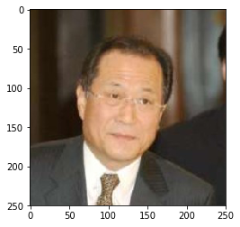


    Human
    input 2
    ------


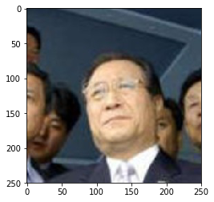


    Human
    input 3
    ------


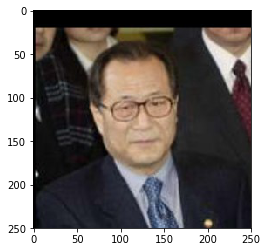


    Human
    input 4
    ------


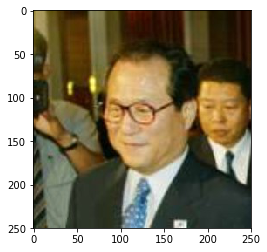


    Human
    input 5
    ------


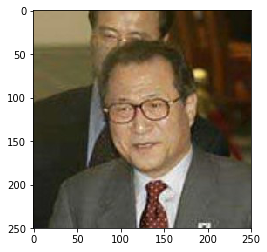


    Human
    input 6
    ------


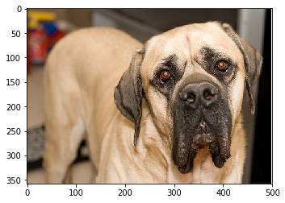


    Dog: Mastiff
    input 7
    ------


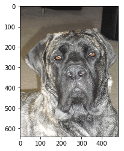


    Dog: Mastiff
    input 8
    ------


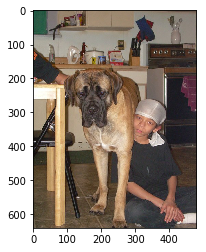


    Dog: Mastiff
    input 9
    ------


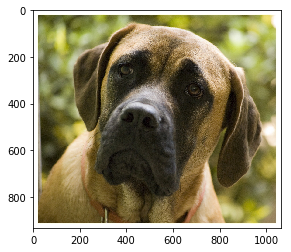


    Dog: Mastiff
    input 10
    ------


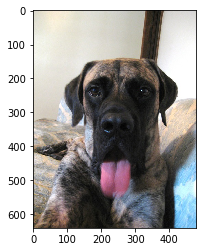


    Dog: Mastiff
    input 11
    ------


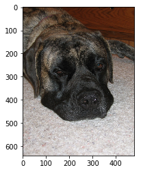


    Dog: Mastiff
    input 12
    ------


```python

```
