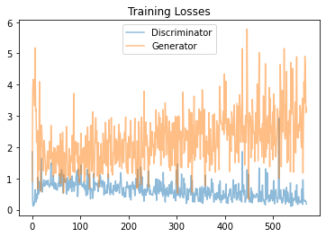
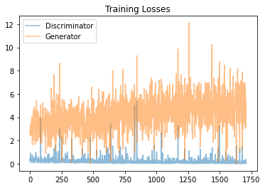

# Face Generation

In this project, you'll define and train a DCGAN on a dataset of faces. Your goal is to get a generator network to generate *new* images of faces that look as realistic as possible!

The project will be broken down into a series of tasks from **loading in data to defining and training adversarial networks**. At the end of the notebook, you'll be able to visualize the results of your trained Generator to see how it performs; your generated samples should look like fairly realistic faces with small amounts of noise.

### Get the Data

You'll be using the [CelebFaces Attributes Dataset (CelebA)](http://mmlab.ie.cuhk.edu.hk/projects/CelebA.html) to train your adversarial networks.

This dataset is more complex than the number datasets (like MNIST or SVHN) you've been working with, and so, you should prepare to define deeper networks and train them for a longer time to get good results. It is suggested that you utilize a GPU for training.

### Pre-processed Data

Since the project's main focus is on building the GANs, we've done *some* of the pre-processing for you. Each of the CelebA images has been cropped to remove parts of the image that don't include a face, then resized down to 64x64x3 NumPy images. Some sample data is show below.


> If you are working locally, you can download this data [by clicking here](https://s3.amazonaws.com/video.udacity-data.com/topher/2018/November/5be7eb6f_processed-celeba-small/processed-celeba-small.zip)

This is a zip file that you'll need to extract in the home directory of this notebook for further loading and processing. After extracting the data, you should be left with a directory of data `processed_celeba_small/`


```python
# can comment out after executing
# !unzip processed_celeba_small.zip
```


```python
data_dir = 'processed_celeba_small/'
"""
DON'T MODIFY ANYTHING IN THIS CELL
"""
import pickle as pkl
import matplotlib.pyplot as plt
import numpy as np
import problem_unittests as tests
#import helper

%matplotlib inline
```

## Visualize the CelebA Data

The [CelebA](http://mmlab.ie.cuhk.edu.hk/projects/CelebA.html) dataset contains over 200,000 celebrity images with annotations. Since you're going to be generating faces, you won't need the annotations, you'll only need the images. Note that these are color images with [3 color channels (RGB)](https://en.wikipedia.org/wiki/Channel_(digital_image)#RGB_Images) each.

### Pre-process and Load the Data

Since the project's main focus is on building the GANs, we've done *some* of the pre-processing for you. Each of the CelebA images has been cropped to remove parts of the image that don't include a face, then resized down to 64x64x3 NumPy images. This *pre-processed* dataset is a smaller subset of the very large CelebA data.

> There are a few other steps that you'll need to **transform** this data and create a **DataLoader**.

#### Exercise: Complete the following `get_dataloader` function, such that it satisfies these requirements:

* Your images should be square, Tensor images of size `image_size x image_size` in the x and y dimension.
* Your function should return a DataLoader that shuffles and batches these Tensor images.

#### ImageFolder

To create a dataset given a directory of images, it's recommended that you use PyTorch's [ImageFolder](https://pytorch.org/docs/stable/torchvision/datasets.html#imagefolder) wrapper, with a root directory `processed_celeba_small/` and data transformation passed in.


```python
# necessary imports
import torch
from torchvision import datasets
from torchvision import transforms
```


```python
def get_dataloader(batch_size, image_size, data_dir='processed_celeba_small/'):
    """
    Batch the neural network data using DataLoader
    :param batch_size: The size of each batch; the number of images in a batch
    :param img_size: The square size of the image data (x, y)
    :param data_dir: Directory where image data is located
    :return: DataLoader with batched data
    """
    
    # TODO: Implement function and return a dataloader
    transform_data = transforms.Compose([
        transforms.Resize(image_size),
        transforms.ToTensor()])
    data = datasets.ImageFolder(data_dir, transform=transform_data)
    data_loader = torch.utils.data.DataLoader(data, batch_size=batch_size, shuffle=True)
    return data_loader

```

## Create a DataLoader

#### Exercise: Create a DataLoader `celeba_train_loader` with appropriate hyperparameters.

Call the above function and create a dataloader to view images. 
* You can decide on any reasonable `batch_size` parameter
* Your `image_size` **must be** `32`. Resizing the data to a smaller size will make for faster training, while still creating convincing images of faces!


```python
# Define function hyperparameters
batch_size = 32
img_size = 32

"""
DON'T MODIFY ANYTHING IN THIS CELL THAT IS BELOW THIS LINE
"""
# Call your function and get a dataloader
celeba_train_loader = get_dataloader(batch_size, img_size)

```

Next, you can view some images! You should seen square images of somewhat-centered faces.

Note: You'll need to convert the Tensor images into a NumPy type and transpose the dimensions to correctly display an image, suggested `imshow` code is below, but it may not be perfect.


```python
# helper display function
def imshow(img):
    npimg = img.numpy()
    plt.imshow(np.transpose(npimg, (1, 2, 0)))

"""
DON'T MODIFY ANYTHING IN THIS CELL THAT IS BELOW THIS LINE
"""
# obtain one batch of training images
dataiter = iter(celeba_train_loader)
images, _ = dataiter.next() # _ for no labels

# plot the images in the batch, along with the corresponding labels
fig = plt.figure(figsize=(20, 4))
plot_size=20
for idx in np.arange(plot_size):
    ax = fig.add_subplot(2, plot_size/2, idx+1, xticks=[], yticks=[])
    imshow(images[idx])
```


#### Exercise: Pre-process your image data and scale it to a pixel range of -1 to 1

You need to do a bit of pre-processing; you know that the output of a `tanh` activated generator will contain pixel values in a range from -1 to 1, and so, we need to rescale our training images to a range of -1 to 1. (Right now, they are in a range from 0-1.)


```python
# TODO: Complete the scale function
def scale(x, feature_range=(-1, 1)):
    ''' Scale takes in an image x and returns that image, scaled
       with a feature_range of pixel values from -1 to 1. 
       This function assumes that the input x is already scaled from 0-1.'''
    # assume x is scaled to (0, 1)
    # scale to feature_range and return scaled x
    min_val, max_val = feature_range
    return (max_val - min_val) * x + min_val

```


```python
"""
DON'T MODIFY ANYTHING IN THIS CELL THAT IS BELOW THIS LINE
"""
# check scaled range
# should be close to -1 to 1
img = images[0]
scaled_img = scale(img)

print('Min: ', scaled_img.min())
print('Max: ', scaled_img.max())
```

    Min:  tensor(-0.9843)
    Max:  tensor(0.9373)


---
# Define the Model

A GAN is comprised of two adversarial networks, a discriminator and a generator.

## Discriminator

Your first task will be to define the discriminator. This is a convolutional classifier like you've built before, only without any maxpooling layers. To deal with this complex data, it's suggested you use a deep network with **normalization**. You are also allowed to create any helper functions that may be useful.

#### Exercise: Complete the Discriminator class
* The inputs to the discriminator are 32x32x3 tensor images
* The output should be a single value that will indicate whether a given image is real or fake


```python
import torch.nn as nn
import torch.nn.functional as F
```


```python
def convolution(inputs, outputs, k_size=4, stride=2, padding=1, batch_norm=True):
    layers = []
    layers.append(
        nn.Conv2d(inputs, outputs, kernel_size=k_size, stride=stride, padding=padding, bias=False)
    )
    if batch_norm:
        layers.append(nn.BatchNorm2d(outputs))
    return nn.Sequential(*layers)

def convolution_transpose(inputs, outputs, k_size=4, stride=2, padding=1, batch_norm=True):
    layers = []
    layers.append(
        nn.ConvTranspose2d(inputs, outputs, kernel_size=k_size, stride=stride, padding=padding, bias=False)
    )
    if batch_norm:
        layers.append(nn.BatchNorm2d(outputs))
    return nn.Sequential(*layers)
```


```python
class Discriminator(nn.Module):

    def __init__(self, conv_dim):
        """
        Initialize the Discriminator Module
        :param conv_dim: The depth of the first convolutional layer
        """
        super(Discriminator, self).__init__()

        # complete init function
        self.conv_dim = conv_dim
        # 3 RGB inputs, first layer
        # 3 x 32 x 32
        self.conv1 = convolution(3, conv_dim, batch_norm=False)
        # 16
        self.conv2 = convolution(conv_dim, conv_dim*2)
        # 8
        self.conv3 = convolution(conv_dim*2, conv_dim*4)
        # 4
        self.fc = nn.Linear(conv_dim*64, 1)

    def forward(self, x):
        """
        Forward propagation of the neural network
        :param x: The input to the neural network     
        :return: Discriminator logits; the output of the neural network
        """
        # define feedforward behavior
        c1_out = F.leaky_relu(self.conv1(x), 0.2)
        c2_out = F.leaky_relu(self.conv2(c1_out), 0.2)
        c3_out = F.leaky_relu(self.conv3(c2_out), 0.2)
        c_out = c3_out.view(-1, self.conv_dim*4*4*4)
        x = self.fc(c_out)
        return x


"""
DON'T MODIFY ANYTHING IN THIS CELL THAT IS BELOW THIS LINE
"""
tests.test_discriminator(Discriminator)
```

    Tests Passed


## Generator

The generator should upsample an input and generate a *new* image of the same size as our training data `32x32x3`. This should be mostly transpose convolutional layers with normalization applied to the outputs.

#### Exercise: Complete the Generator class
* The inputs to the generator are vectors of some length `z_size`
* The output should be a image of shape `32x32x3`


```python
class Generator(nn.Module):
    
    def __init__(self, z_size, conv_dim):
        """
        Initialize the Generator Module
        :param z_size: The length of the input latent vector, z
        :param conv_dim: The depth of the inputs to the *last* transpose convolutional layer
        """
        super(Generator, self).__init__()

        # complete init function
        self.z_size = z_size
        self.conv_dim = conv_dim
        self.fc = nn.Linear(z_size, self.conv_dim*4*4*4)
        self.conv2d_trans1 = convolution_transpose(self.conv_dim*4, self.conv_dim*2)
        self.conv2d_trans2 = convolution_transpose(self.conv_dim*2, self.conv_dim)
        # 3 RGB output
        self.conv2d_trans3 = convolution_transpose(self.conv_dim, 3, batch_norm=False)
        

    def forward(self, x):
        """
        Forward propagation of the neural network
        :param x: The input to the neural network     
        :return: A 32x32x3 Tensor image as output
        """
        # define feedforward behavior
        fc_out = self.fc(x)
        # reshape
        fc_out = fc_out.view(-1, self.conv_dim *4, 4, 4)
        
        out_conv_trans1 = F.relu(self.conv2d_trans1(fc_out))
        out_conv_trans2 = F.relu(self.conv2d_trans2(out_conv_trans1))
        out_conv_trans3 = self.conv2d_trans3(out_conv_trans2)
        x = torch.tanh(out_conv_trans3)
        return x

"""
DON'T MODIFY ANYTHING IN THIS CELL THAT IS BELOW THIS LINE
"""
tests.test_generator(Generator)
```

    Tests Passed


## Initialize the weights of your networks

To help your models converge, you should initialize the weights of the convolutional and linear layers in your model. From reading the [original DCGAN paper](https://arxiv.org/pdf/1511.06434.pdf), they say:
> All weights were initialized from a zero-centered Normal distribution with standard deviation 0.02.

So, your next task will be to define a weight initialization function that does just this!

You can refer back to the lesson on weight initialization or even consult existing model code, such as that from [the `networks.py` file in CycleGAN Github repository](https://github.com/junyanz/pytorch-CycleGAN-and-pix2pix/blob/master/models/networks.py) to help you complete this function.

#### Exercise: Complete the weight initialization function

* This should initialize only **convolutional** and **linear** layers
* Initialize the weights to a normal distribution, centered around 0, with a standard deviation of 0.02.
* The bias terms, if they exist, may be left alone or set to 0.


```python
def weights_init_normal(m):
    """
    Applies initial weights to certain layers in a model .
    The weights are taken from a normal distribution 
    with mean = 0, std dev = 0.02.
    :param m: A module or layer in a network    
    """
    # classname will be something like:
    # `Conv`, `BatchNorm2d`, `Linear`, etc.
    classname = m.__class__.__name__
    
    # TODO: Apply initial weights to convolutional and linear layers
    if 'Conv' in classname or 'Linear' in classname:
        torch.nn.init.normal_(m.weight.data, 0, 0.02)
    
```

## Build complete network

Define your models' hyperparameters and instantiate the discriminator and generator from the classes defined above. Make sure you've passed in the correct input arguments.

#### Exercise: Define model hyperparameters


```python
"""
DON'T MODIFY ANYTHING IN THIS CELL THAT IS BELOW THIS LINE
"""
def build_network(d_conv_dim, g_conv_dim, z_size):
    # define discriminator and generator
    D = Discriminator(d_conv_dim)
    G = Generator(z_size=z_size, conv_dim=g_conv_dim)

    # initialize model weights
    D.apply(weights_init_normal)
    G.apply(weights_init_normal)

    print(D)
    print()
    print(G)
    
    return D, G

```


```python
# Define model hyperparams
d_conv_dim = 32
g_conv_dim = 32
z_size = 512

"""
DON'T MODIFY ANYTHING IN THIS CELL THAT IS BELOW THIS LINE
"""
D, G = build_network(d_conv_dim, g_conv_dim, z_size)
```

    Discriminator(
      (conv1): Sequential(
        (0): Conv2d(3, 32, kernel_size=(4, 4), stride=(2, 2), padding=(1, 1), bias=False)
      )
      (conv2): Sequential(
        (0): Conv2d(32, 64, kernel_size=(4, 4), stride=(2, 2), padding=(1, 1), bias=False)
        (1): BatchNorm2d(64, eps=1e-05, momentum=0.1, affine=True, track_running_stats=True)
      )
      (conv3): Sequential(
        (0): Conv2d(64, 128, kernel_size=(4, 4), stride=(2, 2), padding=(1, 1), bias=False)
        (1): BatchNorm2d(128, eps=1e-05, momentum=0.1, affine=True, track_running_stats=True)
      )
      (fc): Linear(in_features=2048, out_features=1, bias=True)
    )
    
    Generator(
      (fc): Linear(in_features=512, out_features=2048, bias=True)
      (conv2d_trans1): Sequential(
        (0): ConvTranspose2d(128, 64, kernel_size=(4, 4), stride=(2, 2), padding=(1, 1), bias=False)
        (1): BatchNorm2d(64, eps=1e-05, momentum=0.1, affine=True, track_running_stats=True)
      )
      (conv2d_trans2): Sequential(
        (0): ConvTranspose2d(64, 32, kernel_size=(4, 4), stride=(2, 2), padding=(1, 1), bias=False)
        (1): BatchNorm2d(32, eps=1e-05, momentum=0.1, affine=True, track_running_stats=True)
      )
      (conv2d_trans3): Sequential(
        (0): ConvTranspose2d(32, 3, kernel_size=(4, 4), stride=(2, 2), padding=(1, 1), bias=False)
      )
    )


### Training on GPU

Check if you can train on GPU. Here, we'll set this as a boolean variable `train_on_gpu`. Later, you'll be responsible for making sure that 
>* Models,
* Model inputs, and
* Loss function arguments

Are moved to GPU, where appropriate.


```python
"""
DON'T MODIFY ANYTHING IN THIS CELL
"""
import torch

# Check for a GPU
train_on_gpu = torch.cuda.is_available()
if not train_on_gpu:
    print('No GPU found. Please use a GPU to train your neural network.')
else:
    print('Training on GPU!')
```

    Training on GPU!


---
## Discriminator and Generator Losses

Now we need to calculate the losses for both types of adversarial networks.

### Discriminator Losses

> * For the discriminator, the total loss is the sum of the losses for real and fake images, `d_loss = d_real_loss + d_fake_loss`. 
* Remember that we want the discriminator to output 1 for real images and 0 for fake images, so we need to set up the losses to reflect that.


### Generator Loss

The generator loss will look similar only with flipped labels. The generator's goal is to get the discriminator to *think* its generated images are *real*.

#### Exercise: Complete real and fake loss functions

**You may choose to use either cross entropy or a least squares error loss to complete the following `real_loss` and `fake_loss` functions.**


```python
def real_loss(D_out):
    '''Calculates how close discriminator outputs are to being real.
       param, D_out: discriminator logits
       return: real loss'''
    batch_size = D_out.size(0)
    #1s
    labels = torch.ones(batch_size)
    if train_on_gpu:
        labels = labels.cuda()
    criterion =nn.BCEWithLogitsLoss()
    loss = criterion(D_out.squeeze(), labels)
    return loss

def fake_loss(D_out):
    '''Calculates how close discriminator outputs are to being fake.
       param, D_out: discriminator logits
       return: fake loss'''
    batch_size = D_out.size(0)
    #0s
    labels = torch.zeros(batch_size)
    if train_on_gpu:
        labels = labels.cuda()
    criterion =nn.BCEWithLogitsLoss()
    loss = criterion(D_out.squeeze(), labels)
    return loss
```

## Optimizers

#### Exercise: Define optimizers for your Discriminator (D) and Generator (G)

Define optimizers for your models with appropriate hyperparameters.


```python
import torch.optim as optim

learning_rate = 0.0002
b1 = 0.5
b2 = 0.999
# Create optimizers for the discriminator D and generator G
d_optimizer = optim.Adam(D.parameters(), learning_rate, [b1, b2])
g_optimizer = optim.Adam(G.parameters(), learning_rate, [b1, b2])
```

---
## Training

Training will involve alternating between training the discriminator and the generator. You'll use your functions `real_loss` and `fake_loss` to help you calculate the discriminator losses.

* You should train the discriminator by alternating on real and fake images
* Then the generator, which tries to trick the discriminator and should have an opposing loss function


#### Saving Samples

You've been given some code to print out some loss statistics and save some generated "fake" samples.

#### Exercise: Complete the training function

Keep in mind that, if you've moved your models to GPU, you'll also have to move any model inputs to GPU.


```python
def train(D, G, n_epochs, print_every=50):
    '''Trains adversarial networks for some number of epochs
       param, D: the discriminator network
       param, G: the generator network
       param, n_epochs: number of epochs to train for
       param, print_every: when to print and record the models' losses
       return: D and G losses'''
    
    # move models to GPU
    if train_on_gpu:
        D.cuda()
        G.cuda()

    # keep track of loss and generated, "fake" samples
    samples = []
    losses = []

    # Get some fixed data for sampling. These are images that are held
    # constant throughout training, and allow us to inspect the model's performance
    sample_size=16
    fixed_z = np.random.uniform(-1, 1, size=(sample_size, z_size))
    fixed_z = torch.from_numpy(fixed_z).float()
    # move z to GPU if available
    if train_on_gpu:
        fixed_z = fixed_z.cuda()

    # epoch training loop
    for epoch in range(n_epochs):

        # batch training loop
        for batch_i, (real_images, _) in enumerate(celeba_train_loader):

            batch_size = real_images.size(0)
            real_images = scale(real_images)

            # ===============================================
            #         YOUR CODE HERE: TRAIN THE NETWORKS
            # ===============================================
            
            # 1. Train the discriminator on real and fake images
            d_optimizer.zero_grad()
            if train_on_gpu:
                real_images = real_images.cuda()
            # take real images, run them through discriminator
            D_real_logits = D(real_images)
            # get loss from discriminator based on real loss
            d_real_loss = real_loss(D_real_logits)
            
            # train discriminator with fake images
            z = np.random.uniform(-1, 1, size=(batch_size, z_size))
            z = torch.from_numpy(z).float()
            # move to gpu
            if train_on_gpu:
                z = z.cuda()
            # get fake images from generator
            fake_images = G(z)
            # compute loss of discriminator with fake images
            D_fake_logits = D(fake_images)
            d_fake_loss = fake_loss(D_fake_logits)
            
            d_loss = d_real_loss + d_fake_loss
            d_loss.backward()
            d_optimizer.step()

            # 2. Train the generator with an adversarial loss
            g_optimizer.zero_grad()
            # generate latent variable to get fake images
            z = np.random.uniform(-1, 1, size=(batch_size, z_size))
            z = torch.from_numpy(z).float()
            # move to gpu
            if train_on_gpu:
                z = z.cuda()
            # get fake images
            fake_images = G(z)
            # compute fake_logits from updated discriminator
            D_fake_logits = D(fake_images)
            # compute real_loss from fake_logits
            g_loss = real_loss(D_fake_logits)
            # backprop
            g_loss.backward()
            # update weights
            g_optimizer.step()
            # ===============================================
            #              END OF YOUR CODE
            # ===============================================

            # Print some loss stats
            if batch_i % print_every == 0:
                # append discriminator loss and generator loss
                losses.append((d_loss.item(), g_loss.item()))
                # print discriminator and generator loss
                print('Epoch [{:5d}/{:5d}] | d_loss: {:6.4f} | g_loss: {:6.4f}'.format(
                        epoch+1, n_epochs, d_loss.item(), g_loss.item()))


        ## AFTER EACH EPOCH##    
        # this code assumes your generator is named G, feel free to change the name
        # generate and save sample, fake images
        G.eval() # for generating samples
        samples_z = G(fixed_z)
        samples.append(samples_z)
        G.train() # back to training mode

    # Save training generator samples
    with open('train_samples.pkl', 'wb') as f:
        pkl.dump(samples, f)
    
    # finally return losses
    return losses
```

Set your number of training epochs and train your GAN!


```python
# set number of epochs 
n_epochs = 30


"""
DON'T MODIFY ANYTHING IN THIS CELL
"""
# call training function
losses = train(D, G, n_epochs=n_epochs)
```

    Epoch [    1/   30] | d_loss: 0.2978 | g_loss: 2.7857
    Epoch [    1/   30] | d_loss: 0.4608 | g_loss: 2.4949
    Epoch [    1/   30] | d_loss: 0.2595 | g_loss: 2.9644
    Epoch [    1/   30] | d_loss: 0.4469 | g_loss: 3.0971
    Epoch [    1/   30] | d_loss: 0.1389 | g_loss: 2.6158
    Epoch [    1/   30] | d_loss: 0.4310 | g_loss: 3.3882
    Epoch [    1/   30] | d_loss: 0.9298 | g_loss: 2.3962
    Epoch [    1/   30] | d_loss: 0.1550 | g_loss: 2.9391
    Epoch [    1/   30] | d_loss: 0.5881 | g_loss: 2.6839
    Epoch [    1/   30] | d_loss: 0.1660 | g_loss: 3.1669
    Epoch [    1/   30] | d_loss: 0.2416 | g_loss: 3.6607
    Epoch [    1/   30] | d_loss: 0.3832 | g_loss: 2.3983
    Epoch [    1/   30] | d_loss: 0.5496 | g_loss: 2.7001
    Epoch [    1/   30] | d_loss: 0.2536 | g_loss: 2.5388
    Epoch [    1/   30] | d_loss: 0.1950 | g_loss: 4.0191
    Epoch [    1/   30] | d_loss: 0.1361 | g_loss: 3.6194
    Epoch [    1/   30] | d_loss: 0.5558 | g_loss: 3.1674
    Epoch [    1/   30] | d_loss: 0.5580 | g_loss: 3.3974
    Epoch [    1/   30] | d_loss: 0.4194 | g_loss: 3.3286
    Epoch [    1/   30] | d_loss: 0.7616 | g_loss: 1.6162
    Epoch [    1/   30] | d_loss: 0.3904 | g_loss: 3.7172
    Epoch [    1/   30] | d_loss: 0.1387 | g_loss: 2.5864
    Epoch [    1/   30] | d_loss: 0.2355 | g_loss: 3.9224
    Epoch [    1/   30] | d_loss: 0.4129 | g_loss: 3.5439
    Epoch [    1/   30] | d_loss: 0.2346 | g_loss: 2.7585
    Epoch [    1/   30] | d_loss: 0.3556 | g_loss: 2.2326
    Epoch [    1/   30] | d_loss: 0.1316 | g_loss: 2.0460
    Epoch [    1/   30] | d_loss: 0.3161 | g_loss: 3.4290
    Epoch [    1/   30] | d_loss: 0.1096 | g_loss: 4.5512
    Epoch [    1/   30] | d_loss: 0.3569 | g_loss: 2.8176
    Epoch [    1/   30] | d_loss: 0.3659 | g_loss: 3.9047
    Epoch [    1/   30] | d_loss: 0.3728 | g_loss: 3.3746
    Epoch [    1/   30] | d_loss: 0.2869 | g_loss: 3.1663
    Epoch [    1/   30] | d_loss: 0.0652 | g_loss: 4.8620
    Epoch [    1/   30] | d_loss: 0.5593 | g_loss: 2.7274
    Epoch [    1/   30] | d_loss: 0.3024 | g_loss: 3.7338
    Epoch [    1/   30] | d_loss: 0.3150 | g_loss: 3.0196
    Epoch [    1/   30] | d_loss: 0.2602 | g_loss: 4.6490
    Epoch [    1/   30] | d_loss: 0.2592 | g_loss: 2.8605
    Epoch [    1/   30] | d_loss: 0.2318 | g_loss: 3.1157
    Epoch [    1/   30] | d_loss: 0.2819 | g_loss: 2.8384
    Epoch [    1/   30] | d_loss: 0.3578 | g_loss: 1.6607
    Epoch [    1/   30] | d_loss: 0.4200 | g_loss: 3.5237
    Epoch [    1/   30] | d_loss: 0.2310 | g_loss: 3.4271
    Epoch [    1/   30] | d_loss: 0.3805 | g_loss: 4.4298
    Epoch [    1/   30] | d_loss: 0.3229 | g_loss: 2.8210
    Epoch [    1/   30] | d_loss: 0.9842 | g_loss: 4.6640
    Epoch [    1/   30] | d_loss: 0.2882 | g_loss: 2.6216
    Epoch [    1/   30] | d_loss: 0.3219 | g_loss: 3.4895
    Epoch [    1/   30] | d_loss: 0.4414 | g_loss: 2.1543
    Epoch [    1/   30] | d_loss: 0.3502 | g_loss: 1.9315
    Epoch [    1/   30] | d_loss: 0.6956 | g_loss: 4.0608
    Epoch [    1/   30] | d_loss: 0.4457 | g_loss: 5.4465
    Epoch [    1/   30] | d_loss: 0.1741 | g_loss: 2.4911
    Epoch [    1/   30] | d_loss: 0.1033 | g_loss: 3.8731
    Epoch [    1/   30] | d_loss: 0.0791 | g_loss: 3.4715
    Epoch [    1/   30] | d_loss: 0.2137 | g_loss: 2.6631
    Epoch [    2/   30] | d_loss: 0.1908 | g_loss: 3.4599
    Epoch [    2/   30] | d_loss: 0.4524 | g_loss: 3.3199
    Epoch [    2/   30] | d_loss: 0.1533 | g_loss: 2.3493
    Epoch [    2/   30] | d_loss: 0.3508 | g_loss: 1.9595
    Epoch [    2/   30] | d_loss: 0.2008 | g_loss: 4.5472
    Epoch [    2/   30] | d_loss: 0.1589 | g_loss: 3.1526
    Epoch [    2/   30] | d_loss: 0.2800 | g_loss: 4.0037
    Epoch [    2/   30] | d_loss: 0.2543 | g_loss: 3.2884
    Epoch [    2/   30] | d_loss: 0.3572 | g_loss: 4.3262
    Epoch [    2/   30] | d_loss: 0.5893 | g_loss: 4.4392
    Epoch [    2/   30] | d_loss: 0.1331 | g_loss: 4.1205
    Epoch [    2/   30] | d_loss: 0.2227 | g_loss: 2.3223
    Epoch [    2/   30] | d_loss: 0.2004 | g_loss: 3.6519
    Epoch [    2/   30] | d_loss: 0.3324 | g_loss: 2.5636
    Epoch [    2/   30] | d_loss: 0.2456 | g_loss: 3.4642
    Epoch [    2/   30] | d_loss: 0.4100 | g_loss: 3.1243
    Epoch [    2/   30] | d_loss: 0.1388 | g_loss: 3.1253
    Epoch [    2/   30] | d_loss: 0.1176 | g_loss: 3.0705
    Epoch [    2/   30] | d_loss: 0.2247 | g_loss: 2.3126
    Epoch [    2/   30] | d_loss: 0.1937 | g_loss: 3.7953
    Epoch [    2/   30] | d_loss: 0.3116 | g_loss: 4.0541
    Epoch [    2/   30] | d_loss: 0.2129 | g_loss: 2.4791
    Epoch [    2/   30] | d_loss: 0.2100 | g_loss: 3.5814
    Epoch [    2/   30] | d_loss: 0.1624 | g_loss: 2.8294
    Epoch [    2/   30] | d_loss: 0.2722 | g_loss: 2.9879
    Epoch [    2/   30] | d_loss: 0.3972 | g_loss: 2.5116
    Epoch [    2/   30] | d_loss: 0.4689 | g_loss: 1.7476
    Epoch [    2/   30] | d_loss: 0.1353 | g_loss: 3.8090
    Epoch [    2/   30] | d_loss: 3.9572 | g_loss: 5.0705
    Epoch [    2/   30] | d_loss: 0.5067 | g_loss: 2.8333
    Epoch [    2/   30] | d_loss: 0.2099 | g_loss: 3.3796
    Epoch [    2/   30] | d_loss: 0.2806 | g_loss: 2.1874
    Epoch [    2/   30] | d_loss: 0.6378 | g_loss: 2.2962
    Epoch [    2/   30] | d_loss: 0.2597 | g_loss: 3.0943
    Epoch [    2/   30] | d_loss: 0.0566 | g_loss: 3.9313
    Epoch [    2/   30] | d_loss: 0.3751 | g_loss: 1.8714
    Epoch [    2/   30] | d_loss: 0.4438 | g_loss: 1.8237
    Epoch [    2/   30] | d_loss: 0.2440 | g_loss: 3.7655
    Epoch [    2/   30] | d_loss: 0.1917 | g_loss: 3.2077
    Epoch [    2/   30] | d_loss: 0.2558 | g_loss: 3.5232
    Epoch [    2/   30] | d_loss: 0.2527 | g_loss: 2.9452
    Epoch [    2/   30] | d_loss: 0.3068 | g_loss: 2.6012
    Epoch [    2/   30] | d_loss: 0.2321 | g_loss: 3.6312
    Epoch [    2/   30] | d_loss: 0.1635 | g_loss: 5.2512
    Epoch [    2/   30] | d_loss: 0.2415 | g_loss: 5.0032
    Epoch [    2/   30] | d_loss: 0.1460 | g_loss: 3.3732
    Epoch [    2/   30] | d_loss: 0.2843 | g_loss: 2.7694
    Epoch [    2/   30] | d_loss: 0.1649 | g_loss: 4.7846
    Epoch [    2/   30] | d_loss: 0.1485 | g_loss: 3.0398
    Epoch [    2/   30] | d_loss: 0.1581 | g_loss: 3.0469
    Epoch [    2/   30] | d_loss: 0.2291 | g_loss: 3.4901
    Epoch [    2/   30] | d_loss: 0.4390 | g_loss: 3.4655
    Epoch [    2/   30] | d_loss: 0.1371 | g_loss: 3.9756
    Epoch [    2/   30] | d_loss: 0.1056 | g_loss: 3.2111
    Epoch [    2/   30] | d_loss: 0.3811 | g_loss: 3.3559
    Epoch [    2/   30] | d_loss: 0.2014 | g_loss: 3.5977
    Epoch [    2/   30] | d_loss: 0.1980 | g_loss: 3.1802
    Epoch [    3/   30] | d_loss: 0.1114 | g_loss: 3.6594
    Epoch [    3/   30] | d_loss: 0.0730 | g_loss: 3.3162
    Epoch [    3/   30] | d_loss: 0.3258 | g_loss: 2.3550
    Epoch [    3/   30] | d_loss: 0.5937 | g_loss: 2.7952
    Epoch [    3/   30] | d_loss: 0.4398 | g_loss: 3.1635
    Epoch [    3/   30] | d_loss: 0.3833 | g_loss: 3.6094
    Epoch [    3/   30] | d_loss: 0.1594 | g_loss: 4.8357
    Epoch [    3/   30] | d_loss: 0.2259 | g_loss: 3.7916
    Epoch [    3/   30] | d_loss: 0.1388 | g_loss: 3.6342
    Epoch [    3/   30] | d_loss: 0.4791 | g_loss: 2.5606
    Epoch [    3/   30] | d_loss: 0.0903 | g_loss: 2.9323
    Epoch [    3/   30] | d_loss: 0.5370 | g_loss: 0.8501
    Epoch [    3/   30] | d_loss: 0.1456 | g_loss: 2.6011
    Epoch [    3/   30] | d_loss: 0.2392 | g_loss: 4.3836
    Epoch [    3/   30] | d_loss: 0.1935 | g_loss: 3.4297
    Epoch [    3/   30] | d_loss: 0.1822 | g_loss: 3.6956
    Epoch [    3/   30] | d_loss: 0.3208 | g_loss: 3.2247
    Epoch [    3/   30] | d_loss: 0.0597 | g_loss: 4.3116
    Epoch [    3/   30] | d_loss: 0.3790 | g_loss: 3.6537
    Epoch [    3/   30] | d_loss: 0.2393 | g_loss: 3.4490
    Epoch [    3/   30] | d_loss: 0.1917 | g_loss: 3.0832
    Epoch [    3/   30] | d_loss: 0.2775 | g_loss: 3.7373
    Epoch [    3/   30] | d_loss: 0.1516 | g_loss: 4.6769
    Epoch [    3/   30] | d_loss: 0.3233 | g_loss: 3.0393
    Epoch [    3/   30] | d_loss: 0.2090 | g_loss: 2.7433
    Epoch [    3/   30] | d_loss: 0.2955 | g_loss: 2.6987
    Epoch [    3/   30] | d_loss: 0.3817 | g_loss: 2.5447
    Epoch [    3/   30] | d_loss: 0.7981 | g_loss: 3.1714
    Epoch [    3/   30] | d_loss: 0.2997 | g_loss: 1.4080
    Epoch [    3/   30] | d_loss: 0.4555 | g_loss: 3.8253
    Epoch [    3/   30] | d_loss: 0.1470 | g_loss: 4.2718
    Epoch [    3/   30] | d_loss: 0.1358 | g_loss: 3.0855
    Epoch [    3/   30] | d_loss: 0.0849 | g_loss: 3.5531
    Epoch [    3/   30] | d_loss: 0.1706 | g_loss: 2.1629
    Epoch [    3/   30] | d_loss: 0.3032 | g_loss: 3.2945
    Epoch [    3/   30] | d_loss: 0.8577 | g_loss: 3.4289
    Epoch [    3/   30] | d_loss: 0.1861 | g_loss: 4.1808
    Epoch [    3/   30] | d_loss: 0.5163 | g_loss: 1.5391
    Epoch [    3/   30] | d_loss: 0.3994 | g_loss: 2.6532
    Epoch [    3/   30] | d_loss: 0.4314 | g_loss: 4.4894
    Epoch [    3/   30] | d_loss: 0.3299 | g_loss: 2.0885
    Epoch [    3/   30] | d_loss: 0.0865 | g_loss: 3.7674
    Epoch [    3/   30] | d_loss: 0.3640 | g_loss: 2.4063
    Epoch [    3/   30] | d_loss: 0.2785 | g_loss: 2.2146
    Epoch [    3/   30] | d_loss: 0.3083 | g_loss: 2.6671
    Epoch [    3/   30] | d_loss: 0.2030 | g_loss: 3.0125
    Epoch [    3/   30] | d_loss: 0.2757 | g_loss: 2.8763
    Epoch [    3/   30] | d_loss: 0.2119 | g_loss: 2.6034
    Epoch [    3/   30] | d_loss: 0.3068 | g_loss: 1.4186
    Epoch [    3/   30] | d_loss: 0.4695 | g_loss: 4.1015
    Epoch [    3/   30] | d_loss: 0.2215 | g_loss: 3.9752
    Epoch [    3/   30] | d_loss: 0.2274 | g_loss: 3.1877
    Epoch [    3/   30] | d_loss: 0.1423 | g_loss: 3.9608
    Epoch [    3/   30] | d_loss: 0.3239 | g_loss: 2.1721
    Epoch [    3/   30] | d_loss: 0.5386 | g_loss: 1.4399
    Epoch [    3/   30] | d_loss: 0.2184 | g_loss: 6.5114
    Epoch [    3/   30] | d_loss: 0.1956 | g_loss: 4.8649
    Epoch [    4/   30] | d_loss: 0.2941 | g_loss: 4.6592
    Epoch [    4/   30] | d_loss: 0.2576 | g_loss: 4.0127
    Epoch [    4/   30] | d_loss: 0.2681 | g_loss: 4.2293
    Epoch [    4/   30] | d_loss: 0.4161 | g_loss: 3.8515
    Epoch [    4/   30] | d_loss: 0.2708 | g_loss: 2.9076
    Epoch [    4/   30] | d_loss: 0.5020 | g_loss: 2.2068
    Epoch [    4/   30] | d_loss: 0.2639 | g_loss: 2.8266
    Epoch [    4/   30] | d_loss: 0.5912 | g_loss: 3.6738
    Epoch [    4/   30] | d_loss: 0.1821 | g_loss: 5.4224
    Epoch [    4/   30] | d_loss: 0.4700 | g_loss: 2.3601
    Epoch [    4/   30] | d_loss: 0.3927 | g_loss: 2.4189
    Epoch [    4/   30] | d_loss: 0.1199 | g_loss: 2.3715
    Epoch [    4/   30] | d_loss: 0.4716 | g_loss: 2.4108
    Epoch [    4/   30] | d_loss: 0.3013 | g_loss: 3.9171
    Epoch [    4/   30] | d_loss: 0.0780 | g_loss: 3.9764
    Epoch [    4/   30] | d_loss: 0.0912 | g_loss: 3.4417
    Epoch [    4/   30] | d_loss: 0.6913 | g_loss: 5.5441
    Epoch [    4/   30] | d_loss: 0.1467 | g_loss: 3.1680
    Epoch [    4/   30] | d_loss: 0.2046 | g_loss: 3.4988
    Epoch [    4/   30] | d_loss: 1.3046 | g_loss: 7.6842
    Epoch [    4/   30] | d_loss: 0.3645 | g_loss: 2.6123
    Epoch [    4/   30] | d_loss: 0.3686 | g_loss: 3.6912
    Epoch [    4/   30] | d_loss: 0.0946 | g_loss: 4.5221
    Epoch [    4/   30] | d_loss: 0.0639 | g_loss: 5.4047
    Epoch [    4/   30] | d_loss: 0.1726 | g_loss: 4.0460
    Epoch [    4/   30] | d_loss: 0.1791 | g_loss: 2.1460
    Epoch [    4/   30] | d_loss: 0.2982 | g_loss: 4.5451
    Epoch [    4/   30] | d_loss: 0.4790 | g_loss: 1.8225
    Epoch [    4/   30] | d_loss: 0.1154 | g_loss: 2.6378
    Epoch [    4/   30] | d_loss: 0.1730 | g_loss: 4.2397
    Epoch [    4/   30] | d_loss: 0.3480 | g_loss: 3.1060
    Epoch [    4/   30] | d_loss: 0.2278 | g_loss: 2.9725
    Epoch [    4/   30] | d_loss: 1.6136 | g_loss: 1.0620
    Epoch [    4/   30] | d_loss: 0.3801 | g_loss: 1.6084
    Epoch [    4/   30] | d_loss: 0.4710 | g_loss: 2.2981
    Epoch [    4/   30] | d_loss: 0.1907 | g_loss: 3.6019
    Epoch [    4/   30] | d_loss: 0.0644 | g_loss: 3.8145
    Epoch [    4/   30] | d_loss: 0.2308 | g_loss: 1.9924
    Epoch [    4/   30] | d_loss: 1.0292 | g_loss: 6.0406
    Epoch [    4/   30] | d_loss: 0.4231 | g_loss: 3.6655
    Epoch [    4/   30] | d_loss: 0.4722 | g_loss: 2.7565
    Epoch [    4/   30] | d_loss: 0.1866 | g_loss: 2.5109
    Epoch [    4/   30] | d_loss: 0.0951 | g_loss: 3.4501
    Epoch [    4/   30] | d_loss: 0.1133 | g_loss: 4.1601
    Epoch [    4/   30] | d_loss: 0.2629 | g_loss: 3.1766
    Epoch [    4/   30] | d_loss: 0.1183 | g_loss: 3.7701
    Epoch [    4/   30] | d_loss: 0.1451 | g_loss: 2.7135
    Epoch [    4/   30] | d_loss: 0.3414 | g_loss: 3.8044
    Epoch [    4/   30] | d_loss: 0.1509 | g_loss: 3.5868
    Epoch [    4/   30] | d_loss: 0.2882 | g_loss: 3.5147
    Epoch [    4/   30] | d_loss: 0.0805 | g_loss: 5.0942
    Epoch [    4/   30] | d_loss: 0.3998 | g_loss: 3.8190
    Epoch [    4/   30] | d_loss: 0.9159 | g_loss: 5.9415
    Epoch [    4/   30] | d_loss: 1.0661 | g_loss: 3.3616
    Epoch [    4/   30] | d_loss: 0.3611 | g_loss: 3.5302
    Epoch [    4/   30] | d_loss: 0.1152 | g_loss: 2.4471
    Epoch [    4/   30] | d_loss: 0.1533 | g_loss: 2.4501
    Epoch [    5/   30] | d_loss: 0.6464 | g_loss: 4.7762
    Epoch [    5/   30] | d_loss: 0.1312 | g_loss: 3.3539
    Epoch [    5/   30] | d_loss: 0.2981 | g_loss: 2.3819
    Epoch [    5/   30] | d_loss: 0.1467 | g_loss: 2.5822
    Epoch [    5/   30] | d_loss: 0.1304 | g_loss: 3.4856
    Epoch [    5/   30] | d_loss: 0.3541 | g_loss: 2.2301
    Epoch [    5/   30] | d_loss: 0.2081 | g_loss: 2.9812
    Epoch [    5/   30] | d_loss: 0.3539 | g_loss: 4.7787
    Epoch [    5/   30] | d_loss: 3.0464 | g_loss: 8.6453
    Epoch [    5/   30] | d_loss: 0.2201 | g_loss: 3.3565
    Epoch [    5/   30] | d_loss: 0.3064 | g_loss: 3.1631
    Epoch [    5/   30] | d_loss: 0.3307 | g_loss: 3.5888
    Epoch [    5/   30] | d_loss: 0.1577 | g_loss: 2.7992
    Epoch [    5/   30] | d_loss: 0.3623 | g_loss: 2.7828
    Epoch [    5/   30] | d_loss: 0.2068 | g_loss: 2.8058
    Epoch [    5/   30] | d_loss: 0.2516 | g_loss: 2.1851
    Epoch [    5/   30] | d_loss: 0.0578 | g_loss: 4.8446
    Epoch [    5/   30] | d_loss: 0.0956 | g_loss: 3.1931
    Epoch [    5/   30] | d_loss: 0.2056 | g_loss: 3.8853
    Epoch [    5/   30] | d_loss: 0.3425 | g_loss: 2.0887
    Epoch [    5/   30] | d_loss: 0.2162 | g_loss: 3.6364
    Epoch [    5/   30] | d_loss: 0.4165 | g_loss: 4.3513
    Epoch [    5/   30] | d_loss: 0.1806 | g_loss: 3.7639
    Epoch [    5/   30] | d_loss: 0.4209 | g_loss: 2.5059
    Epoch [    5/   30] | d_loss: 2.3087 | g_loss: 0.2281
    Epoch [    5/   30] | d_loss: 0.2462 | g_loss: 3.9165
    Epoch [    5/   30] | d_loss: 0.3463 | g_loss: 5.5545
    Epoch [    5/   30] | d_loss: 0.1368 | g_loss: 3.9760
    Epoch [    5/   30] | d_loss: 0.3446 | g_loss: 2.2893
    Epoch [    5/   30] | d_loss: 0.3756 | g_loss: 3.1498
    Epoch [    5/   30] | d_loss: 0.2103 | g_loss: 4.3312
    Epoch [    5/   30] | d_loss: 0.2844 | g_loss: 4.1729
    Epoch [    5/   30] | d_loss: 0.4034 | g_loss: 4.3193
    Epoch [    5/   30] | d_loss: 0.1423 | g_loss: 3.7483
    Epoch [    5/   30] | d_loss: 0.4998 | g_loss: 1.6640
    Epoch [    5/   30] | d_loss: 0.2379 | g_loss: 3.7438
    Epoch [    5/   30] | d_loss: 0.2755 | g_loss: 3.9816
    Epoch [    5/   30] | d_loss: 0.1363 | g_loss: 4.0540
    Epoch [    5/   30] | d_loss: 0.1931 | g_loss: 3.5210
    Epoch [    5/   30] | d_loss: 0.0947 | g_loss: 5.4887
    Epoch [    5/   30] | d_loss: 0.2580 | g_loss: 4.1160
    Epoch [    5/   30] | d_loss: 0.2275 | g_loss: 2.7861
    Epoch [    5/   30] | d_loss: 0.4100 | g_loss: 3.8209
    Epoch [    5/   30] | d_loss: 0.1707 | g_loss: 4.6208
    Epoch [    5/   30] | d_loss: 0.1538 | g_loss: 2.6337
    Epoch [    5/   30] | d_loss: 0.0700 | g_loss: 4.6177
    Epoch [    5/   30] | d_loss: 0.1744 | g_loss: 5.2801
    Epoch [    5/   30] | d_loss: 0.2550 | g_loss: 3.2766
    Epoch [    5/   30] | d_loss: 0.3984 | g_loss: 4.1132
    Epoch [    5/   30] | d_loss: 0.2681 | g_loss: 4.5866
    Epoch [    5/   30] | d_loss: 0.1147 | g_loss: 4.0879
    Epoch [    5/   30] | d_loss: 0.1210 | g_loss: 4.7532
    Epoch [    5/   30] | d_loss: 0.2059 | g_loss: 4.5851
    Epoch [    5/   30] | d_loss: 0.8880 | g_loss: 4.4520
    Epoch [    5/   30] | d_loss: 0.3808 | g_loss: 1.6561
    Epoch [    5/   30] | d_loss: 0.1213 | g_loss: 3.6527
    Epoch [    5/   30] | d_loss: 0.2993 | g_loss: 4.6426
    Epoch [    6/   30] | d_loss: 0.2097 | g_loss: 4.7426
    Epoch [    6/   30] | d_loss: 0.1111 | g_loss: 3.5434
    Epoch [    6/   30] | d_loss: 0.5288 | g_loss: 4.5489
    Epoch [    6/   30] | d_loss: 0.2110 | g_loss: 3.6808
    Epoch [    6/   30] | d_loss: 0.4191 | g_loss: 3.8525
    Epoch [    6/   30] | d_loss: 0.1166 | g_loss: 4.2287
    Epoch [    6/   30] | d_loss: 0.1345 | g_loss: 2.6686
    Epoch [    6/   30] | d_loss: 0.2302 | g_loss: 2.9140
    Epoch [    6/   30] | d_loss: 0.7323 | g_loss: 4.5793
    Epoch [    6/   30] | d_loss: 0.5043 | g_loss: 2.8103
    Epoch [    6/   30] | d_loss: 1.0332 | g_loss: 4.5322
    Epoch [    6/   30] | d_loss: 0.5425 | g_loss: 3.3958
    Epoch [    6/   30] | d_loss: 0.4156 | g_loss: 2.1944
    Epoch [    6/   30] | d_loss: 0.3964 | g_loss: 2.4743
    Epoch [    6/   30] | d_loss: 0.1088 | g_loss: 3.3731
    Epoch [    6/   30] | d_loss: 0.1145 | g_loss: 3.8280
    Epoch [    6/   30] | d_loss: 0.1835 | g_loss: 3.7409
    Epoch [    6/   30] | d_loss: 0.1386 | g_loss: 3.1798
    Epoch [    6/   30] | d_loss: 0.0840 | g_loss: 3.8864
    Epoch [    6/   30] | d_loss: 0.0943 | g_loss: 3.4203
    Epoch [    6/   30] | d_loss: 0.1589 | g_loss: 4.2347
    Epoch [    6/   30] | d_loss: 0.3168 | g_loss: 3.7717
    Epoch [    6/   30] | d_loss: 0.2407 | g_loss: 5.1123
    Epoch [    6/   30] | d_loss: 0.2225 | g_loss: 3.0464
    Epoch [    6/   30] | d_loss: 0.2040 | g_loss: 3.9523
    Epoch [    6/   30] | d_loss: 0.1909 | g_loss: 5.0381
    Epoch [    6/   30] | d_loss: 0.2329 | g_loss: 4.6352
    Epoch [    6/   30] | d_loss: 0.4090 | g_loss: 2.8577
    Epoch [    6/   30] | d_loss: 0.3393 | g_loss: 3.2467
    Epoch [    6/   30] | d_loss: 0.1052 | g_loss: 2.9830
    Epoch [    6/   30] | d_loss: 0.0936 | g_loss: 5.0908
    Epoch [    6/   30] | d_loss: 0.2130 | g_loss: 3.3423
    Epoch [    6/   30] | d_loss: 0.3045 | g_loss: 3.3206
    Epoch [    6/   30] | d_loss: 0.2048 | g_loss: 3.6378
    Epoch [    6/   30] | d_loss: 0.1044 | g_loss: 3.8102
    Epoch [    6/   30] | d_loss: 0.1783 | g_loss: 4.5865
    Epoch [    6/   30] | d_loss: 0.1332 | g_loss: 3.7519
    Epoch [    6/   30] | d_loss: 0.0605 | g_loss: 5.2749
    Epoch [    6/   30] | d_loss: 0.1284 | g_loss: 3.3430
    Epoch [    6/   30] | d_loss: 0.2917 | g_loss: 5.5634
    Epoch [    6/   30] | d_loss: 0.3196 | g_loss: 5.1062
    Epoch [    6/   30] | d_loss: 0.2575 | g_loss: 4.6692
    Epoch [    6/   30] | d_loss: 0.1688 | g_loss: 3.2985
    Epoch [    6/   30] | d_loss: 0.2686 | g_loss: 5.3219
    Epoch [    6/   30] | d_loss: 0.1864 | g_loss: 4.7625
    Epoch [    6/   30] | d_loss: 2.1063 | g_loss: 0.1232
    Epoch [    6/   30] | d_loss: 0.1553 | g_loss: 3.4389
    Epoch [    6/   30] | d_loss: 0.0840 | g_loss: 4.7332
    Epoch [    6/   30] | d_loss: 0.1208 | g_loss: 4.6447
    Epoch [    6/   30] | d_loss: 0.4979 | g_loss: 2.5523
    Epoch [    6/   30] | d_loss: 0.1694 | g_loss: 4.7888
    Epoch [    6/   30] | d_loss: 0.1756 | g_loss: 3.8050
    Epoch [    6/   30] | d_loss: 0.4626 | g_loss: 2.9727
    Epoch [    6/   30] | d_loss: 0.1114 | g_loss: 3.0645
    Epoch [    6/   30] | d_loss: 0.2515 | g_loss: 3.2751
    Epoch [    6/   30] | d_loss: 0.1083 | g_loss: 3.0454
    Epoch [    6/   30] | d_loss: 0.2202 | g_loss: 3.5936
    Epoch [    7/   30] | d_loss: 0.1615 | g_loss: 3.5792
    Epoch [    7/   30] | d_loss: 0.7560 | g_loss: 3.0802
    Epoch [    7/   30] | d_loss: 0.4453 | g_loss: 3.5051
    Epoch [    7/   30] | d_loss: 0.2238 | g_loss: 3.2440
    Epoch [    7/   30] | d_loss: 0.1768 | g_loss: 4.9288
    Epoch [    7/   30] | d_loss: 0.1303 | g_loss: 3.4238
    Epoch [    7/   30] | d_loss: 0.1477 | g_loss: 4.1861
    Epoch [    7/   30] | d_loss: 0.1495 | g_loss: 3.4176
    Epoch [    7/   30] | d_loss: 0.3095 | g_loss: 2.7286
    Epoch [    7/   30] | d_loss: 0.1689 | g_loss: 4.7398
    Epoch [    7/   30] | d_loss: 0.1722 | g_loss: 4.0870
    Epoch [    7/   30] | d_loss: 0.0448 | g_loss: 4.6951
    Epoch [    7/   30] | d_loss: 0.2181 | g_loss: 4.1596
    Epoch [    7/   30] | d_loss: 0.0479 | g_loss: 4.7225
    Epoch [    7/   30] | d_loss: 0.3828 | g_loss: 2.6244
    Epoch [    7/   30] | d_loss: 0.1607 | g_loss: 3.0747
    Epoch [    7/   30] | d_loss: 0.1825 | g_loss: 2.5421
    Epoch [    7/   30] | d_loss: 0.1850 | g_loss: 2.2134
    Epoch [    7/   30] | d_loss: 0.1554 | g_loss: 4.8336
    Epoch [    7/   30] | d_loss: 0.1117 | g_loss: 3.6109
    Epoch [    7/   30] | d_loss: 0.1156 | g_loss: 3.5097
    Epoch [    7/   30] | d_loss: 0.2384 | g_loss: 4.6304
    Epoch [    7/   30] | d_loss: 0.0969 | g_loss: 2.3634
    Epoch [    7/   30] | d_loss: 0.0528 | g_loss: 4.0072
    Epoch [    7/   30] | d_loss: 0.1065 | g_loss: 4.9690
    Epoch [    7/   30] | d_loss: 0.1476 | g_loss: 3.8743
    Epoch [    7/   30] | d_loss: 0.1524 | g_loss: 3.4798
    Epoch [    7/   30] | d_loss: 0.1667 | g_loss: 3.4287
    Epoch [    7/   30] | d_loss: 0.3356 | g_loss: 4.1589
    Epoch [    7/   30] | d_loss: 0.1922 | g_loss: 3.6485
    Epoch [    7/   30] | d_loss: 0.1378 | g_loss: 3.4244
    Epoch [    7/   30] | d_loss: 0.3342 | g_loss: 2.6731
    Epoch [    7/   30] | d_loss: 0.3966 | g_loss: 2.3586
    Epoch [    7/   30] | d_loss: 0.1137 | g_loss: 5.0296
    Epoch [    7/   30] | d_loss: 0.3018 | g_loss: 4.0729
    Epoch [    7/   30] | d_loss: 0.3720 | g_loss: 4.1074
    Epoch [    7/   30] | d_loss: 0.2917 | g_loss: 5.1332
    Epoch [    7/   30] | d_loss: 0.2540 | g_loss: 2.9346
    Epoch [    7/   30] | d_loss: 0.2416 | g_loss: 2.8685
    Epoch [    7/   30] | d_loss: 0.3972 | g_loss: 4.2737
    Epoch [    7/   30] | d_loss: 0.1667 | g_loss: 5.2315
    Epoch [    7/   30] | d_loss: 0.1434 | g_loss: 4.3348
    Epoch [    7/   30] | d_loss: 0.0515 | g_loss: 4.5996
    Epoch [    7/   30] | d_loss: 0.1189 | g_loss: 5.7984
    Epoch [    7/   30] | d_loss: 0.4164 | g_loss: 2.8110
    Epoch [    7/   30] | d_loss: 0.1715 | g_loss: 3.4272
    Epoch [    7/   30] | d_loss: 0.4035 | g_loss: 2.2680
    Epoch [    7/   30] | d_loss: 0.2845 | g_loss: 4.1308
    Epoch [    7/   30] | d_loss: 0.1789 | g_loss: 3.9876
    Epoch [    7/   30] | d_loss: 0.1741 | g_loss: 3.5065
    Epoch [    7/   30] | d_loss: 0.1769 | g_loss: 4.1549
    Epoch [    7/   30] | d_loss: 0.1352 | g_loss: 4.3744
    Epoch [    7/   30] | d_loss: 0.3863 | g_loss: 2.6327
    Epoch [    7/   30] | d_loss: 0.3124 | g_loss: 2.7467
    Epoch [    7/   30] | d_loss: 0.1631 | g_loss: 1.6353
    Epoch [    7/   30] | d_loss: 0.0878 | g_loss: 3.4528
    Epoch [    7/   30] | d_loss: 0.1192 | g_loss: 3.0091
    Epoch [    8/   30] | d_loss: 0.1709 | g_loss: 3.7475
    Epoch [    8/   30] | d_loss: 0.1391 | g_loss: 2.9161
    Epoch [    8/   30] | d_loss: 0.1649 | g_loss: 4.0644
    Epoch [    8/   30] | d_loss: 0.2069 | g_loss: 3.6827
    Epoch [    8/   30] | d_loss: 0.0930 | g_loss: 4.5640
    Epoch [    8/   30] | d_loss: 0.1988 | g_loss: 4.0566
    Epoch [    8/   30] | d_loss: 0.3427 | g_loss: 3.6679
    Epoch [    8/   30] | d_loss: 0.5115 | g_loss: 4.7742
    Epoch [    8/   30] | d_loss: 0.2272 | g_loss: 3.3879
    Epoch [    8/   30] | d_loss: 0.1840 | g_loss: 4.2372
    Epoch [    8/   30] | d_loss: 0.1342 | g_loss: 3.6410
    Epoch [    8/   30] | d_loss: 0.3330 | g_loss: 5.1537
    Epoch [    8/   30] | d_loss: 0.2800 | g_loss: 2.9516
    Epoch [    8/   30] | d_loss: 0.1302 | g_loss: 1.4146
    Epoch [    8/   30] | d_loss: 1.2960 | g_loss: 0.7184
    Epoch [    8/   30] | d_loss: 0.1763 | g_loss: 3.1376
    Epoch [    8/   30] | d_loss: 0.2094 | g_loss: 3.4928
    Epoch [    8/   30] | d_loss: 0.1292 | g_loss: 2.6594
    Epoch [    8/   30] | d_loss: 0.1444 | g_loss: 5.0193
    Epoch [    8/   30] | d_loss: 0.3182 | g_loss: 4.2247
    Epoch [    8/   30] | d_loss: 0.2664 | g_loss: 2.5807
    Epoch [    8/   30] | d_loss: 0.7140 | g_loss: 1.8998
    Epoch [    8/   30] | d_loss: 0.1653 | g_loss: 3.6393
    Epoch [    8/   30] | d_loss: 0.3201 | g_loss: 3.5559
    Epoch [    8/   30] | d_loss: 0.0890 | g_loss: 5.3746
    Epoch [    8/   30] | d_loss: 0.1672 | g_loss: 4.5047
    Epoch [    8/   30] | d_loss: 0.1885 | g_loss: 4.0518
    Epoch [    8/   30] | d_loss: 0.3188 | g_loss: 2.6264
    Epoch [    8/   30] | d_loss: 0.4192 | g_loss: 4.8038
    Epoch [    8/   30] | d_loss: 0.1315 | g_loss: 4.1561
    Epoch [    8/   30] | d_loss: 0.0994 | g_loss: 3.9033
    Epoch [    8/   30] | d_loss: 0.1043 | g_loss: 4.0249
    Epoch [    8/   30] | d_loss: 0.7688 | g_loss: 1.8387
    Epoch [    8/   30] | d_loss: 0.2253 | g_loss: 3.6294
    Epoch [    8/   30] | d_loss: 0.2250 | g_loss: 2.9613
    Epoch [    8/   30] | d_loss: 0.8859 | g_loss: 2.5238
    Epoch [    8/   30] | d_loss: 0.4480 | g_loss: 3.4230
    Epoch [    8/   30] | d_loss: 0.1981 | g_loss: 2.5576
    Epoch [    8/   30] | d_loss: 0.1717 | g_loss: 3.2747
    Epoch [    8/   30] | d_loss: 0.2614 | g_loss: 2.6715
    Epoch [    8/   30] | d_loss: 0.1430 | g_loss: 2.7508
    Epoch [    8/   30] | d_loss: 0.2363 | g_loss: 3.3495
    Epoch [    8/   30] | d_loss: 0.0874 | g_loss: 2.5958
    Epoch [    8/   30] | d_loss: 0.1767 | g_loss: 3.5016
    Epoch [    8/   30] | d_loss: 0.3184 | g_loss: 2.1942
    Epoch [    8/   30] | d_loss: 0.4046 | g_loss: 2.2767
    Epoch [    8/   30] | d_loss: 0.0198 | g_loss: 4.2351
    Epoch [    8/   30] | d_loss: 0.0647 | g_loss: 4.0853
    Epoch [    8/   30] | d_loss: 0.1371 | g_loss: 4.0627
    Epoch [    8/   30] | d_loss: 0.1050 | g_loss: 4.2913
    Epoch [    8/   30] | d_loss: 0.2070 | g_loss: 4.8157
    Epoch [    8/   30] | d_loss: 0.2697 | g_loss: 2.3300
    Epoch [    8/   30] | d_loss: 0.1227 | g_loss: 2.1488
    Epoch [    8/   30] | d_loss: 0.3753 | g_loss: 2.1519
    Epoch [    8/   30] | d_loss: 0.4125 | g_loss: 3.6617
    Epoch [    8/   30] | d_loss: 0.3106 | g_loss: 2.6816
    Epoch [    8/   30] | d_loss: 0.1903 | g_loss: 3.7941
    Epoch [    9/   30] | d_loss: 0.1081 | g_loss: 3.9171
    Epoch [    9/   30] | d_loss: 0.2022 | g_loss: 4.8587
    Epoch [    9/   30] | d_loss: 0.1522 | g_loss: 5.4762
    Epoch [    9/   30] | d_loss: 0.8924 | g_loss: 1.0223
    Epoch [    9/   30] | d_loss: 0.1962 | g_loss: 1.9858
    Epoch [    9/   30] | d_loss: 0.1015 | g_loss: 4.3735
    Epoch [    9/   30] | d_loss: 0.1021 | g_loss: 3.8181
    Epoch [    9/   30] | d_loss: 0.1500 | g_loss: 1.9041
    Epoch [    9/   30] | d_loss: 0.1413 | g_loss: 3.8365
    Epoch [    9/   30] | d_loss: 0.0813 | g_loss: 4.7956
    Epoch [    9/   30] | d_loss: 0.3043 | g_loss: 4.0421
    Epoch [    9/   30] | d_loss: 0.1608 | g_loss: 3.8203
    Epoch [    9/   30] | d_loss: 0.4534 | g_loss: 2.6860
    Epoch [    9/   30] | d_loss: 0.2908 | g_loss: 2.4312
    Epoch [    9/   30] | d_loss: 0.3529 | g_loss: 4.7117
    Epoch [    9/   30] | d_loss: 0.2767 | g_loss: 4.1477
    Epoch [    9/   30] | d_loss: 0.1181 | g_loss: 3.9848
    Epoch [    9/   30] | d_loss: 0.0497 | g_loss: 3.6965
    Epoch [    9/   30] | d_loss: 0.1146 | g_loss: 3.6825
    Epoch [    9/   30] | d_loss: 0.1725 | g_loss: 4.3032
    Epoch [    9/   30] | d_loss: 2.2912 | g_loss: 0.0254
    Epoch [    9/   30] | d_loss: 0.2279 | g_loss: 2.9154
    Epoch [    9/   30] | d_loss: 0.2137 | g_loss: 2.6545
    Epoch [    9/   30] | d_loss: 0.0708 | g_loss: 2.8290
    Epoch [    9/   30] | d_loss: 0.1501 | g_loss: 3.3253
    Epoch [    9/   30] | d_loss: 0.0951 | g_loss: 3.7892
    Epoch [    9/   30] | d_loss: 0.1356 | g_loss: 2.4584
    Epoch [    9/   30] | d_loss: 0.3732 | g_loss: 4.2285
    Epoch [    9/   30] | d_loss: 0.1047 | g_loss: 2.7879
    Epoch [    9/   30] | d_loss: 0.3381 | g_loss: 3.1484
    Epoch [    9/   30] | d_loss: 0.1081 | g_loss: 5.5739
    Epoch [    9/   30] | d_loss: 0.1723 | g_loss: 6.6102
    Epoch [    9/   30] | d_loss: 0.4308 | g_loss: 2.7707
    Epoch [    9/   30] | d_loss: 0.0847 | g_loss: 4.1736
    Epoch [    9/   30] | d_loss: 0.0778 | g_loss: 5.2708
    Epoch [    9/   30] | d_loss: 0.1932 | g_loss: 4.3399
    Epoch [    9/   30] | d_loss: 0.3678 | g_loss: 4.1772
    Epoch [    9/   30] | d_loss: 0.1431 | g_loss: 2.8269
    Epoch [    9/   30] | d_loss: 0.0720 | g_loss: 5.6105
    Epoch [    9/   30] | d_loss: 0.1732 | g_loss: 5.0622
    Epoch [    9/   30] | d_loss: 0.3154 | g_loss: 1.9125
    Epoch [    9/   30] | d_loss: 0.2315 | g_loss: 4.5944
    Epoch [    9/   30] | d_loss: 0.3113 | g_loss: 5.6172
    Epoch [    9/   30] | d_loss: 0.4573 | g_loss: 3.8435
    Epoch [    9/   30] | d_loss: 0.2250 | g_loss: 3.5381
    Epoch [    9/   30] | d_loss: 0.2336 | g_loss: 4.2596
    Epoch [    9/   30] | d_loss: 0.3010 | g_loss: 3.8234
    Epoch [    9/   30] | d_loss: 0.3008 | g_loss: 2.9898
    Epoch [    9/   30] | d_loss: 0.0899 | g_loss: 5.4134
    Epoch [    9/   30] | d_loss: 0.2605 | g_loss: 4.2547
    Epoch [    9/   30] | d_loss: 0.1619 | g_loss: 5.3936
    Epoch [    9/   30] | d_loss: 0.0536 | g_loss: 4.0473
    Epoch [    9/   30] | d_loss: 0.1285 | g_loss: 2.1903
    Epoch [    9/   30] | d_loss: 0.1471 | g_loss: 3.3566
    Epoch [    9/   30] | d_loss: 0.0882 | g_loss: 3.1896
    Epoch [    9/   30] | d_loss: 0.2589 | g_loss: 2.7784
    Epoch [    9/   30] | d_loss: 0.1580 | g_loss: 4.2708
    Epoch [   10/   30] | d_loss: 0.3342 | g_loss: 2.6610
    Epoch [   10/   30] | d_loss: 0.1835 | g_loss: 2.7686
    Epoch [   10/   30] | d_loss: 0.0747 | g_loss: 3.8231
    Epoch [   10/   30] | d_loss: 0.3019 | g_loss: 2.7496
    Epoch [   10/   30] | d_loss: 0.2615 | g_loss: 4.2422
    Epoch [   10/   30] | d_loss: 0.2514 | g_loss: 3.2441
    Epoch [   10/   30] | d_loss: 0.2327 | g_loss: 3.0780
    Epoch [   10/   30] | d_loss: 0.0907 | g_loss: 4.0953
    Epoch [   10/   30] | d_loss: 0.0612 | g_loss: 2.9212
    Epoch [   10/   30] | d_loss: 0.1302 | g_loss: 4.3285
    Epoch [   10/   30] | d_loss: 0.1045 | g_loss: 3.6990
    Epoch [   10/   30] | d_loss: 0.1427 | g_loss: 4.7689
    Epoch [   10/   30] | d_loss: 0.2651 | g_loss: 2.0663
    Epoch [   10/   30] | d_loss: 1.1815 | g_loss: 0.6472
    Epoch [   10/   30] | d_loss: 0.1942 | g_loss: 4.1901
    Epoch [   10/   30] | d_loss: 0.2013 | g_loss: 4.2505
    Epoch [   10/   30] | d_loss: 0.1844 | g_loss: 2.4927
    Epoch [   10/   30] | d_loss: 0.3526 | g_loss: 3.4024
    Epoch [   10/   30] | d_loss: 0.0942 | g_loss: 3.7775
    Epoch [   10/   30] | d_loss: 0.0336 | g_loss: 4.9018
    Epoch [   10/   30] | d_loss: 0.2483 | g_loss: 3.8913
    Epoch [   10/   30] | d_loss: 0.1759 | g_loss: 4.9659
    Epoch [   10/   30] | d_loss: 0.0967 | g_loss: 4.7143
    Epoch [   10/   30] | d_loss: 0.1103 | g_loss: 3.6039
    Epoch [   10/   30] | d_loss: 0.0804 | g_loss: 4.4523
    Epoch [   10/   30] | d_loss: 0.2418 | g_loss: 2.4055
    Epoch [   10/   30] | d_loss: 0.2584 | g_loss: 5.5167
    Epoch [   10/   30] | d_loss: 0.1147 | g_loss: 4.7395
    Epoch [   10/   30] | d_loss: 0.0692 | g_loss: 4.5984
    Epoch [   10/   30] | d_loss: 0.4634 | g_loss: 3.1348
    Epoch [   10/   30] | d_loss: 0.4125 | g_loss: 6.4272
    Epoch [   10/   30] | d_loss: 0.1622 | g_loss: 4.1414
    Epoch [   10/   30] | d_loss: 0.4433 | g_loss: 2.9766
    Epoch [   10/   30] | d_loss: 0.2289 | g_loss: 4.8128
    Epoch [   10/   30] | d_loss: 0.2341 | g_loss: 4.5804
    Epoch [   10/   30] | d_loss: 0.5614 | g_loss: 2.8870
    Epoch [   10/   30] | d_loss: 0.2992 | g_loss: 2.1160
    Epoch [   10/   30] | d_loss: 0.0887 | g_loss: 3.7008
    Epoch [   10/   30] | d_loss: 0.2441 | g_loss: 2.4587
    Epoch [   10/   30] | d_loss: 0.2501 | g_loss: 3.7269
    Epoch [   10/   30] | d_loss: 0.1980 | g_loss: 3.9493
    Epoch [   10/   30] | d_loss: 0.0591 | g_loss: 3.6250
    Epoch [   10/   30] | d_loss: 0.2692 | g_loss: 5.2120
    Epoch [   10/   30] | d_loss: 0.0483 | g_loss: 4.1351
    Epoch [   10/   30] | d_loss: 1.1324 | g_loss: 5.0657
    Epoch [   10/   30] | d_loss: 0.1628 | g_loss: 4.1734
    Epoch [   10/   30] | d_loss: 0.1968 | g_loss: 2.1745
    Epoch [   10/   30] | d_loss: 0.3678 | g_loss: 4.1994
    Epoch [   10/   30] | d_loss: 0.1258 | g_loss: 5.2825
    Epoch [   10/   30] | d_loss: 0.1244 | g_loss: 3.8390
    Epoch [   10/   30] | d_loss: 0.1965 | g_loss: 3.3275
    Epoch [   10/   30] | d_loss: 0.1837 | g_loss: 3.6058
    Epoch [   10/   30] | d_loss: 0.1319 | g_loss: 5.1594
    Epoch [   10/   30] | d_loss: 0.0931 | g_loss: 2.9248
    Epoch [   10/   30] | d_loss: 0.1529 | g_loss: 3.8727
    Epoch [   10/   30] | d_loss: 0.3031 | g_loss: 2.7661
    Epoch [   10/   30] | d_loss: 0.2055 | g_loss: 3.2068
    Epoch [   11/   30] | d_loss: 0.4982 | g_loss: 2.8035
    Epoch [   11/   30] | d_loss: 0.7632 | g_loss: 6.2005
    Epoch [   11/   30] | d_loss: 0.2032 | g_loss: 3.8426
    Epoch [   11/   30] | d_loss: 0.4522 | g_loss: 2.6830
    Epoch [   11/   30] | d_loss: 0.0653 | g_loss: 4.2224
    Epoch [   11/   30] | d_loss: 0.3993 | g_loss: 2.0576
    Epoch [   11/   30] | d_loss: 0.2550 | g_loss: 2.9747
    Epoch [   11/   30] | d_loss: 0.0586 | g_loss: 4.5089
    Epoch [   11/   30] | d_loss: 0.1833 | g_loss: 3.4887
    Epoch [   11/   30] | d_loss: 0.2629 | g_loss: 4.4324
    Epoch [   11/   30] | d_loss: 0.0813 | g_loss: 3.5156
    Epoch [   11/   30] | d_loss: 0.2207 | g_loss: 6.1878
    Epoch [   11/   30] | d_loss: 0.2558 | g_loss: 2.6255
    Epoch [   11/   30] | d_loss: 0.0716 | g_loss: 3.2614
    Epoch [   11/   30] | d_loss: 0.1661 | g_loss: 4.8901
    Epoch [   11/   30] | d_loss: 0.1601 | g_loss: 4.2378
    Epoch [   11/   30] | d_loss: 0.0481 | g_loss: 4.5544
    Epoch [   11/   30] | d_loss: 0.1554 | g_loss: 4.2891
    Epoch [   11/   30] | d_loss: 0.3122 | g_loss: 2.7627
    Epoch [   11/   30] | d_loss: 0.7248 | g_loss: 1.3813
    Epoch [   11/   30] | d_loss: 0.2957 | g_loss: 4.7147
    Epoch [   11/   30] | d_loss: 0.1799 | g_loss: 3.4670
    Epoch [   11/   30] | d_loss: 0.0919 | g_loss: 4.9692
    Epoch [   11/   30] | d_loss: 0.2457 | g_loss: 3.9973
    Epoch [   11/   30] | d_loss: 0.2815 | g_loss: 3.2511
    Epoch [   11/   30] | d_loss: 0.2207 | g_loss: 4.2101
    Epoch [   11/   30] | d_loss: 0.3109 | g_loss: 1.8050
    Epoch [   11/   30] | d_loss: 0.2454 | g_loss: 2.9072
    Epoch [   11/   30] | d_loss: 0.0440 | g_loss: 3.7466
    Epoch [   11/   30] | d_loss: 0.1852 | g_loss: 3.8630
    Epoch [   11/   30] | d_loss: 0.3280 | g_loss: 5.3519
    Epoch [   11/   30] | d_loss: 0.7244 | g_loss: 3.9937
    Epoch [   11/   30] | d_loss: 0.1479 | g_loss: 4.3590
    Epoch [   11/   30] | d_loss: 0.1610 | g_loss: 4.7747
    Epoch [   11/   30] | d_loss: 0.3013 | g_loss: 3.3574
    Epoch [   11/   30] | d_loss: 0.0660 | g_loss: 5.5961
    Epoch [   11/   30] | d_loss: 1.4378 | g_loss: 0.9705
    Epoch [   11/   30] | d_loss: 0.0455 | g_loss: 3.7824
    Epoch [   11/   30] | d_loss: 0.1174 | g_loss: 4.1397
    Epoch [   11/   30] | d_loss: 0.1571 | g_loss: 3.5648
    Epoch [   11/   30] | d_loss: 0.3005 | g_loss: 4.3733
    Epoch [   11/   30] | d_loss: 0.0809 | g_loss: 3.9393
    Epoch [   11/   30] | d_loss: 0.0767 | g_loss: 3.1729
    Epoch [   11/   30] | d_loss: 0.1235 | g_loss: 4.2181
    Epoch [   11/   30] | d_loss: 0.1792 | g_loss: 3.1366
    Epoch [   11/   30] | d_loss: 0.2852 | g_loss: 2.7651
    Epoch [   11/   30] | d_loss: 0.4054 | g_loss: 3.9826
    Epoch [   11/   30] | d_loss: 1.3067 | g_loss: 2.7454
    Epoch [   11/   30] | d_loss: 0.2024 | g_loss: 2.7887
    Epoch [   11/   30] | d_loss: 0.2434 | g_loss: 5.8383
    Epoch [   11/   30] | d_loss: 0.3187 | g_loss: 3.3744
    Epoch [   11/   30] | d_loss: 0.1106 | g_loss: 2.6942
    Epoch [   11/   30] | d_loss: 0.0872 | g_loss: 5.0067
    Epoch [   11/   30] | d_loss: 0.0742 | g_loss: 2.8650
    Epoch [   11/   30] | d_loss: 0.0503 | g_loss: 4.1313
    Epoch [   11/   30] | d_loss: 0.1354 | g_loss: 4.1704
    Epoch [   11/   30] | d_loss: 0.1732 | g_loss: 4.2415
    Epoch [   12/   30] | d_loss: 0.8432 | g_loss: 1.2737
    Epoch [   12/   30] | d_loss: 0.3394 | g_loss: 5.7726
    Epoch [   12/   30] | d_loss: 0.0897 | g_loss: 6.0534
    Epoch [   12/   30] | d_loss: 0.1606 | g_loss: 4.9319
    Epoch [   12/   30] | d_loss: 0.0841 | g_loss: 4.5642
    Epoch [   12/   30] | d_loss: 0.1566 | g_loss: 4.8655
    Epoch [   12/   30] | d_loss: 0.1861 | g_loss: 4.6282
    Epoch [   12/   30] | d_loss: 0.1116 | g_loss: 2.1058
    Epoch [   12/   30] | d_loss: 0.1846 | g_loss: 4.6195
    Epoch [   12/   30] | d_loss: 0.5586 | g_loss: 1.9684
    Epoch [   12/   30] | d_loss: 0.1667 | g_loss: 3.7280
    Epoch [   12/   30] | d_loss: 3.3784 | g_loss: 0.2260
    Epoch [   12/   30] | d_loss: 0.2196 | g_loss: 3.5193
    Epoch [   12/   30] | d_loss: 0.2244 | g_loss: 4.2346
    Epoch [   12/   30] | d_loss: 0.2109 | g_loss: 4.0837
    Epoch [   12/   30] | d_loss: 0.1100 | g_loss: 4.6461
    Epoch [   12/   30] | d_loss: 0.0968 | g_loss: 4.9592
    Epoch [   12/   30] | d_loss: 0.0564 | g_loss: 4.9369
    Epoch [   12/   30] | d_loss: 0.0436 | g_loss: 5.3934
    Epoch [   12/   30] | d_loss: 0.0643 | g_loss: 5.1478
    Epoch [   12/   30] | d_loss: 0.2257 | g_loss: 3.7845
    Epoch [   12/   30] | d_loss: 0.2320 | g_loss: 3.0857
    Epoch [   12/   30] | d_loss: 0.3323 | g_loss: 4.8502
    Epoch [   12/   30] | d_loss: 0.2228 | g_loss: 5.5729
    Epoch [   12/   30] | d_loss: 0.1518 | g_loss: 3.3201
    Epoch [   12/   30] | d_loss: 0.0979 | g_loss: 5.1491
    Epoch [   12/   30] | d_loss: 0.0365 | g_loss: 3.1442
    Epoch [   12/   30] | d_loss: 1.5757 | g_loss: 8.0124
    Epoch [   12/   30] | d_loss: 0.2261 | g_loss: 4.4868
    Epoch [   12/   30] | d_loss: 0.0498 | g_loss: 3.7174
    Epoch [   12/   30] | d_loss: 0.2190 | g_loss: 2.1635
    Epoch [   12/   30] | d_loss: 0.3084 | g_loss: 2.5293
    Epoch [   12/   30] | d_loss: 0.1005 | g_loss: 3.1535
    Epoch [   12/   30] | d_loss: 0.4616 | g_loss: 5.3778
    Epoch [   12/   30] | d_loss: 0.0933 | g_loss: 4.1021
    Epoch [   12/   30] | d_loss: 0.1385 | g_loss: 4.2680
    Epoch [   12/   30] | d_loss: 0.1365 | g_loss: 4.7145
    Epoch [   12/   30] | d_loss: 0.3354 | g_loss: 3.9153
    Epoch [   12/   30] | d_loss: 0.0653 | g_loss: 4.2483
    Epoch [   12/   30] | d_loss: 0.2578 | g_loss: 3.9683
    Epoch [   12/   30] | d_loss: 0.2208 | g_loss: 3.5264
    Epoch [   12/   30] | d_loss: 0.0114 | g_loss: 4.5340
    Epoch [   12/   30] | d_loss: 0.1951 | g_loss: 4.3242
    Epoch [   12/   30] | d_loss: 0.1160 | g_loss: 2.9567
    Epoch [   12/   30] | d_loss: 0.2408 | g_loss: 4.5037
    Epoch [   12/   30] | d_loss: 0.1636 | g_loss: 5.5774
    Epoch [   12/   30] | d_loss: 0.2992 | g_loss: 3.6260
    Epoch [   12/   30] | d_loss: 0.0496 | g_loss: 4.0742
    Epoch [   12/   30] | d_loss: 0.2410 | g_loss: 3.7186
    Epoch [   12/   30] | d_loss: 0.2126 | g_loss: 2.9329
    Epoch [   12/   30] | d_loss: 0.3437 | g_loss: 3.6935
    Epoch [   12/   30] | d_loss: 0.1384 | g_loss: 4.2496
    Epoch [   12/   30] | d_loss: 0.7112 | g_loss: 6.4278
    Epoch [   12/   30] | d_loss: 0.1653 | g_loss: 3.2316
    Epoch [   12/   30] | d_loss: 0.0536 | g_loss: 4.7438
    Epoch [   12/   30] | d_loss: 0.1052 | g_loss: 2.9285
    Epoch [   12/   30] | d_loss: 0.0960 | g_loss: 5.1874
    Epoch [   13/   30] | d_loss: 0.0489 | g_loss: 4.6782
    Epoch [   13/   30] | d_loss: 0.1534 | g_loss: 4.8808
    Epoch [   13/   30] | d_loss: 0.1596 | g_loss: 5.0502
    Epoch [   13/   30] | d_loss: 0.1892 | g_loss: 4.1717
    Epoch [   13/   30] | d_loss: 0.1783 | g_loss: 3.8878
    Epoch [   13/   30] | d_loss: 0.0625 | g_loss: 5.2033
    Epoch [   13/   30] | d_loss: 0.2868 | g_loss: 4.3060
    Epoch [   13/   30] | d_loss: 0.2389 | g_loss: 3.3214
    Epoch [   13/   30] | d_loss: 0.1501 | g_loss: 4.8679
    Epoch [   13/   30] | d_loss: 0.1188 | g_loss: 3.4664
    Epoch [   13/   30] | d_loss: 0.2039 | g_loss: 5.4370
    Epoch [   13/   30] | d_loss: 0.2068 | g_loss: 1.3141
    Epoch [   13/   30] | d_loss: 0.5150 | g_loss: 3.4440
    Epoch [   13/   30] | d_loss: 0.1907 | g_loss: 3.9054
    Epoch [   13/   30] | d_loss: 0.1447 | g_loss: 2.8327
    Epoch [   13/   30] | d_loss: 0.0479 | g_loss: 2.8682
    Epoch [   13/   30] | d_loss: 0.4729 | g_loss: 3.6219
    Epoch [   13/   30] | d_loss: 0.2679 | g_loss: 4.2321
    Epoch [   13/   30] | d_loss: 0.1618 | g_loss: 4.0670
    Epoch [   13/   30] | d_loss: 0.2584 | g_loss: 4.2427
    Epoch [   13/   30] | d_loss: 0.1309 | g_loss: 5.2692
    Epoch [   13/   30] | d_loss: 0.1705 | g_loss: 4.0608
    Epoch [   13/   30] | d_loss: 1.1207 | g_loss: 0.9702
    Epoch [   13/   30] | d_loss: 0.1080 | g_loss: 2.9763
    Epoch [   13/   30] | d_loss: 0.1602 | g_loss: 5.2434
    Epoch [   13/   30] | d_loss: 0.0489 | g_loss: 4.1723
    Epoch [   13/   30] | d_loss: 0.0503 | g_loss: 5.3587
    Epoch [   13/   30] | d_loss: 0.1608 | g_loss: 3.6125
    Epoch [   13/   30] | d_loss: 0.0356 | g_loss: 5.8811
    Epoch [   13/   30] | d_loss: 0.1343 | g_loss: 4.4549
    Epoch [   13/   30] | d_loss: 0.1764 | g_loss: 4.8085
    Epoch [   13/   30] | d_loss: 1.4871 | g_loss: 5.5896
    Epoch [   13/   30] | d_loss: 0.0602 | g_loss: 6.7155
    Epoch [   13/   30] | d_loss: 0.2607 | g_loss: 5.9182
    Epoch [   13/   30] | d_loss: 0.4956 | g_loss: 3.9010
    Epoch [   13/   30] | d_loss: 0.2852 | g_loss: 3.9953
    Epoch [   13/   30] | d_loss: 0.1952 | g_loss: 4.3660
    Epoch [   13/   30] | d_loss: 0.1205 | g_loss: 5.4874
    Epoch [   13/   30] | d_loss: 0.0310 | g_loss: 5.9154
    Epoch [   13/   30] | d_loss: 0.2136 | g_loss: 3.8331
    Epoch [   13/   30] | d_loss: 0.0848 | g_loss: 4.5064
    Epoch [   13/   30] | d_loss: 0.1279 | g_loss: 4.7441
    Epoch [   13/   30] | d_loss: 0.0883 | g_loss: 4.3532
    Epoch [   13/   30] | d_loss: 0.4439 | g_loss: 5.0478
    Epoch [   13/   30] | d_loss: 0.1299 | g_loss: 4.9049
    Epoch [   13/   30] | d_loss: 0.0683 | g_loss: 5.0143
    Epoch [   13/   30] | d_loss: 0.7354 | g_loss: 2.3742
    Epoch [   13/   30] | d_loss: 0.1958 | g_loss: 3.0449
    Epoch [   13/   30] | d_loss: 0.1045 | g_loss: 3.7552
    Epoch [   13/   30] | d_loss: 0.1109 | g_loss: 4.2827
    Epoch [   13/   30] | d_loss: 0.4860 | g_loss: 1.2343
    Epoch [   13/   30] | d_loss: 0.0320 | g_loss: 8.1337
    Epoch [   13/   30] | d_loss: 0.2188 | g_loss: 3.7617
    Epoch [   13/   30] | d_loss: 0.0596 | g_loss: 4.9136
    Epoch [   13/   30] | d_loss: 0.1551 | g_loss: 4.3597
    Epoch [   13/   30] | d_loss: 0.0485 | g_loss: 3.6584
    Epoch [   13/   30] | d_loss: 0.1157 | g_loss: 5.1041
    Epoch [   14/   30] | d_loss: 0.0215 | g_loss: 3.8641
    Epoch [   14/   30] | d_loss: 0.1395 | g_loss: 5.7525
    Epoch [   14/   30] | d_loss: 0.1606 | g_loss: 5.4677
    Epoch [   14/   30] | d_loss: 0.1999 | g_loss: 2.6696
    Epoch [   14/   30] | d_loss: 0.1140 | g_loss: 4.3918
    Epoch [   14/   30] | d_loss: 0.3465 | g_loss: 3.0141
    Epoch [   14/   30] | d_loss: 0.0787 | g_loss: 2.8173
    Epoch [   14/   30] | d_loss: 0.1251 | g_loss: 3.8094
    Epoch [   14/   30] | d_loss: 0.0389 | g_loss: 2.6288
    Epoch [   14/   30] | d_loss: 0.1406 | g_loss: 4.3562
    Epoch [   14/   30] | d_loss: 0.1864 | g_loss: 5.5003
    Epoch [   14/   30] | d_loss: 0.1621 | g_loss: 4.2873
    Epoch [   14/   30] | d_loss: 0.0219 | g_loss: 4.3835
    Epoch [   14/   30] | d_loss: 0.1083 | g_loss: 4.6812
    Epoch [   14/   30] | d_loss: 0.1025 | g_loss: 6.8548
    Epoch [   14/   30] | d_loss: 1.4583 | g_loss: 3.3913
    Epoch [   14/   30] | d_loss: 0.1507 | g_loss: 5.0418
    Epoch [   14/   30] | d_loss: 0.1794 | g_loss: 3.3678
    Epoch [   14/   30] | d_loss: 0.1839 | g_loss: 4.6139
    Epoch [   14/   30] | d_loss: 0.1589 | g_loss: 3.9904
    Epoch [   14/   30] | d_loss: 0.0829 | g_loss: 4.3356
    Epoch [   14/   30] | d_loss: 0.0687 | g_loss: 3.8826
    Epoch [   14/   30] | d_loss: 0.0694 | g_loss: 5.2459
    Epoch [   14/   30] | d_loss: 0.1834 | g_loss: 5.9384
    Epoch [   14/   30] | d_loss: 0.0803 | g_loss: 5.0422
    Epoch [   14/   30] | d_loss: 0.2269 | g_loss: 4.4111
    Epoch [   14/   30] | d_loss: 0.0671 | g_loss: 5.5517
    Epoch [   14/   30] | d_loss: 0.0965 | g_loss: 5.0419
    Epoch [   14/   30] | d_loss: 0.1239 | g_loss: 1.8994
    Epoch [   14/   30] | d_loss: 0.9017 | g_loss: 2.1730
    Epoch [   14/   30] | d_loss: 0.4195 | g_loss: 5.1052
    Epoch [   14/   30] | d_loss: 0.4024 | g_loss: 5.3085
    Epoch [   14/   30] | d_loss: 0.6906 | g_loss: 1.7671
    Epoch [   14/   30] | d_loss: 0.1363 | g_loss: 4.7500
    Epoch [   14/   30] | d_loss: 0.2768 | g_loss: 2.5825
    Epoch [   14/   30] | d_loss: 0.0577 | g_loss: 3.6677
    Epoch [   14/   30] | d_loss: 0.2992 | g_loss: 3.7333
    Epoch [   14/   30] | d_loss: 0.1022 | g_loss: 3.8117
    Epoch [   14/   30] | d_loss: 0.2435 | g_loss: 4.9646
    Epoch [   14/   30] | d_loss: 0.1155 | g_loss: 5.0006
    Epoch [   14/   30] | d_loss: 0.0784 | g_loss: 2.7151
    Epoch [   14/   30] | d_loss: 0.1487 | g_loss: 5.0062
    Epoch [   14/   30] | d_loss: 0.0879 | g_loss: 5.2509
    Epoch [   14/   30] | d_loss: 0.1927 | g_loss: 3.4013
    Epoch [   14/   30] | d_loss: 0.0770 | g_loss: 4.9965
    Epoch [   14/   30] | d_loss: 0.1407 | g_loss: 4.9694
    Epoch [   14/   30] | d_loss: 0.1070 | g_loss: 5.2130
    Epoch [   14/   30] | d_loss: 0.1173 | g_loss: 3.0079
    Epoch [   14/   30] | d_loss: 0.2336 | g_loss: 5.6018
    Epoch [   14/   30] | d_loss: 0.1842 | g_loss: 4.9398
    Epoch [   14/   30] | d_loss: 0.2016 | g_loss: 3.2188
    Epoch [   14/   30] | d_loss: 0.3610 | g_loss: 4.6140
    Epoch [   14/   30] | d_loss: 0.2322 | g_loss: 5.2277
    Epoch [   14/   30] | d_loss: 0.1918 | g_loss: 3.2508
    Epoch [   14/   30] | d_loss: 0.0370 | g_loss: 4.9943
    Epoch [   14/   30] | d_loss: 0.0827 | g_loss: 3.8358
    Epoch [   14/   30] | d_loss: 0.4831 | g_loss: 3.6296
    Epoch [   15/   30] | d_loss: 0.4526 | g_loss: 3.6814
    Epoch [   15/   30] | d_loss: 0.4842 | g_loss: 3.7115
    Epoch [   15/   30] | d_loss: 0.1117 | g_loss: 5.4626
    Epoch [   15/   30] | d_loss: 0.2658 | g_loss: 4.0946
    Epoch [   15/   30] | d_loss: 0.2637 | g_loss: 4.2643
    Epoch [   15/   30] | d_loss: 0.1263 | g_loss: 2.8586
    Epoch [   15/   30] | d_loss: 0.0572 | g_loss: 6.3841
    Epoch [   15/   30] | d_loss: 0.1811 | g_loss: 3.7534
    Epoch [   15/   30] | d_loss: 0.0723 | g_loss: 3.2707
    Epoch [   15/   30] | d_loss: 0.0644 | g_loss: 5.9696
    Epoch [   15/   30] | d_loss: 0.1868 | g_loss: 5.8431
    Epoch [   15/   30] | d_loss: 0.0482 | g_loss: 5.4010
    Epoch [   15/   30] | d_loss: 0.2299 | g_loss: 5.1084
    Epoch [   15/   30] | d_loss: 0.0951 | g_loss: 2.4282
    Epoch [   15/   30] | d_loss: 0.1494 | g_loss: 3.3808
    Epoch [   15/   30] | d_loss: 0.0919 | g_loss: 6.1296
    Epoch [   15/   30] | d_loss: 0.0570 | g_loss: 5.8648
    Epoch [   15/   30] | d_loss: 0.1733 | g_loss: 4.7912
    Epoch [   15/   30] | d_loss: 0.2880 | g_loss: 5.1318
    Epoch [   15/   30] | d_loss: 0.0932 | g_loss: 4.1990
    Epoch [   15/   30] | d_loss: 0.1366 | g_loss: 3.9168
    Epoch [   15/   30] | d_loss: 0.0759 | g_loss: 3.9729
    Epoch [   15/   30] | d_loss: 0.0611 | g_loss: 5.8383
    Epoch [   15/   30] | d_loss: 0.0795 | g_loss: 5.3690
    Epoch [   15/   30] | d_loss: 0.1479 | g_loss: 4.7785
    Epoch [   15/   30] | d_loss: 0.1220 | g_loss: 3.7640
    Epoch [   15/   30] | d_loss: 0.7789 | g_loss: 5.0011
    Epoch [   15/   30] | d_loss: 0.1362 | g_loss: 5.0917
    Epoch [   15/   30] | d_loss: 0.0479 | g_loss: 6.7880
    Epoch [   15/   30] | d_loss: 5.0057 | g_loss: 0.9818
    Epoch [   15/   30] | d_loss: 0.4677 | g_loss: 4.0413
    Epoch [   15/   30] | d_loss: 0.1088 | g_loss: 3.9018
    Epoch [   15/   30] | d_loss: 0.0918 | g_loss: 4.5975
    Epoch [   15/   30] | d_loss: 0.1043 | g_loss: 3.0344
    Epoch [   15/   30] | d_loss: 0.2015 | g_loss: 4.5255
    Epoch [   15/   30] | d_loss: 0.1499 | g_loss: 4.2001
    Epoch [   15/   30] | d_loss: 0.1512 | g_loss: 5.7323
    Epoch [   15/   30] | d_loss: 0.0603 | g_loss: 4.3602
    Epoch [   15/   30] | d_loss: 0.1276 | g_loss: 3.6296
    Epoch [   15/   30] | d_loss: 0.0532 | g_loss: 4.5958
    Epoch [   15/   30] | d_loss: 0.0499 | g_loss: 4.7025
    Epoch [   15/   30] | d_loss: 0.0474 | g_loss: 4.9231
    Epoch [   15/   30] | d_loss: 0.1813 | g_loss: 4.9556
    Epoch [   15/   30] | d_loss: 0.1707 | g_loss: 3.8802
    Epoch [   15/   30] | d_loss: 0.0220 | g_loss: 5.6735
    Epoch [   15/   30] | d_loss: 0.0981 | g_loss: 5.1729
    Epoch [   15/   30] | d_loss: 5.4044 | g_loss: 5.7635
    Epoch [   15/   30] | d_loss: 4.1307 | g_loss: 9.2879
    Epoch [   15/   30] | d_loss: 0.2318 | g_loss: 1.8105
    Epoch [   15/   30] | d_loss: 0.1702 | g_loss: 4.7527
    Epoch [   15/   30] | d_loss: 0.1460 | g_loss: 4.7716
    Epoch [   15/   30] | d_loss: 0.2395 | g_loss: 2.8062
    Epoch [   15/   30] | d_loss: 0.0916 | g_loss: 4.4922
    Epoch [   15/   30] | d_loss: 0.1052 | g_loss: 5.0838
    Epoch [   15/   30] | d_loss: 0.1018 | g_loss: 3.6760
    Epoch [   15/   30] | d_loss: 0.1825 | g_loss: 4.4909
    Epoch [   15/   30] | d_loss: 0.4942 | g_loss: 3.8773
    Epoch [   16/   30] | d_loss: 0.0839 | g_loss: 4.2814
    Epoch [   16/   30] | d_loss: 0.0850 | g_loss: 5.4937
    Epoch [   16/   30] | d_loss: 0.0782 | g_loss: 5.2003
    Epoch [   16/   30] | d_loss: 0.1525 | g_loss: 5.2289
    Epoch [   16/   30] | d_loss: 0.0576 | g_loss: 5.1467
    Epoch [   16/   30] | d_loss: 0.1621 | g_loss: 5.6315
    Epoch [   16/   30] | d_loss: 0.0691 | g_loss: 3.9566
    Epoch [   16/   30] | d_loss: 0.0258 | g_loss: 3.9328
    Epoch [   16/   30] | d_loss: 0.1062 | g_loss: 4.7939
    Epoch [   16/   30] | d_loss: 0.0677 | g_loss: 3.6124
    Epoch [   16/   30] | d_loss: 0.0389 | g_loss: 4.7659
    Epoch [   16/   30] | d_loss: 0.3768 | g_loss: 5.2259
    Epoch [   16/   30] | d_loss: 0.3420 | g_loss: 4.7225
    Epoch [   16/   30] | d_loss: 0.1887 | g_loss: 3.8471
    Epoch [   16/   30] | d_loss: 0.2373 | g_loss: 5.9693
    Epoch [   16/   30] | d_loss: 0.1208 | g_loss: 4.1074
    Epoch [   16/   30] | d_loss: 0.0631 | g_loss: 3.7845
    Epoch [   16/   30] | d_loss: 0.2787 | g_loss: 4.5937
    Epoch [   16/   30] | d_loss: 0.2717 | g_loss: 3.3142
    Epoch [   16/   30] | d_loss: 0.0810 | g_loss: 4.0074
    Epoch [   16/   30] | d_loss: 0.0823 | g_loss: 5.9043
    Epoch [   16/   30] | d_loss: 0.2620 | g_loss: 4.4743
    Epoch [   16/   30] | d_loss: 0.2526 | g_loss: 2.8877
    Epoch [   16/   30] | d_loss: 0.0581 | g_loss: 4.6121
    Epoch [   16/   30] | d_loss: 0.1951 | g_loss: 4.1148
    Epoch [   16/   30] | d_loss: 0.2100 | g_loss: 3.4307
    Epoch [   16/   30] | d_loss: 0.4245 | g_loss: 5.9266
    Epoch [   16/   30] | d_loss: 0.1719 | g_loss: 4.7498
    Epoch [   16/   30] | d_loss: 0.0973 | g_loss: 3.7246
    Epoch [   16/   30] | d_loss: 0.1671 | g_loss: 3.2175
    Epoch [   16/   30] | d_loss: 0.0633 | g_loss: 4.4049
    Epoch [   16/   30] | d_loss: 0.1187 | g_loss: 4.2180
    Epoch [   16/   30] | d_loss: 0.1687 | g_loss: 5.2376
    Epoch [   16/   30] | d_loss: 0.1202 | g_loss: 5.4046
    Epoch [   16/   30] | d_loss: 0.5726 | g_loss: 1.9943
    Epoch [   16/   30] | d_loss: 0.0947 | g_loss: 5.5269
    Epoch [   16/   30] | d_loss: 0.0472 | g_loss: 4.2089
    Epoch [   16/   30] | d_loss: 0.7534 | g_loss: 2.7378
    Epoch [   16/   30] | d_loss: 0.1025 | g_loss: 3.6216
    Epoch [   16/   30] | d_loss: 0.0357 | g_loss: 5.2172
    Epoch [   16/   30] | d_loss: 0.3223 | g_loss: 4.8160
    Epoch [   16/   30] | d_loss: 0.1220 | g_loss: 4.5010
    Epoch [   16/   30] | d_loss: 0.0598 | g_loss: 3.8765
    Epoch [   16/   30] | d_loss: 0.2026 | g_loss: 3.4832
    Epoch [   16/   30] | d_loss: 0.0546 | g_loss: 4.7521
    Epoch [   16/   30] | d_loss: 0.2296 | g_loss: 2.9491
    Epoch [   16/   30] | d_loss: 0.1106 | g_loss: 5.1634
    Epoch [   16/   30] | d_loss: 0.2448 | g_loss: 6.4789
    Epoch [   16/   30] | d_loss: 0.1203 | g_loss: 6.2087
    Epoch [   16/   30] | d_loss: 0.1881 | g_loss: 4.7879
    Epoch [   16/   30] | d_loss: 0.0836 | g_loss: 5.8510
    Epoch [   16/   30] | d_loss: 0.1223 | g_loss: 5.2593
    Epoch [   16/   30] | d_loss: 0.2127 | g_loss: 3.3595
    Epoch [   16/   30] | d_loss: 0.1910 | g_loss: 3.2814
    Epoch [   16/   30] | d_loss: 0.0907 | g_loss: 5.1557
    Epoch [   16/   30] | d_loss: 0.0288 | g_loss: 4.8307
    Epoch [   16/   30] | d_loss: 0.3256 | g_loss: 3.5847
    Epoch [   17/   30] | d_loss: 0.1401 | g_loss: 5.0961
    Epoch [   17/   30] | d_loss: 0.0919 | g_loss: 5.0835
    Epoch [   17/   30] | d_loss: 0.1913 | g_loss: 3.6385
    Epoch [   17/   30] | d_loss: 0.0951 | g_loss: 2.5775
    Epoch [   17/   30] | d_loss: 0.1295 | g_loss: 4.1787
    Epoch [   17/   30] | d_loss: 0.1942 | g_loss: 3.8603
    Epoch [   17/   30] | d_loss: 0.2704 | g_loss: 3.9466
    Epoch [   17/   30] | d_loss: 0.0805 | g_loss: 3.2562
    Epoch [   17/   30] | d_loss: 0.2541 | g_loss: 4.3272
    Epoch [   17/   30] | d_loss: 0.0317 | g_loss: 6.3288
    Epoch [   17/   30] | d_loss: 0.2669 | g_loss: 3.6824
    Epoch [   17/   30] | d_loss: 0.0959 | g_loss: 4.7310
    Epoch [   17/   30] | d_loss: 0.1209 | g_loss: 4.5371
    Epoch [   17/   30] | d_loss: 0.2728 | g_loss: 3.9673
    Epoch [   17/   30] | d_loss: 0.1508 | g_loss: 4.0235
    Epoch [   17/   30] | d_loss: 0.1077 | g_loss: 5.6240
    Epoch [   17/   30] | d_loss: 0.0666 | g_loss: 5.0453
    Epoch [   17/   30] | d_loss: 0.5739 | g_loss: 2.3557
    Epoch [   17/   30] | d_loss: 0.1296 | g_loss: 4.3029
    Epoch [   17/   30] | d_loss: 0.0464 | g_loss: 5.7188
    Epoch [   17/   30] | d_loss: 0.2653 | g_loss: 3.7811
    Epoch [   17/   30] | d_loss: 0.4331 | g_loss: 6.0175
    Epoch [   17/   30] | d_loss: 0.1956 | g_loss: 4.4616
    Epoch [   17/   30] | d_loss: 0.1879 | g_loss: 4.6748
    Epoch [   17/   30] | d_loss: 0.1108 | g_loss: 3.1928
    Epoch [   17/   30] | d_loss: 0.0609 | g_loss: 5.3439
    Epoch [   17/   30] | d_loss: 0.0869 | g_loss: 4.4262
    Epoch [   17/   30] | d_loss: 0.0948 | g_loss: 2.0118
    Epoch [   17/   30] | d_loss: 0.6656 | g_loss: 4.6325
    Epoch [   17/   30] | d_loss: 0.0405 | g_loss: 3.4914
    Epoch [   17/   30] | d_loss: 0.1589 | g_loss: 4.5347
    Epoch [   17/   30] | d_loss: 0.3671 | g_loss: 2.7626
    Epoch [   17/   30] | d_loss: 0.2116 | g_loss: 3.4777
    Epoch [   17/   30] | d_loss: 0.3723 | g_loss: 5.1037
    Epoch [   17/   30] | d_loss: 0.0996 | g_loss: 4.4527
    Epoch [   17/   30] | d_loss: 0.1642 | g_loss: 6.8752
    Epoch [   17/   30] | d_loss: 0.1323 | g_loss: 4.5256
    Epoch [   17/   30] | d_loss: 0.1304 | g_loss: 3.3082
    Epoch [   17/   30] | d_loss: 0.2446 | g_loss: 3.0628
    Epoch [   17/   30] | d_loss: 0.0563 | g_loss: 3.5987
    Epoch [   17/   30] | d_loss: 0.2615 | g_loss: 4.6541
    Epoch [   17/   30] | d_loss: 0.1417 | g_loss: 3.5412
    Epoch [   17/   30] | d_loss: 0.1487 | g_loss: 5.0318
    Epoch [   17/   30] | d_loss: 0.1513 | g_loss: 4.6333
    Epoch [   17/   30] | d_loss: 0.0586 | g_loss: 6.6624
    Epoch [   17/   30] | d_loss: 0.1494 | g_loss: 4.6216
    Epoch [   17/   30] | d_loss: 0.2688 | g_loss: 5.7131
    Epoch [   17/   30] | d_loss: 0.1573 | g_loss: 7.3534
    Epoch [   17/   30] | d_loss: 0.2882 | g_loss: 6.9602
    Epoch [   17/   30] | d_loss: 0.2948 | g_loss: 2.5773
    Epoch [   17/   30] | d_loss: 0.0464 | g_loss: 2.9984
    Epoch [   17/   30] | d_loss: 0.0759 | g_loss: 5.2964
    Epoch [   17/   30] | d_loss: 0.0701 | g_loss: 5.7931
    Epoch [   17/   30] | d_loss: 1.1543 | g_loss: 7.1302
    Epoch [   17/   30] | d_loss: 0.1063 | g_loss: 4.9671
    Epoch [   17/   30] | d_loss: 0.0880 | g_loss: 5.5904
    Epoch [   17/   30] | d_loss: 0.1917 | g_loss: 4.1391
    Epoch [   18/   30] | d_loss: 0.3778 | g_loss: 5.6414
    Epoch [   18/   30] | d_loss: 0.1656 | g_loss: 3.9414
    Epoch [   18/   30] | d_loss: 0.1254 | g_loss: 5.0479
    Epoch [   18/   30] | d_loss: 0.0514 | g_loss: 5.1336
    Epoch [   18/   30] | d_loss: 0.0967 | g_loss: 5.5358
    Epoch [   18/   30] | d_loss: 0.1483 | g_loss: 4.9980
    Epoch [   18/   30] | d_loss: 0.3038 | g_loss: 5.4856
    Epoch [   18/   30] | d_loss: 0.0939 | g_loss: 4.9225
    Epoch [   18/   30] | d_loss: 0.0447 | g_loss: 4.5289
    Epoch [   18/   30] | d_loss: 0.0199 | g_loss: 5.8518
    Epoch [   18/   30] | d_loss: 0.1123 | g_loss: 3.2442
    Epoch [   18/   30] | d_loss: 1.5978 | g_loss: 1.2057
    Epoch [   18/   30] | d_loss: 0.2194 | g_loss: 4.1458
    Epoch [   18/   30] | d_loss: 0.1665 | g_loss: 3.9378
    Epoch [   18/   30] | d_loss: 0.4070 | g_loss: 1.8910
    Epoch [   18/   30] | d_loss: 0.0507 | g_loss: 5.7094
    Epoch [   18/   30] | d_loss: 0.0993 | g_loss: 3.2473
    Epoch [   18/   30] | d_loss: 0.2174 | g_loss: 5.2534
    Epoch [   18/   30] | d_loss: 0.1008 | g_loss: 2.9304
    Epoch [   18/   30] | d_loss: 0.0288 | g_loss: 5.1072
    Epoch [   18/   30] | d_loss: 0.0299 | g_loss: 6.1416
    Epoch [   18/   30] | d_loss: 0.1130 | g_loss: 2.9501
    Epoch [   18/   30] | d_loss: 0.1238 | g_loss: 7.0048
    Epoch [   18/   30] | d_loss: 0.0466 | g_loss: 3.6365
    Epoch [   18/   30] | d_loss: 0.0325 | g_loss: 4.9574
    Epoch [   18/   30] | d_loss: 0.3687 | g_loss: 3.9414
    Epoch [   18/   30] | d_loss: 0.1951 | g_loss: 4.0423
    Epoch [   18/   30] | d_loss: 0.0393 | g_loss: 5.5241
    Epoch [   18/   30] | d_loss: 0.1756 | g_loss: 4.0788
    Epoch [   18/   30] | d_loss: 0.1562 | g_loss: 3.1501
    Epoch [   18/   30] | d_loss: 0.1143 | g_loss: 4.0290
    Epoch [   18/   30] | d_loss: 0.2668 | g_loss: 4.2830
    Epoch [   18/   30] | d_loss: 1.0410 | g_loss: 2.3875
    Epoch [   18/   30] | d_loss: 0.1712 | g_loss: 3.3577
    Epoch [   18/   30] | d_loss: 0.3529 | g_loss: 3.2844
    Epoch [   18/   30] | d_loss: 0.0606 | g_loss: 4.8507
    Epoch [   18/   30] | d_loss: 0.1295 | g_loss: 4.9138
    Epoch [   18/   30] | d_loss: 0.0483 | g_loss: 4.6539
    Epoch [   18/   30] | d_loss: 0.1303 | g_loss: 4.6069
    Epoch [   18/   30] | d_loss: 0.1423 | g_loss: 3.8801
    Epoch [   18/   30] | d_loss: 0.3350 | g_loss: 3.8277
    Epoch [   18/   30] | d_loss: 0.0645 | g_loss: 4.2855
    Epoch [   18/   30] | d_loss: 0.0412 | g_loss: 5.9573
    Epoch [   18/   30] | d_loss: 0.0725 | g_loss: 2.9702
    Epoch [   18/   30] | d_loss: 0.1064 | g_loss: 5.4814
    Epoch [   18/   30] | d_loss: 0.0491 | g_loss: 5.6450
    Epoch [   18/   30] | d_loss: 0.2140 | g_loss: 4.3856
    Epoch [   18/   30] | d_loss: 0.2320 | g_loss: 5.7042
    Epoch [   18/   30] | d_loss: 0.0738 | g_loss: 3.7050
    Epoch [   18/   30] | d_loss: 0.0329 | g_loss: 4.3931
    Epoch [   18/   30] | d_loss: 0.0655 | g_loss: 4.4681
    Epoch [   18/   30] | d_loss: 0.0969 | g_loss: 7.2085
    Epoch [   18/   30] | d_loss: 0.2160 | g_loss: 2.7829
    Epoch [   18/   30] | d_loss: 0.1719 | g_loss: 3.8256
    Epoch [   18/   30] | d_loss: 0.0535 | g_loss: 3.2366
    Epoch [   18/   30] | d_loss: 0.3000 | g_loss: 4.7013
    Epoch [   18/   30] | d_loss: 0.2704 | g_loss: 4.6716
    Epoch [   19/   30] | d_loss: 0.1959 | g_loss: 4.9501
    Epoch [   19/   30] | d_loss: 0.1184 | g_loss: 4.5165
    Epoch [   19/   30] | d_loss: 0.0524 | g_loss: 4.9966
    Epoch [   19/   30] | d_loss: 0.0686 | g_loss: 3.5274
    Epoch [   19/   30] | d_loss: 0.1777 | g_loss: 4.4277
    Epoch [   19/   30] | d_loss: 0.0697 | g_loss: 4.4269
    Epoch [   19/   30] | d_loss: 0.1874 | g_loss: 4.6231
    Epoch [   19/   30] | d_loss: 0.0922 | g_loss: 4.1711
    Epoch [   19/   30] | d_loss: 0.0700 | g_loss: 4.3083
    Epoch [   19/   30] | d_loss: 0.1914 | g_loss: 5.9856
    Epoch [   19/   30] | d_loss: 0.0262 | g_loss: 7.2849
    Epoch [   19/   30] | d_loss: 2.6606 | g_loss: 3.9280
    Epoch [   19/   30] | d_loss: 1.1240 | g_loss: 2.8123
    Epoch [   19/   30] | d_loss: 0.6793 | g_loss: 2.4840
    Epoch [   19/   30] | d_loss: 0.0548 | g_loss: 4.5501
    Epoch [   19/   30] | d_loss: 0.0855 | g_loss: 4.8093
    Epoch [   19/   30] | d_loss: 0.0334 | g_loss: 6.8216
    Epoch [   19/   30] | d_loss: 0.0232 | g_loss: 4.7361
    Epoch [   19/   30] | d_loss: 0.0635 | g_loss: 4.1614
    Epoch [   19/   30] | d_loss: 0.0270 | g_loss: 6.0244
    Epoch [   19/   30] | d_loss: 0.4074 | g_loss: 1.3923
    Epoch [   19/   30] | d_loss: 0.0816 | g_loss: 6.3153
    Epoch [   19/   30] | d_loss: 0.9283 | g_loss: 2.7147
    Epoch [   19/   30] | d_loss: 0.1922 | g_loss: 5.5681
    Epoch [   19/   30] | d_loss: 0.0565 | g_loss: 5.2923
    Epoch [   19/   30] | d_loss: 0.1915 | g_loss: 3.8585
    Epoch [   19/   30] | d_loss: 0.0815 | g_loss: 5.3754
    Epoch [   19/   30] | d_loss: 0.0657 | g_loss: 5.8562
    Epoch [   19/   30] | d_loss: 0.1653 | g_loss: 4.8912
    Epoch [   19/   30] | d_loss: 0.1294 | g_loss: 4.6280
    Epoch [   19/   30] | d_loss: 0.0561 | g_loss: 5.3229
    Epoch [   19/   30] | d_loss: 0.0314 | g_loss: 3.8306
    Epoch [   19/   30] | d_loss: 0.0591 | g_loss: 4.4084
    Epoch [   19/   30] | d_loss: 0.1824 | g_loss: 4.7675
    Epoch [   19/   30] | d_loss: 0.1197 | g_loss: 4.8564
    Epoch [   19/   30] | d_loss: 0.0298 | g_loss: 6.0694
    Epoch [   19/   30] | d_loss: 0.0782 | g_loss: 4.8538
    Epoch [   19/   30] | d_loss: 0.0585 | g_loss: 3.5536
    Epoch [   19/   30] | d_loss: 0.1007 | g_loss: 4.2211
    Epoch [   19/   30] | d_loss: 0.0216 | g_loss: 3.7681
    Epoch [   19/   30] | d_loss: 0.1033 | g_loss: 3.9219
    Epoch [   19/   30] | d_loss: 0.1773 | g_loss: 5.3626
    Epoch [   19/   30] | d_loss: 0.0610 | g_loss: 2.3045
    Epoch [   19/   30] | d_loss: 0.4460 | g_loss: 3.7719
    Epoch [   19/   30] | d_loss: 0.0563 | g_loss: 5.0344
    Epoch [   19/   30] | d_loss: 0.2540 | g_loss: 3.7929
    Epoch [   19/   30] | d_loss: 0.0368 | g_loss: 5.6735
    Epoch [   19/   30] | d_loss: 0.1146 | g_loss: 4.4598
    Epoch [   19/   30] | d_loss: 0.0986 | g_loss: 5.6763
    Epoch [   19/   30] | d_loss: 0.0854 | g_loss: 3.5902
    Epoch [   19/   30] | d_loss: 0.1769 | g_loss: 6.3141
    Epoch [   19/   30] | d_loss: 0.2766 | g_loss: 5.5846
    Epoch [   19/   30] | d_loss: 0.1154 | g_loss: 5.5464
    Epoch [   19/   30] | d_loss: 0.3556 | g_loss: 5.2457
    Epoch [   19/   30] | d_loss: 0.0419 | g_loss: 5.5230
    Epoch [   19/   30] | d_loss: 0.0175 | g_loss: 5.7661
    Epoch [   19/   30] | d_loss: 0.1503 | g_loss: 2.6632
    Epoch [   20/   30] | d_loss: 0.0736 | g_loss: 4.0150
    Epoch [   20/   30] | d_loss: 0.1007 | g_loss: 4.3501
    Epoch [   20/   30] | d_loss: 0.0550 | g_loss: 5.7681
    Epoch [   20/   30] | d_loss: 0.1982 | g_loss: 4.1790
    Epoch [   20/   30] | d_loss: 0.0312 | g_loss: 6.7241
    Epoch [   20/   30] | d_loss: 0.1466 | g_loss: 4.6576
    Epoch [   20/   30] | d_loss: 0.1282 | g_loss: 4.0227
    Epoch [   20/   30] | d_loss: 0.1118 | g_loss: 3.9765
    Epoch [   20/   30] | d_loss: 0.7623 | g_loss: 3.6522
    Epoch [   20/   30] | d_loss: 0.1793 | g_loss: 4.6845
    Epoch [   20/   30] | d_loss: 0.1585 | g_loss: 4.9978
    Epoch [   20/   30] | d_loss: 0.1271 | g_loss: 5.6966
    Epoch [   20/   30] | d_loss: 0.0486 | g_loss: 5.3164
    Epoch [   20/   30] | d_loss: 0.4058 | g_loss: 3.6051
    Epoch [   20/   30] | d_loss: 0.2175 | g_loss: 5.5442
    Epoch [   20/   30] | d_loss: 0.0864 | g_loss: 4.3571
    Epoch [   20/   30] | d_loss: 0.0297 | g_loss: 5.1998
    Epoch [   20/   30] | d_loss: 0.0514 | g_loss: 4.5580
    Epoch [   20/   30] | d_loss: 0.0543 | g_loss: 3.8111
    Epoch [   20/   30] | d_loss: 0.4802 | g_loss: 6.0855
    Epoch [   20/   30] | d_loss: 0.0065 | g_loss: 5.1305
    Epoch [   20/   30] | d_loss: 0.0809 | g_loss: 5.2714
    Epoch [   20/   30] | d_loss: 0.3005 | g_loss: 6.8885
    Epoch [   20/   30] | d_loss: 0.1811 | g_loss: 4.0996
    Epoch [   20/   30] | d_loss: 0.0289 | g_loss: 5.9682
    Epoch [   20/   30] | d_loss: 0.0121 | g_loss: 5.2033
    Epoch [   20/   30] | d_loss: 0.1153 | g_loss: 5.1116
    Epoch [   20/   30] | d_loss: 0.2107 | g_loss: 4.1561
    Epoch [   20/   30] | d_loss: 0.4519 | g_loss: 4.0879
    Epoch [   20/   30] | d_loss: 0.2028 | g_loss: 4.7746
    Epoch [   20/   30] | d_loss: 0.1610 | g_loss: 5.3747
    Epoch [   20/   30] | d_loss: 0.2771 | g_loss: 4.9799
    Epoch [   20/   30] | d_loss: 0.0295 | g_loss: 3.5534
    Epoch [   20/   30] | d_loss: 0.0727 | g_loss: 5.2480
    Epoch [   20/   30] | d_loss: 0.0786 | g_loss: 4.5663
    Epoch [   20/   30] | d_loss: 0.1070 | g_loss: 5.4108
    Epoch [   20/   30] | d_loss: 0.2539 | g_loss: 4.0191
    Epoch [   20/   30] | d_loss: 0.0872 | g_loss: 4.7886
    Epoch [   20/   30] | d_loss: 0.0460 | g_loss: 3.9377
    Epoch [   20/   30] | d_loss: 0.0791 | g_loss: 4.3046
    Epoch [   20/   30] | d_loss: 0.0880 | g_loss: 5.0444
    Epoch [   20/   30] | d_loss: 0.0557 | g_loss: 4.5145
    Epoch [   20/   30] | d_loss: 0.0392 | g_loss: 5.3604
    Epoch [   20/   30] | d_loss: 0.0479 | g_loss: 5.7068
    Epoch [   20/   30] | d_loss: 0.2825 | g_loss: 3.6231
    Epoch [   20/   30] | d_loss: 0.4886 | g_loss: 6.8081
    Epoch [   20/   30] | d_loss: 0.0546 | g_loss: 4.6909
    Epoch [   20/   30] | d_loss: 0.0948 | g_loss: 4.4310
    Epoch [   20/   30] | d_loss: 0.1053 | g_loss: 4.0763
    Epoch [   20/   30] | d_loss: 0.1893 | g_loss: 5.0295
    Epoch [   20/   30] | d_loss: 0.1163 | g_loss: 3.5723
    Epoch [   20/   30] | d_loss: 0.1429 | g_loss: 5.8117
    Epoch [   20/   30] | d_loss: 0.0555 | g_loss: 4.2121
    Epoch [   20/   30] | d_loss: 0.0231 | g_loss: 5.6257
    Epoch [   20/   30] | d_loss: 0.0533 | g_loss: 4.4661
    Epoch [   20/   30] | d_loss: 0.0557 | g_loss: 5.6422
    Epoch [   20/   30] | d_loss: 0.0562 | g_loss: 4.3732
    Epoch [   21/   30] | d_loss: 0.5125 | g_loss: 5.7280
    Epoch [   21/   30] | d_loss: 0.0628 | g_loss: 4.4500
    Epoch [   21/   30] | d_loss: 0.1387 | g_loss: 5.8534
    Epoch [   21/   30] | d_loss: 0.0932 | g_loss: 3.3489
    Epoch [   21/   30] | d_loss: 0.1522 | g_loss: 2.5660
    Epoch [   21/   30] | d_loss: 0.1378 | g_loss: 2.9906
    Epoch [   21/   30] | d_loss: 0.1162 | g_loss: 3.9694
    Epoch [   21/   30] | d_loss: 0.0243 | g_loss: 5.9510
    Epoch [   21/   30] | d_loss: 0.1690 | g_loss: 3.8358
    Epoch [   21/   30] | d_loss: 0.1972 | g_loss: 6.0752
    Epoch [   21/   30] | d_loss: 0.1372 | g_loss: 4.2605
    Epoch [   21/   30] | d_loss: 0.1083 | g_loss: 4.9207
    Epoch [   21/   30] | d_loss: 0.2567 | g_loss: 2.0659
    Epoch [   21/   30] | d_loss: 0.2196 | g_loss: 6.4096
    Epoch [   21/   30] | d_loss: 0.0858 | g_loss: 4.6918
    Epoch [   21/   30] | d_loss: 0.1964 | g_loss: 6.0739
    Epoch [   21/   30] | d_loss: 0.1988 | g_loss: 5.0530
    Epoch [   21/   30] | d_loss: 0.4648 | g_loss: 7.7467
    Epoch [   21/   30] | d_loss: 0.0734 | g_loss: 6.6529
    Epoch [   21/   30] | d_loss: 0.2570 | g_loss: 5.2039
    Epoch [   21/   30] | d_loss: 0.1275 | g_loss: 3.7126
    Epoch [   21/   30] | d_loss: 0.2826 | g_loss: 6.0556
    Epoch [   21/   30] | d_loss: 0.3046 | g_loss: 3.0828
    Epoch [   21/   30] | d_loss: 0.1254 | g_loss: 2.7770
    Epoch [   21/   30] | d_loss: 0.4199 | g_loss: 2.2935
    Epoch [   21/   30] | d_loss: 0.2278 | g_loss: 4.5844
    Epoch [   21/   30] | d_loss: 0.1691 | g_loss: 4.8022
    Epoch [   21/   30] | d_loss: 0.2209 | g_loss: 3.4870
    Epoch [   21/   30] | d_loss: 0.1840 | g_loss: 4.8372
    Epoch [   21/   30] | d_loss: 0.2103 | g_loss: 3.5320
    Epoch [   21/   30] | d_loss: 3.2662 | g_loss: 9.8750
    Epoch [   21/   30] | d_loss: 0.5668 | g_loss: 2.8997
    Epoch [   21/   30] | d_loss: 0.1040 | g_loss: 3.8341
    Epoch [   21/   30] | d_loss: 0.2090 | g_loss: 3.6307
    Epoch [   21/   30] | d_loss: 0.0436 | g_loss: 7.0270
    Epoch [   21/   30] | d_loss: 0.0699 | g_loss: 3.8016
    Epoch [   21/   30] | d_loss: 0.1288 | g_loss: 5.4785
    Epoch [   21/   30] | d_loss: 0.1060 | g_loss: 2.2068
    Epoch [   21/   30] | d_loss: 0.2175 | g_loss: 7.0929
    Epoch [   21/   30] | d_loss: 0.2573 | g_loss: 3.5016
    Epoch [   21/   30] | d_loss: 0.2175 | g_loss: 3.8717
    Epoch [   21/   30] | d_loss: 0.2392 | g_loss: 6.8107
    Epoch [   21/   30] | d_loss: 0.0974 | g_loss: 3.1636
    Epoch [   21/   30] | d_loss: 0.1177 | g_loss: 5.5164
    Epoch [   21/   30] | d_loss: 0.1865 | g_loss: 6.4878
    Epoch [   21/   30] | d_loss: 0.0701 | g_loss: 3.7509
    Epoch [   21/   30] | d_loss: 0.0868 | g_loss: 3.4797
    Epoch [   21/   30] | d_loss: 0.0345 | g_loss: 6.4753
    Epoch [   21/   30] | d_loss: 0.3013 | g_loss: 3.6713
    Epoch [   21/   30] | d_loss: 0.2837 | g_loss: 5.1721
    Epoch [   21/   30] | d_loss: 0.1791 | g_loss: 3.1551
    Epoch [   21/   30] | d_loss: 0.2597 | g_loss: 5.1516
    Epoch [   21/   30] | d_loss: 0.1591 | g_loss: 3.8224
    Epoch [   21/   30] | d_loss: 0.0965 | g_loss: 7.6613
    Epoch [   21/   30] | d_loss: 0.0705 | g_loss: 3.6740
    Epoch [   21/   30] | d_loss: 0.0859 | g_loss: 3.1505
    Epoch [   21/   30] | d_loss: 0.0372 | g_loss: 4.1935
    Epoch [   22/   30] | d_loss: 0.1850 | g_loss: 5.8281
    Epoch [   22/   30] | d_loss: 0.0779 | g_loss: 3.4172
    Epoch [   22/   30] | d_loss: 0.0552 | g_loss: 5.6827
    Epoch [   22/   30] | d_loss: 0.2637 | g_loss: 5.6255
    Epoch [   22/   30] | d_loss: 0.3182 | g_loss: 3.8096
    Epoch [   22/   30] | d_loss: 0.0267 | g_loss: 5.4446
    Epoch [   22/   30] | d_loss: 0.0521 | g_loss: 5.6720
    Epoch [   22/   30] | d_loss: 0.0366 | g_loss: 3.9994
    Epoch [   22/   30] | d_loss: 0.1859 | g_loss: 6.0478
    Epoch [   22/   30] | d_loss: 0.1343 | g_loss: 4.5018
    Epoch [   22/   30] | d_loss: 0.0507 | g_loss: 6.7707
    Epoch [   22/   30] | d_loss: 0.1467 | g_loss: 2.4973
    Epoch [   22/   30] | d_loss: 0.1305 | g_loss: 2.4581
    Epoch [   22/   30] | d_loss: 0.0786 | g_loss: 5.9731
    Epoch [   22/   30] | d_loss: 0.2204 | g_loss: 3.9143
    Epoch [   22/   30] | d_loss: 0.3929 | g_loss: 2.7946
    Epoch [   22/   30] | d_loss: 0.1388 | g_loss: 4.5847
    Epoch [   22/   30] | d_loss: 0.1071 | g_loss: 4.1965
    Epoch [   22/   30] | d_loss: 0.0969 | g_loss: 4.3782
    Epoch [   22/   30] | d_loss: 0.1042 | g_loss: 4.4006
    Epoch [   22/   30] | d_loss: 0.0562 | g_loss: 4.8293
    Epoch [   22/   30] | d_loss: 0.1211 | g_loss: 4.0009
    Epoch [   22/   30] | d_loss: 0.0392 | g_loss: 5.2805
    Epoch [   22/   30] | d_loss: 0.0931 | g_loss: 5.2146
    Epoch [   22/   30] | d_loss: 0.0894 | g_loss: 4.4639
    Epoch [   22/   30] | d_loss: 1.2848 | g_loss: 0.3818
    Epoch [   22/   30] | d_loss: 0.4513 | g_loss: 7.3642
    Epoch [   22/   30] | d_loss: 0.7140 | g_loss: 5.3803
    Epoch [   22/   30] | d_loss: 0.0583 | g_loss: 3.2366
    Epoch [   22/   30] | d_loss: 0.1080 | g_loss: 4.4014
    Epoch [   22/   30] | d_loss: 0.2125 | g_loss: 3.9191
    Epoch [   22/   30] | d_loss: 0.0199 | g_loss: 6.1316
    Epoch [   22/   30] | d_loss: 0.0458 | g_loss: 4.7868
    Epoch [   22/   30] | d_loss: 0.0577 | g_loss: 6.1240
    Epoch [   22/   30] | d_loss: 0.1440 | g_loss: 2.2597
    Epoch [   22/   30] | d_loss: 0.0974 | g_loss: 4.6555
    Epoch [   22/   30] | d_loss: 0.0519 | g_loss: 4.5657
    Epoch [   22/   30] | d_loss: 0.0452 | g_loss: 4.3576
    Epoch [   22/   30] | d_loss: 0.2203 | g_loss: 3.7822
    Epoch [   22/   30] | d_loss: 0.3234 | g_loss: 3.9011
    Epoch [   22/   30] | d_loss: 0.1249 | g_loss: 3.5804
    Epoch [   22/   30] | d_loss: 0.2015 | g_loss: 6.5131
    Epoch [   22/   30] | d_loss: 0.1166 | g_loss: 6.5042
    Epoch [   22/   30] | d_loss: 0.0457 | g_loss: 6.8721
    Epoch [   22/   30] | d_loss: 0.1949 | g_loss: 5.7648
    Epoch [   22/   30] | d_loss: 0.0932 | g_loss: 5.5006
    Epoch [   22/   30] | d_loss: 0.0716 | g_loss: 4.9285
    Epoch [   22/   30] | d_loss: 0.0654 | g_loss: 6.7866
    Epoch [   22/   30] | d_loss: 0.1433 | g_loss: 2.6351
    Epoch [   22/   30] | d_loss: 0.1058 | g_loss: 4.9304
    Epoch [   22/   30] | d_loss: 0.0354 | g_loss: 5.2521
    Epoch [   22/   30] | d_loss: 0.1885 | g_loss: 5.7234
    Epoch [   22/   30] | d_loss: 0.1898 | g_loss: 3.7133
    Epoch [   22/   30] | d_loss: 0.0679 | g_loss: 6.5396
    Epoch [   22/   30] | d_loss: 0.0443 | g_loss: 5.9172
    Epoch [   22/   30] | d_loss: 0.1794 | g_loss: 3.5866
    Epoch [   22/   30] | d_loss: 0.1009 | g_loss: 5.0903
    Epoch [   23/   30] | d_loss: 0.1498 | g_loss: 4.5765
    Epoch [   23/   30] | d_loss: 0.0757 | g_loss: 5.6909
    Epoch [   23/   30] | d_loss: 0.2080 | g_loss: 7.5191
    Epoch [   23/   30] | d_loss: 1.0994 | g_loss: 12.1033
    Epoch [   23/   30] | d_loss: 0.1126 | g_loss: 5.5533
    Epoch [   23/   30] | d_loss: 0.0551 | g_loss: 4.0888
    Epoch [   23/   30] | d_loss: 0.0851 | g_loss: 5.8530
    Epoch [   23/   30] | d_loss: 0.0651 | g_loss: 4.1405
    Epoch [   23/   30] | d_loss: 0.1471 | g_loss: 3.4168
    Epoch [   23/   30] | d_loss: 0.1726 | g_loss: 5.1560
    Epoch [   23/   30] | d_loss: 0.1053 | g_loss: 4.4331
    Epoch [   23/   30] | d_loss: 0.0441 | g_loss: 6.2520
    Epoch [   23/   30] | d_loss: 0.0698 | g_loss: 5.7263
    Epoch [   23/   30] | d_loss: 0.2033 | g_loss: 5.4720
    Epoch [   23/   30] | d_loss: 0.1665 | g_loss: 6.4626
    Epoch [   23/   30] | d_loss: 0.5324 | g_loss: 7.4336
    Epoch [   23/   30] | d_loss: 0.2617 | g_loss: 4.4412
    Epoch [   23/   30] | d_loss: 0.1003 | g_loss: 4.7839
    Epoch [   23/   30] | d_loss: 0.0875 | g_loss: 4.9366
    Epoch [   23/   30] | d_loss: 0.1147 | g_loss: 4.5787
    Epoch [   23/   30] | d_loss: 0.0578 | g_loss: 6.2069
    Epoch [   23/   30] | d_loss: 0.0775 | g_loss: 6.3105
    Epoch [   23/   30] | d_loss: 0.0265 | g_loss: 4.4848
    Epoch [   23/   30] | d_loss: 0.1235 | g_loss: 5.8959
    Epoch [   23/   30] | d_loss: 0.0231 | g_loss: 5.7820
    Epoch [   23/   30] | d_loss: 0.5672 | g_loss: 4.2422
    Epoch [   23/   30] | d_loss: 0.1492 | g_loss: 4.6899
    Epoch [   23/   30] | d_loss: 0.2857 | g_loss: 4.0294
    Epoch [   23/   30] | d_loss: 0.3165 | g_loss: 2.6151
    Epoch [   23/   30] | d_loss: 0.3384 | g_loss: 3.6105
    Epoch [   23/   30] | d_loss: 0.1515 | g_loss: 2.1322
    Epoch [   23/   30] | d_loss: 0.0133 | g_loss: 5.7618
    Epoch [   23/   30] | d_loss: 0.0858 | g_loss: 4.4319
    Epoch [   23/   30] | d_loss: 0.0720 | g_loss: 4.9789
    Epoch [   23/   30] | d_loss: 0.1346 | g_loss: 4.3548
    Epoch [   23/   30] | d_loss: 0.2212 | g_loss: 5.9069
    Epoch [   23/   30] | d_loss: 0.0364 | g_loss: 4.1650
    Epoch [   23/   30] | d_loss: 0.0497 | g_loss: 4.3230
    Epoch [   23/   30] | d_loss: 0.0547 | g_loss: 4.8473
    Epoch [   23/   30] | d_loss: 0.0240 | g_loss: 5.8009
    Epoch [   23/   30] | d_loss: 0.1003 | g_loss: 5.3346
    Epoch [   23/   30] | d_loss: 0.0385 | g_loss: 4.6031
    Epoch [   23/   30] | d_loss: 0.0797 | g_loss: 6.3840
    Epoch [   23/   30] | d_loss: 0.1189 | g_loss: 4.7524
    Epoch [   23/   30] | d_loss: 0.0072 | g_loss: 6.8987
    Epoch [   23/   30] | d_loss: 0.4580 | g_loss: 4.9248
    Epoch [   23/   30] | d_loss: 0.2155 | g_loss: 4.4088
    Epoch [   23/   30] | d_loss: 0.1416 | g_loss: 5.5573
    Epoch [   23/   30] | d_loss: 0.3602 | g_loss: 3.0929
    Epoch [   23/   30] | d_loss: 0.1507 | g_loss: 4.0020
    Epoch [   23/   30] | d_loss: 0.3905 | g_loss: 2.2792
    Epoch [   23/   30] | d_loss: 0.1002 | g_loss: 4.9318
    Epoch [   23/   30] | d_loss: 0.0441 | g_loss: 4.6549
    Epoch [   23/   30] | d_loss: 0.1124 | g_loss: 5.2282
    Epoch [   23/   30] | d_loss: 0.0205 | g_loss: 5.5400
    Epoch [   23/   30] | d_loss: 0.2017 | g_loss: 3.4914
    Epoch [   23/   30] | d_loss: 0.1111 | g_loss: 4.1568
    Epoch [   24/   30] | d_loss: 0.2230 | g_loss: 4.2882
    Epoch [   24/   30] | d_loss: 0.1471 | g_loss: 3.5701
    Epoch [   24/   30] | d_loss: 0.2485 | g_loss: 3.4078
    Epoch [   24/   30] | d_loss: 0.1294 | g_loss: 4.7666
    Epoch [   24/   30] | d_loss: 0.0153 | g_loss: 6.3839
    Epoch [   24/   30] | d_loss: 0.1130 | g_loss: 5.8641
    Epoch [   24/   30] | d_loss: 0.2809 | g_loss: 6.2472
    Epoch [   24/   30] | d_loss: 0.1105 | g_loss: 6.7050
    Epoch [   24/   30] | d_loss: 0.0620 | g_loss: 3.9996
    Epoch [   24/   30] | d_loss: 0.0516 | g_loss: 5.3914
    Epoch [   24/   30] | d_loss: 0.1352 | g_loss: 6.0778
    Epoch [   24/   30] | d_loss: 0.0610 | g_loss: 4.5896
    Epoch [   24/   30] | d_loss: 0.0229 | g_loss: 6.2771
    Epoch [   24/   30] | d_loss: 0.0386 | g_loss: 4.2760
    Epoch [   24/   30] | d_loss: 0.4021 | g_loss: 5.9052
    Epoch [   24/   30] | d_loss: 0.0124 | g_loss: 5.9010
    Epoch [   24/   30] | d_loss: 0.0604 | g_loss: 5.8522
    Epoch [   24/   30] | d_loss: 0.0578 | g_loss: 5.0441
    Epoch [   24/   30] | d_loss: 0.0799 | g_loss: 5.7525
    Epoch [   24/   30] | d_loss: 0.7093 | g_loss: 6.4236
    Epoch [   24/   30] | d_loss: 0.2668 | g_loss: 6.8120
    Epoch [   24/   30] | d_loss: 0.0811 | g_loss: 5.9966
    Epoch [   24/   30] | d_loss: 0.2337 | g_loss: 3.2291
    Epoch [   24/   30] | d_loss: 0.1531 | g_loss: 4.4748
    Epoch [   24/   30] | d_loss: 0.4976 | g_loss: 3.4953
    Epoch [   24/   30] | d_loss: 0.0955 | g_loss: 4.8753
    Epoch [   24/   30] | d_loss: 0.0643 | g_loss: 7.0182
    Epoch [   24/   30] | d_loss: 0.0781 | g_loss: 5.5914
    Epoch [   24/   30] | d_loss: 0.1461 | g_loss: 5.7781
    Epoch [   24/   30] | d_loss: 0.2012 | g_loss: 2.9696
    Epoch [   24/   30] | d_loss: 0.1102 | g_loss: 6.2515
    Epoch [   24/   30] | d_loss: 0.1120 | g_loss: 5.4921
    Epoch [   24/   30] | d_loss: 0.2278 | g_loss: 5.5422
    Epoch [   24/   30] | d_loss: 0.0169 | g_loss: 5.3351
    Epoch [   24/   30] | d_loss: 1.2908 | g_loss: 1.4573
    Epoch [   24/   30] | d_loss: 0.5356 | g_loss: 2.1245
    Epoch [   24/   30] | d_loss: 0.1579 | g_loss: 6.0893
    Epoch [   24/   30] | d_loss: 0.1954 | g_loss: 3.2750
    Epoch [   24/   30] | d_loss: 0.0750 | g_loss: 4.7447
    Epoch [   24/   30] | d_loss: 0.0751 | g_loss: 2.6994
    Epoch [   24/   30] | d_loss: 0.0765 | g_loss: 5.2708
    Epoch [   24/   30] | d_loss: 0.0895 | g_loss: 5.3624
    Epoch [   24/   30] | d_loss: 0.2328 | g_loss: 6.8804
    Epoch [   24/   30] | d_loss: 0.0576 | g_loss: 5.1897
    Epoch [   24/   30] | d_loss: 0.0812 | g_loss: 5.5339
    Epoch [   24/   30] | d_loss: 0.0846 | g_loss: 4.8566
    Epoch [   24/   30] | d_loss: 0.2883 | g_loss: 3.5508
    Epoch [   24/   30] | d_loss: 0.1936 | g_loss: 3.3843
    Epoch [   24/   30] | d_loss: 0.0867 | g_loss: 5.2728
    Epoch [   24/   30] | d_loss: 0.3743 | g_loss: 3.0960
    Epoch [   24/   30] | d_loss: 0.0484 | g_loss: 3.6504
    Epoch [   24/   30] | d_loss: 0.0915 | g_loss: 3.4447
    Epoch [   24/   30] | d_loss: 0.0358 | g_loss: 5.5228
    Epoch [   24/   30] | d_loss: 0.0549 | g_loss: 5.4349
    Epoch [   24/   30] | d_loss: 0.0807 | g_loss: 3.3899
    Epoch [   24/   30] | d_loss: 0.1027 | g_loss: 4.9011
    Epoch [   24/   30] | d_loss: 0.2100 | g_loss: 4.9826
    Epoch [   25/   30] | d_loss: 0.2997 | g_loss: 4.8241
    Epoch [   25/   30] | d_loss: 0.0310 | g_loss: 4.3769
    Epoch [   25/   30] | d_loss: 0.4022 | g_loss: 6.0056
    Epoch [   25/   30] | d_loss: 0.1352 | g_loss: 4.1753
    Epoch [   25/   30] | d_loss: 0.1056 | g_loss: 5.2495
    Epoch [   25/   30] | d_loss: 0.0947 | g_loss: 6.0626
    Epoch [   25/   30] | d_loss: 0.1189 | g_loss: 4.9582
    Epoch [   25/   30] | d_loss: 0.0783 | g_loss: 5.4618
    Epoch [   25/   30] | d_loss: 0.1337 | g_loss: 5.2169
    Epoch [   25/   30] | d_loss: 0.0322 | g_loss: 3.9700
    Epoch [   25/   30] | d_loss: 0.6005 | g_loss: 3.5179
    Epoch [   25/   30] | d_loss: 0.1593 | g_loss: 3.3817
    Epoch [   25/   30] | d_loss: 0.0456 | g_loss: 5.7759
    Epoch [   25/   30] | d_loss: 0.1761 | g_loss: 3.7509
    Epoch [   25/   30] | d_loss: 0.2534 | g_loss: 5.5411
    Epoch [   25/   30] | d_loss: 0.2091 | g_loss: 5.0745
    Epoch [   25/   30] | d_loss: 0.0668 | g_loss: 5.0769
    Epoch [   25/   30] | d_loss: 0.4095 | g_loss: 6.1255
    Epoch [   25/   30] | d_loss: 0.0779 | g_loss: 5.8996
    Epoch [   25/   30] | d_loss: 0.0780 | g_loss: 6.8634
    Epoch [   25/   30] | d_loss: 0.2819 | g_loss: 7.0154
    Epoch [   25/   30] | d_loss: 0.2368 | g_loss: 4.4208
    Epoch [   25/   30] | d_loss: 0.3285 | g_loss: 3.2217
    Epoch [   25/   30] | d_loss: 0.0455 | g_loss: 5.4202
    Epoch [   25/   30] | d_loss: 0.8485 | g_loss: 4.7020
    Epoch [   25/   30] | d_loss: 0.0270 | g_loss: 5.6891
    Epoch [   25/   30] | d_loss: 0.0469 | g_loss: 5.3057
    Epoch [   25/   30] | d_loss: 0.1570 | g_loss: 6.0013
    Epoch [   25/   30] | d_loss: 0.1892 | g_loss: 3.4444
    Epoch [   25/   30] | d_loss: 0.2026 | g_loss: 5.4732
    Epoch [   25/   30] | d_loss: 0.2493 | g_loss: 6.9152
    Epoch [   25/   30] | d_loss: 0.3838 | g_loss: 3.4717
    Epoch [   25/   30] | d_loss: 0.1788 | g_loss: 5.4846
    Epoch [   25/   30] | d_loss: 0.0639 | g_loss: 4.3937
    Epoch [   25/   30] | d_loss: 0.1458 | g_loss: 2.7503
    Epoch [   25/   30] | d_loss: 0.0628 | g_loss: 5.5130
    Epoch [   25/   30] | d_loss: 0.0196 | g_loss: 6.5162
    Epoch [   25/   30] | d_loss: 0.0295 | g_loss: 5.6437
    Epoch [   25/   30] | d_loss: 0.5289 | g_loss: 3.2003
    Epoch [   25/   30] | d_loss: 0.3340 | g_loss: 6.9675
    Epoch [   25/   30] | d_loss: 0.2298 | g_loss: 4.9142
    Epoch [   25/   30] | d_loss: 0.1205 | g_loss: 4.4399
    Epoch [   25/   30] | d_loss: 0.0978 | g_loss: 4.7911
    Epoch [   25/   30] | d_loss: 0.1190 | g_loss: 3.0901
    Epoch [   25/   30] | d_loss: 0.1667 | g_loss: 4.7701
    Epoch [   25/   30] | d_loss: 0.0659 | g_loss: 2.9805
    Epoch [   25/   30] | d_loss: 0.0931 | g_loss: 6.2905
    Epoch [   25/   30] | d_loss: 0.0354 | g_loss: 6.9716
    Epoch [   25/   30] | d_loss: 0.1532 | g_loss: 3.1922
    Epoch [   25/   30] | d_loss: 0.0394 | g_loss: 6.6916
    Epoch [   25/   30] | d_loss: 0.0477 | g_loss: 5.8911
    Epoch [   25/   30] | d_loss: 0.2958 | g_loss: 3.8111
    Epoch [   25/   30] | d_loss: 0.3134 | g_loss: 3.5109
    Epoch [   25/   30] | d_loss: 0.2309 | g_loss: 3.2577
    Epoch [   25/   30] | d_loss: 0.0630 | g_loss: 4.3432
    Epoch [   25/   30] | d_loss: 0.1422 | g_loss: 5.1049
    Epoch [   25/   30] | d_loss: 0.1487 | g_loss: 3.8188
    Epoch [   26/   30] | d_loss: 0.8910 | g_loss: 3.4657
    Epoch [   26/   30] | d_loss: 0.2548 | g_loss: 3.6895
    Epoch [   26/   30] | d_loss: 0.1228 | g_loss: 5.1548
    Epoch [   26/   30] | d_loss: 0.1553 | g_loss: 3.3863
    Epoch [   26/   30] | d_loss: 0.2790 | g_loss: 5.4362
    Epoch [   26/   30] | d_loss: 0.1163 | g_loss: 4.9847
    Epoch [   26/   30] | d_loss: 0.0739 | g_loss: 6.2598
    Epoch [   26/   30] | d_loss: 0.0770 | g_loss: 5.1054
    Epoch [   26/   30] | d_loss: 0.0461 | g_loss: 3.8043
    Epoch [   26/   30] | d_loss: 0.0555 | g_loss: 3.6172
    Epoch [   26/   30] | d_loss: 0.1107 | g_loss: 5.0309
    Epoch [   26/   30] | d_loss: 0.0360 | g_loss: 6.6101
    Epoch [   26/   30] | d_loss: 0.0261 | g_loss: 7.6248
    Epoch [   26/   30] | d_loss: 0.9834 | g_loss: 10.2732
    Epoch [   26/   30] | d_loss: 0.0760 | g_loss: 4.4249
    Epoch [   26/   30] | d_loss: 1.3953 | g_loss: 3.2200
    Epoch [   26/   30] | d_loss: 0.2358 | g_loss: 4.8093
    Epoch [   26/   30] | d_loss: 0.1577 | g_loss: 4.1642
    Epoch [   26/   30] | d_loss: 0.0858 | g_loss: 4.2125
    Epoch [   26/   30] | d_loss: 0.0543 | g_loss: 4.9429
    Epoch [   26/   30] | d_loss: 0.2338 | g_loss: 4.3447
    Epoch [   26/   30] | d_loss: 0.1068 | g_loss: 5.5239
    Epoch [   26/   30] | d_loss: 0.2498 | g_loss: 1.8684
    Epoch [   26/   30] | d_loss: 0.1467 | g_loss: 4.0470
    Epoch [   26/   30] | d_loss: 0.1201 | g_loss: 2.9252
    Epoch [   26/   30] | d_loss: 0.1540 | g_loss: 2.9835
    Epoch [   26/   30] | d_loss: 0.1086 | g_loss: 6.2274
    Epoch [   26/   30] | d_loss: 0.2834 | g_loss: 4.7377
    Epoch [   26/   30] | d_loss: 0.0738 | g_loss: 7.1844
    Epoch [   26/   30] | d_loss: 0.1664 | g_loss: 5.6024
    Epoch [   26/   30] | d_loss: 0.1229 | g_loss: 7.3620
    Epoch [   26/   30] | d_loss: 0.1082 | g_loss: 5.2820
    Epoch [   26/   30] | d_loss: 0.0235 | g_loss: 5.7526
    Epoch [   26/   30] | d_loss: 0.0972 | g_loss: 6.4785
    Epoch [   26/   30] | d_loss: 0.0480 | g_loss: 4.8660
    Epoch [   26/   30] | d_loss: 0.0252 | g_loss: 4.2458
    Epoch [   26/   30] | d_loss: 0.1789 | g_loss: 4.2941
    Epoch [   26/   30] | d_loss: 0.0896 | g_loss: 6.7884
    Epoch [   26/   30] | d_loss: 0.4730 | g_loss: 4.4422
    Epoch [   26/   30] | d_loss: 0.0108 | g_loss: 5.1796
    Epoch [   26/   30] | d_loss: 0.5007 | g_loss: 2.1596
    Epoch [   26/   30] | d_loss: 0.8094 | g_loss: 5.6728
    Epoch [   26/   30] | d_loss: 0.1021 | g_loss: 4.8068
    Epoch [   26/   30] | d_loss: 0.1252 | g_loss: 4.5703
    Epoch [   26/   30] | d_loss: 0.0902 | g_loss: 5.6104
    Epoch [   26/   30] | d_loss: 0.0347 | g_loss: 5.7351
    Epoch [   26/   30] | d_loss: 0.1840 | g_loss: 6.2634
    Epoch [   26/   30] | d_loss: 0.0290 | g_loss: 6.5844
    Epoch [   26/   30] | d_loss: 0.0856 | g_loss: 5.0310
    Epoch [   26/   30] | d_loss: 0.1570 | g_loss: 5.4894
    Epoch [   26/   30] | d_loss: 0.0500 | g_loss: 5.5635
    Epoch [   26/   30] | d_loss: 0.1536 | g_loss: 4.3498
    Epoch [   26/   30] | d_loss: 0.0206 | g_loss: 6.0409
    Epoch [   26/   30] | d_loss: 0.1455 | g_loss: 2.7499
    Epoch [   26/   30] | d_loss: 0.4017 | g_loss: 5.2239
    Epoch [   26/   30] | d_loss: 0.4381 | g_loss: 3.4222
    Epoch [   26/   30] | d_loss: 0.0870 | g_loss: 4.2683
    Epoch [   27/   30] | d_loss: 0.0691 | g_loss: 5.3931
    Epoch [   27/   30] | d_loss: 0.2599 | g_loss: 3.4086
    Epoch [   27/   30] | d_loss: 0.0347 | g_loss: 4.5310
    Epoch [   27/   30] | d_loss: 0.1548 | g_loss: 5.5897
    Epoch [   27/   30] | d_loss: 0.2419 | g_loss: 7.3699
    Epoch [   27/   30] | d_loss: 1.3180 | g_loss: 0.1674
    Epoch [   27/   30] | d_loss: 0.5543 | g_loss: 3.2405
    Epoch [   27/   30] | d_loss: 0.1711 | g_loss: 5.3811
    Epoch [   27/   30] | d_loss: 0.1315 | g_loss: 4.6938
    Epoch [   27/   30] | d_loss: 0.0447 | g_loss: 4.8091
    Epoch [   27/   30] | d_loss: 0.2099 | g_loss: 3.7772
    Epoch [   27/   30] | d_loss: 0.4645 | g_loss: 3.0875
    Epoch [   27/   30] | d_loss: 0.0405 | g_loss: 5.6856
    Epoch [   27/   30] | d_loss: 0.0633 | g_loss: 3.0379
    Epoch [   27/   30] | d_loss: 0.0613 | g_loss: 3.1825
    Epoch [   27/   30] | d_loss: 0.0509 | g_loss: 3.5302
    Epoch [   27/   30] | d_loss: 3.2763 | g_loss: 8.7317
    Epoch [   27/   30] | d_loss: 0.1486 | g_loss: 2.8627
    Epoch [   27/   30] | d_loss: 0.0843 | g_loss: 4.6491
    Epoch [   27/   30] | d_loss: 0.1969 | g_loss: 6.3363
    Epoch [   27/   30] | d_loss: 0.0208 | g_loss: 6.6470
    Epoch [   27/   30] | d_loss: 0.0647 | g_loss: 6.5039
    Epoch [   27/   30] | d_loss: 0.0444 | g_loss: 3.4946
    Epoch [   27/   30] | d_loss: 0.0650 | g_loss: 6.0597
    Epoch [   27/   30] | d_loss: 0.0800 | g_loss: 5.9477
    Epoch [   27/   30] | d_loss: 0.0562 | g_loss: 3.6304
    Epoch [   27/   30] | d_loss: 0.1466 | g_loss: 5.8433
    Epoch [   27/   30] | d_loss: 0.0209 | g_loss: 5.5102
    Epoch [   27/   30] | d_loss: 0.0378 | g_loss: 4.9111
    Epoch [   27/   30] | d_loss: 0.0414 | g_loss: 4.7084
    Epoch [   27/   30] | d_loss: 0.0773 | g_loss: 5.7757
    Epoch [   27/   30] | d_loss: 0.3582 | g_loss: 3.9481
    Epoch [   27/   30] | d_loss: 0.1351 | g_loss: 4.6848
    Epoch [   27/   30] | d_loss: 0.0938 | g_loss: 4.1002
    Epoch [   27/   30] | d_loss: 0.1426 | g_loss: 4.5816
    Epoch [   27/   30] | d_loss: 0.1295 | g_loss: 4.3572
    Epoch [   27/   30] | d_loss: 0.0395 | g_loss: 3.8190
    Epoch [   27/   30] | d_loss: 0.0289 | g_loss: 6.7936
    Epoch [   27/   30] | d_loss: 0.7108 | g_loss: 2.6236
    Epoch [   27/   30] | d_loss: 0.0329 | g_loss: 5.5453
    Epoch [   27/   30] | d_loss: 0.3368 | g_loss: 4.8950
    Epoch [   27/   30] | d_loss: 0.0248 | g_loss: 6.8578
    Epoch [   27/   30] | d_loss: 0.0383 | g_loss: 4.2227
    Epoch [   27/   30] | d_loss: 0.0548 | g_loss: 4.8681
    Epoch [   27/   30] | d_loss: 0.1706 | g_loss: 5.3609
    Epoch [   27/   30] | d_loss: 0.0539 | g_loss: 4.0465
    Epoch [   27/   30] | d_loss: 0.1167 | g_loss: 5.8361
    Epoch [   27/   30] | d_loss: 0.1093 | g_loss: 5.3564
    Epoch [   27/   30] | d_loss: 0.0642 | g_loss: 3.4979
    Epoch [   27/   30] | d_loss: 0.0689 | g_loss: 5.7359
    Epoch [   27/   30] | d_loss: 0.4710 | g_loss: 3.2120
    Epoch [   27/   30] | d_loss: 0.0505 | g_loss: 4.6978
    Epoch [   27/   30] | d_loss: 0.0434 | g_loss: 5.0267
    Epoch [   27/   30] | d_loss: 0.0564 | g_loss: 7.5902
    Epoch [   27/   30] | d_loss: 0.2165 | g_loss: 4.3802
    Epoch [   27/   30] | d_loss: 0.0308 | g_loss: 8.4649
    Epoch [   27/   30] | d_loss: 0.2918 | g_loss: 3.5627
    Epoch [   28/   30] | d_loss: 0.1434 | g_loss: 4.8773
    Epoch [   28/   30] | d_loss: 0.0614 | g_loss: 6.1802
    Epoch [   28/   30] | d_loss: 0.0132 | g_loss: 4.9232
    Epoch [   28/   30] | d_loss: 0.0844 | g_loss: 4.8574
    Epoch [   28/   30] | d_loss: 0.0688 | g_loss: 6.6357
    Epoch [   28/   30] | d_loss: 0.1195 | g_loss: 5.3242
    Epoch [   28/   30] | d_loss: 0.0552 | g_loss: 4.7489
    Epoch [   28/   30] | d_loss: 0.0957 | g_loss: 3.9180
    Epoch [   28/   30] | d_loss: 0.1140 | g_loss: 5.3211
    Epoch [   28/   30] | d_loss: 0.6139 | g_loss: 0.2721
    Epoch [   28/   30] | d_loss: 1.0498 | g_loss: 3.3387
    Epoch [   28/   30] | d_loss: 0.1445 | g_loss: 3.4309
    Epoch [   28/   30] | d_loss: 0.0702 | g_loss: 5.6930
    Epoch [   28/   30] | d_loss: 0.0786 | g_loss: 3.5124
    Epoch [   28/   30] | d_loss: 0.0271 | g_loss: 5.4418
    Epoch [   28/   30] | d_loss: 0.1303 | g_loss: 5.6006
    Epoch [   28/   30] | d_loss: 0.2130 | g_loss: 5.7097
    Epoch [   28/   30] | d_loss: 0.1546 | g_loss: 4.5046
    Epoch [   28/   30] | d_loss: 0.0394 | g_loss: 4.4834
    Epoch [   28/   30] | d_loss: 0.3221 | g_loss: 3.6899
    Epoch [   28/   30] | d_loss: 0.1221 | g_loss: 5.2774
    Epoch [   28/   30] | d_loss: 0.5769 | g_loss: 1.2497
    Epoch [   28/   30] | d_loss: 0.0304 | g_loss: 6.3591
    Epoch [   28/   30] | d_loss: 0.0312 | g_loss: 5.8152
    Epoch [   28/   30] | d_loss: 0.0209 | g_loss: 5.6448
    Epoch [   28/   30] | d_loss: 0.5355 | g_loss: 3.8304
    Epoch [   28/   30] | d_loss: 0.0444 | g_loss: 4.8985
    Epoch [   28/   30] | d_loss: 0.1872 | g_loss: 5.9124
    Epoch [   28/   30] | d_loss: 0.0327 | g_loss: 3.4713
    Epoch [   28/   30] | d_loss: 0.8217 | g_loss: 5.8598
    Epoch [   28/   30] | d_loss: 0.0246 | g_loss: 5.1672
    Epoch [   28/   30] | d_loss: 0.1524 | g_loss: 5.8595
    Epoch [   28/   30] | d_loss: 0.0156 | g_loss: 6.1072
    Epoch [   28/   30] | d_loss: 0.0948 | g_loss: 5.0011
    Epoch [   28/   30] | d_loss: 0.2201 | g_loss: 3.9167
    Epoch [   28/   30] | d_loss: 0.2704 | g_loss: 5.5382
    Epoch [   28/   30] | d_loss: 0.2074 | g_loss: 3.5223
    Epoch [   28/   30] | d_loss: 0.1311 | g_loss: 5.6104
    Epoch [   28/   30] | d_loss: 0.2184 | g_loss: 4.9174
    Epoch [   28/   30] | d_loss: 0.0999 | g_loss: 3.5043
    Epoch [   28/   30] | d_loss: 0.0277 | g_loss: 5.0988
    Epoch [   28/   30] | d_loss: 0.1589 | g_loss: 3.5979
    Epoch [   28/   30] | d_loss: 0.6324 | g_loss: 8.2085
    Epoch [   28/   30] | d_loss: 0.0347 | g_loss: 7.1574
    Epoch [   28/   30] | d_loss: 0.0349 | g_loss: 7.3897
    Epoch [   28/   30] | d_loss: 0.0517 | g_loss: 4.8393
    Epoch [   28/   30] | d_loss: 0.0294 | g_loss: 4.6221
    Epoch [   28/   30] | d_loss: 0.3112 | g_loss: 3.2683
    Epoch [   28/   30] | d_loss: 0.4290 | g_loss: 4.5119
    Epoch [   28/   30] | d_loss: 0.1377 | g_loss: 4.4010
    Epoch [   28/   30] | d_loss: 0.0620 | g_loss: 5.9893
    Epoch [   28/   30] | d_loss: 0.0927 | g_loss: 4.7396
    Epoch [   28/   30] | d_loss: 0.0860 | g_loss: 5.9018
    Epoch [   28/   30] | d_loss: 0.0541 | g_loss: 5.1976
    Epoch [   28/   30] | d_loss: 0.1711 | g_loss: 4.7122
    Epoch [   28/   30] | d_loss: 0.0437 | g_loss: 4.6411
    Epoch [   28/   30] | d_loss: 0.2812 | g_loss: 5.3767
    Epoch [   29/   30] | d_loss: 0.0945 | g_loss: 4.9087
    Epoch [   29/   30] | d_loss: 0.0195 | g_loss: 6.3451
    Epoch [   29/   30] | d_loss: 0.6665 | g_loss: 3.2795
    Epoch [   29/   30] | d_loss: 0.1092 | g_loss: 6.1362
    Epoch [   29/   30] | d_loss: 0.0567 | g_loss: 5.2881
    Epoch [   29/   30] | d_loss: 0.3580 | g_loss: 5.3369
    Epoch [   29/   30] | d_loss: 0.2473 | g_loss: 5.5680
    Epoch [   29/   30] | d_loss: 0.0375 | g_loss: 5.1418
    Epoch [   29/   30] | d_loss: 0.0632 | g_loss: 6.1401
    Epoch [   29/   30] | d_loss: 0.0661 | g_loss: 6.9247
    Epoch [   29/   30] | d_loss: 0.2610 | g_loss: 5.4545
    Epoch [   29/   30] | d_loss: 0.0398 | g_loss: 7.5608
    Epoch [   29/   30] | d_loss: 0.3335 | g_loss: 2.9729
    Epoch [   29/   30] | d_loss: 0.0464 | g_loss: 3.4560
    Epoch [   29/   30] | d_loss: 0.1708 | g_loss: 4.9006
    Epoch [   29/   30] | d_loss: 0.2221 | g_loss: 5.1462
    Epoch [   29/   30] | d_loss: 0.0349 | g_loss: 4.7681
    Epoch [   29/   30] | d_loss: 0.4369 | g_loss: 3.8475
    Epoch [   29/   30] | d_loss: 0.4379 | g_loss: 4.1969
    Epoch [   29/   30] | d_loss: 0.0512 | g_loss: 4.0819
    Epoch [   29/   30] | d_loss: 0.1498 | g_loss: 2.3091
    Epoch [   29/   30] | d_loss: 0.0365 | g_loss: 4.2532
    Epoch [   29/   30] | d_loss: 0.0801 | g_loss: 5.0200
    Epoch [   29/   30] | d_loss: 0.0358 | g_loss: 5.8516
    Epoch [   29/   30] | d_loss: 0.1020 | g_loss: 5.0970
    Epoch [   29/   30] | d_loss: 0.0842 | g_loss: 5.6610
    Epoch [   29/   30] | d_loss: 0.0199 | g_loss: 6.2214
    Epoch [   29/   30] | d_loss: 0.0603 | g_loss: 6.3607
    Epoch [   29/   30] | d_loss: 0.0219 | g_loss: 5.6850
    Epoch [   29/   30] | d_loss: 0.3265 | g_loss: 6.3956
    Epoch [   29/   30] | d_loss: 0.0190 | g_loss: 7.0016
    Epoch [   29/   30] | d_loss: 0.1362 | g_loss: 4.6124
    Epoch [   29/   30] | d_loss: 0.0270 | g_loss: 5.5243
    Epoch [   29/   30] | d_loss: 0.1399 | g_loss: 5.4961
    Epoch [   29/   30] | d_loss: 0.1462 | g_loss: 5.2742
    Epoch [   29/   30] | d_loss: 1.5382 | g_loss: 0.0232
    Epoch [   29/   30] | d_loss: 0.2095 | g_loss: 5.3916
    Epoch [   29/   30] | d_loss: 0.1674 | g_loss: 5.3112
    Epoch [   29/   30] | d_loss: 0.1032 | g_loss: 5.0433
    Epoch [   29/   30] | d_loss: 0.0221 | g_loss: 3.6013
    Epoch [   29/   30] | d_loss: 0.0964 | g_loss: 4.6561
    Epoch [   29/   30] | d_loss: 0.0449 | g_loss: 3.5633
    Epoch [   29/   30] | d_loss: 0.0487 | g_loss: 5.0693
    Epoch [   29/   30] | d_loss: 0.0070 | g_loss: 6.8726
    Epoch [   29/   30] | d_loss: 0.0403 | g_loss: 4.9484
    Epoch [   29/   30] | d_loss: 0.2467 | g_loss: 8.1524
    Epoch [   29/   30] | d_loss: 0.1659 | g_loss: 3.9162
    Epoch [   29/   30] | d_loss: 0.0779 | g_loss: 5.1315
    Epoch [   29/   30] | d_loss: 0.2566 | g_loss: 3.4930
    Epoch [   29/   30] | d_loss: 0.2506 | g_loss: 6.2159
    Epoch [   29/   30] | d_loss: 0.0773 | g_loss: 4.8024
    Epoch [   29/   30] | d_loss: 0.0454 | g_loss: 4.1858
    Epoch [   29/   30] | d_loss: 0.0274 | g_loss: 6.4876
    Epoch [   29/   30] | d_loss: 0.0886 | g_loss: 6.0220
    Epoch [   29/   30] | d_loss: 0.0794 | g_loss: 4.2948
    Epoch [   29/   30] | d_loss: 0.0898 | g_loss: 5.2634
    Epoch [   29/   30] | d_loss: 0.0537 | g_loss: 6.9210
    Epoch [   30/   30] | d_loss: 0.0453 | g_loss: 5.4231
    Epoch [   30/   30] | d_loss: 0.0307 | g_loss: 6.7059
    Epoch [   30/   30] | d_loss: 0.0784 | g_loss: 2.7167
    Epoch [   30/   30] | d_loss: 0.0689 | g_loss: 5.7802
    Epoch [   30/   30] | d_loss: 0.4591 | g_loss: 2.8718
    Epoch [   30/   30] | d_loss: 1.2872 | g_loss: 0.9606
    Epoch [   30/   30] | d_loss: 0.1320 | g_loss: 6.4277
    Epoch [   30/   30] | d_loss: 0.3076 | g_loss: 4.9996
    Epoch [   30/   30] | d_loss: 0.0560 | g_loss: 4.9278
    Epoch [   30/   30] | d_loss: 0.0419 | g_loss: 4.9869
    Epoch [   30/   30] | d_loss: 0.0445 | g_loss: 4.7402
    Epoch [   30/   30] | d_loss: 0.0635 | g_loss: 6.6920
    Epoch [   30/   30] | d_loss: 0.1587 | g_loss: 6.4399
    Epoch [   30/   30] | d_loss: 0.0684 | g_loss: 7.1162
    Epoch [   30/   30] | d_loss: 0.0273 | g_loss: 6.4737
    Epoch [   30/   30] | d_loss: 0.0691 | g_loss: 5.7738
    Epoch [   30/   30] | d_loss: 0.1176 | g_loss: 4.7971
    Epoch [   30/   30] | d_loss: 0.0203 | g_loss: 3.4932
    Epoch [   30/   30] | d_loss: 0.1659 | g_loss: 4.4713
    Epoch [   30/   30] | d_loss: 0.0081 | g_loss: 5.6510
    Epoch [   30/   30] | d_loss: 0.0464 | g_loss: 5.9670
    Epoch [   30/   30] | d_loss: 0.0201 | g_loss: 6.4642
    Epoch [   30/   30] | d_loss: 0.0295 | g_loss: 4.8397
    Epoch [   30/   30] | d_loss: 0.0345 | g_loss: 4.9743
    Epoch [   30/   30] | d_loss: 0.0526 | g_loss: 4.6561
    Epoch [   30/   30] | d_loss: 0.1027 | g_loss: 7.8863
    Epoch [   30/   30] | d_loss: 1.4979 | g_loss: 1.2616
    Epoch [   30/   30] | d_loss: 0.0889 | g_loss: 3.6005
    Epoch [   30/   30] | d_loss: 0.1404 | g_loss: 4.1539
    Epoch [   30/   30] | d_loss: 0.2059 | g_loss: 2.9385
    Epoch [   30/   30] | d_loss: 0.0727 | g_loss: 5.6426
    Epoch [   30/   30] | d_loss: 0.1099 | g_loss: 6.4805
    Epoch [   30/   30] | d_loss: 0.1392 | g_loss: 5.5411
    Epoch [   30/   30] | d_loss: 0.0545 | g_loss: 6.0750
    Epoch [   30/   30] | d_loss: 0.0348 | g_loss: 5.6006
    Epoch [   30/   30] | d_loss: 0.3089 | g_loss: 6.8769
    Epoch [   30/   30] | d_loss: 0.2472 | g_loss: 4.7726
    Epoch [   30/   30] | d_loss: 0.2701 | g_loss: 3.5716
    Epoch [   30/   30] | d_loss: 0.0130 | g_loss: 6.4630
    Epoch [   30/   30] | d_loss: 0.0858 | g_loss: 4.8365
    Epoch [   30/   30] | d_loss: 0.0208 | g_loss: 6.0175
    Epoch [   30/   30] | d_loss: 0.0805 | g_loss: 5.0206
    Epoch [   30/   30] | d_loss: 0.1429 | g_loss: 5.1844
    Epoch [   30/   30] | d_loss: 0.0953 | g_loss: 5.5342
    Epoch [   30/   30] | d_loss: 0.0610 | g_loss: 5.5763
    Epoch [   30/   30] | d_loss: 0.1620 | g_loss: 7.0123
    Epoch [   30/   30] | d_loss: 0.1304 | g_loss: 4.0401
    Epoch [   30/   30] | d_loss: 0.2816 | g_loss: 6.6697
    Epoch [   30/   30] | d_loss: 0.2761 | g_loss: 5.9205
    Epoch [   30/   30] | d_loss: 0.2522 | g_loss: 3.2159
    Epoch [   30/   30] | d_loss: 0.1024 | g_loss: 6.0052
    Epoch [   30/   30] | d_loss: 0.2599 | g_loss: 5.1528
    Epoch [   30/   30] | d_loss: 0.3862 | g_loss: 3.0498
    Epoch [   30/   30] | d_loss: 0.0624 | g_loss: 3.3577
    Epoch [   30/   30] | d_loss: 0.0367 | g_loss: 4.5900
    Epoch [   30/   30] | d_loss: 0.0192 | g_loss: 3.9636
    Epoch [   30/   30] | d_loss: 0.0728 | g_loss: 5.2186


## Training loss

Plot the training losses for the generator and discriminator, recorded after each epoch.


```python
# following was trained with 10 epochs
fig, ax = plt.subplots()
losses = np.array(losses)
plt.plot(losses.T[0], label='Discriminator', alpha=0.5)
plt.plot(losses.T[1], label='Generator', alpha=0.5)
plt.title("Training Losses")
plt.legend()
```


    <matplotlib.legend.Legend at 0x7f923b4ea580>





## Generator samples from training

View samples of images from the generator, and answer a question about the strengths and weaknesses of your trained models.


```python
# helper function for viewing a list of passed in sample images
def view_samples(epoch, samples):
    fig, axes = plt.subplots(figsize=(16,4), nrows=2, ncols=8, sharey=True, sharex=True)
    for ax, img in zip(axes.flatten(), samples[epoch]):
        img = img.detach().cpu().numpy()
        img = np.transpose(img, (1, 2, 0))
        img = ((img + 1)*255 / (2)).astype(np.uint8)
        ax.xaxis.set_visible(False)
        ax.yaxis.set_visible(False)
        im = ax.imshow(img.reshape((32,32,3)))
```


```python
# Load samples from generator, taken while training
with open('train_samples.pkl', 'rb') as f:
    samples = pkl.load(f)
```


```python
# the following network was trained with 10 epochs
_ = view_samples(-1, samples)
```


### Question: What do you notice about your generated samples and how might you improve this model?
When you answer this question, consider the following factors:
* The dataset is biased; it is made of "celebrity" faces that are mostly white
* Model size; larger models have the opportunity to learn more features in a data feature space
* Optimization strategy; optimizers and number of epochs affect your final result


**Answer:** (Write your answer in this cell)
Most of these faces are white. The dataset is biased, the results are biased as well. I believe the more diverse the dataset, we may get diverse results (generated faces). 

I tried training the network for 10 epochs, 30 epochs. I stuck to the adam optimizer (since it is fairly popular for computer vision/image processing tasks). I tried varying the size of `z` (tried 256, 512). Results with `z = 512` was better. However, they weren't drastically different. Both of them didn't seem to help with diverging of generator loss.

***Results for 10 epochs***:
Some of the faces generated seem real, rest are not very convincing (see image above). We can generate more real faces with more complex models. I tried playing around with batch size, the size of `z`. However, the results didn't seem very different. Within a few epochs, the discriminator loss is fairly low. The generator loss seems to be increasing a slowly. The losses are diverging. 

***Results for 30 epochs***:
I tried training it longer (see image below) for 30 epochs. Some of the generated images are better. However, they are not drastically different. The discriminator loss is fairly flat. However, the generator loss diverged further if I trained it longer. So, epochs may not be the hyper-parameter to tweak.

Complex network (with more layers) may be the right way to go about solving this problem. I need to spend a lot more time on tweaking network architecture (adding more layers), tweaking learning rates to get better results.

Other complex techniques (to get better results) can involve different learning rates for discriminator and generator.


```python
# following was trained with 30 epochs
# Load samples from generator, taken while training
with open('train_samples.pkl', 'rb') as f:
    samples = pkl.load(f)
# plot losses again
fig, ax = plt.subplots()
losses = np.array(losses)
plt.plot(losses.T[0], label='Discriminator', alpha=0.5)
plt.plot(losses.T[1], label='Generator', alpha=0.5)
plt.title("Training Losses")
plt.legend()


```


    <matplotlib.legend.Legend at 0x7f923b4e7280>





```python
# the following network was trained with 30 epochs
_ = view_samples(-1, samples)
```


### Submitting This Project
When submitting this project, make sure to run all the cells before saving the notebook. Save the notebook file as "dlnd_face_generation.ipynb" and save it as a HTML file under "File" -> "Download as". Include the "problem_unittests.py" files in your submission.
